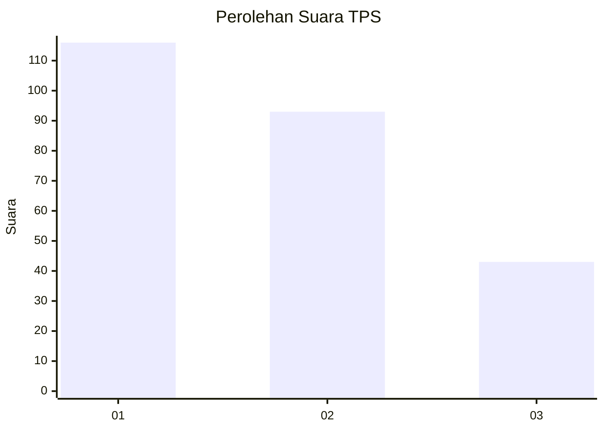
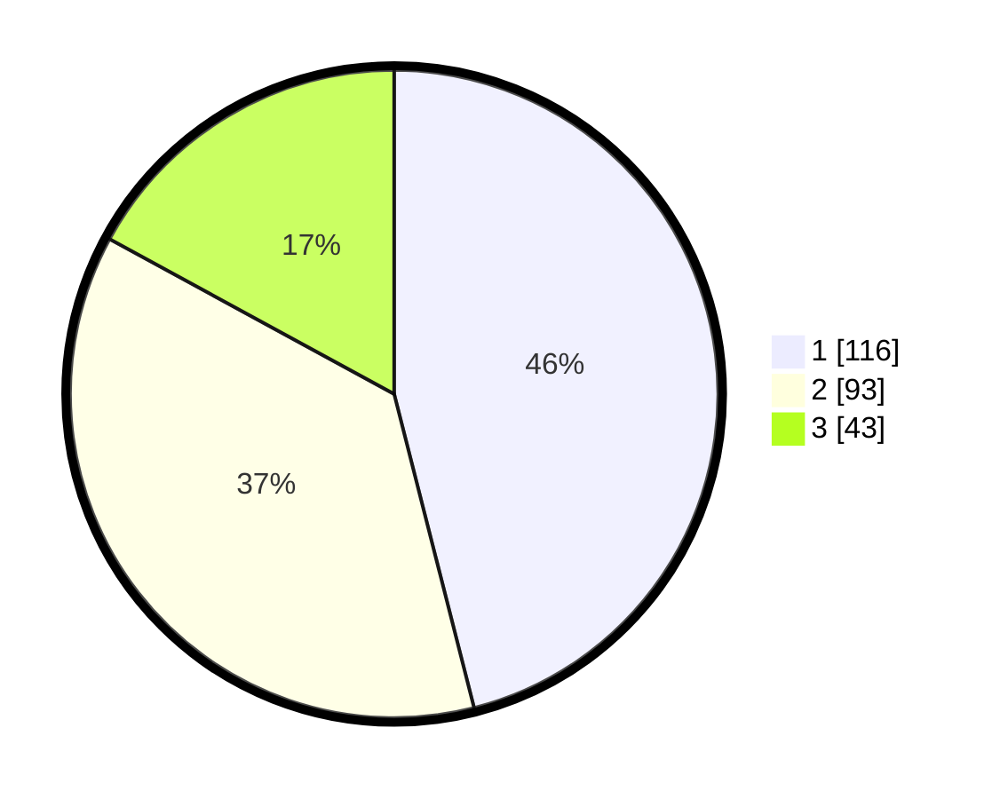

# Hasil

## Grafik

## Tabel

| No. | Nama Paslon    | Suara | Suara (raw) | Persentase |
|:--- |:-------------- | -----:| -----------:| ----------:|
| 1   | ANIES MUHAIMIN | 116   | [116][p-1]  | 46,03      |
| 2   | PRABOWO GIBRAN | 93    | [93][p-2]   | 36,90      |
| 3   | GANJAR MAHFUD  | 43    | [43][p-3]   | 17,06      |

[p-1]: https://github.com/gigit-pemilu/pemilu-2024/blob/main/pilpres/hitung-suara/sub/32-jawa-barat/sub/16-bekasi/sub/06-tambun-selatan/sub/2005-setiadarma/sub/047-tps/sub/paslon-1.txt
[p-2]: https://github.com/gigit-pemilu/pemilu-2024/blob/main/pilpres/hitung-suara/sub/32-jawa-barat/sub/16-bekasi/sub/06-tambun-selatan/sub/2005-setiadarma/sub/047-tps/sub/paslon-2.txt
[p-3]: https://github.com/gigit-pemilu/pemilu-2024/blob/main/pilpres/hitung-suara/sub/32-jawa-barat/sub/16-bekasi/sub/06-tambun-selatan/sub/2005-setiadarma/sub/047-tps/sub/paslon-3.txt

## Foto C Plano

https://sirekap-obj-formc.kpu.go.id/cfdd/pemilu/ppwp/32/16/06/20/05/3216062005047-20240214-185629--d624f2b2-6ea6-4781-be82-fc2581c56422.jpg

https://sirekap-obj-formc.kpu.go.id/cfdd/pemilu/ppwp/32/16/06/20/05/3216062005047-20240214-185746--883d092c-ac88-44db-bab3-d8646ca00db1.jpg

https://sirekap-obj-formc.kpu.go.id/cfdd/pemilu/ppwp/32/16/06/20/05/3216062005047-20240214-185713--222f6b32-9251-4e71-a1b4-ca871e45ad4a.jpg

## Metadata

| Key        | Value               |
| ---------- | ------------------- |
| Time Stamp | 2024-02-25 09:00:00 |

