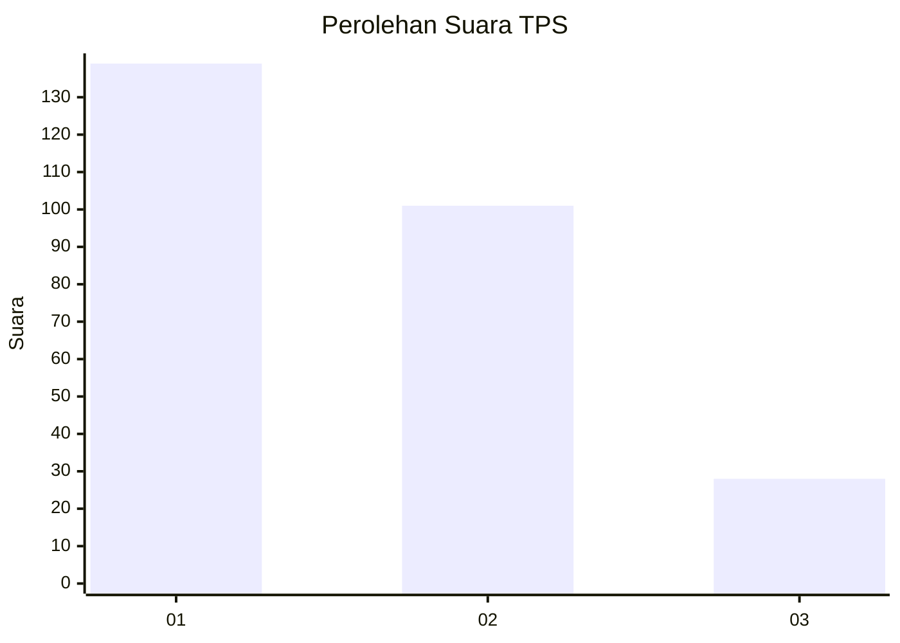
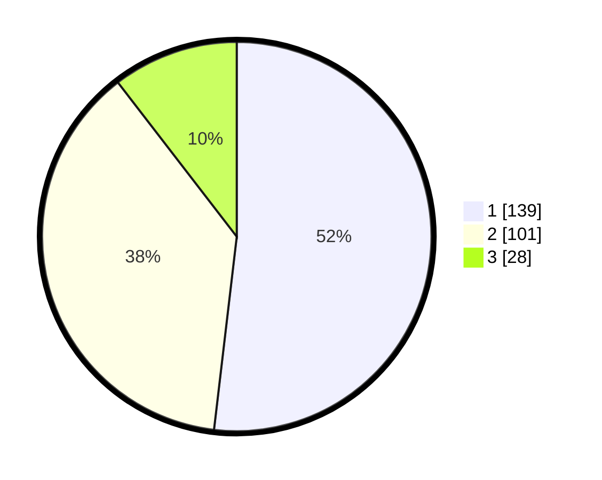

# Hasil

## Grafik

## Tabel

| No. | Nama Paslon    | Suara | Suara (raw) | Persentase |
|:--- |:-------------- | -----:| -----------:| ----------:|
| 1   | ANIES MUHAIMIN | 139   | [139][p-1]  | 51,87      |
| 2   | PRABOWO GIBRAN | 101   | [101][p-2]  | 37,69      |
| 3   | GANJAR MAHFUD  | 28    | [28][p-3]   | 10,45      |

[p-1]: https://github.com/gigit-pemilu/pemilu-2024/blob/main/pilpres/hitung-suara/sub/32-jawa-barat/sub/16-bekasi/sub/06-tambun-selatan/sub/2009-mangunjaya/sub/165-tps/sub/paslon-1.txt
[p-2]: https://github.com/gigit-pemilu/pemilu-2024/blob/main/pilpres/hitung-suara/sub/32-jawa-barat/sub/16-bekasi/sub/06-tambun-selatan/sub/2009-mangunjaya/sub/165-tps/sub/paslon-2.txt
[p-3]: https://github.com/gigit-pemilu/pemilu-2024/blob/main/pilpres/hitung-suara/sub/32-jawa-barat/sub/16-bekasi/sub/06-tambun-selatan/sub/2009-mangunjaya/sub/165-tps/sub/paslon-3.txt

## Foto C Plano

https://sirekap-obj-formc.kpu.go.id/fddd/pemilu/ppwp/32/16/06/20/09/3216062009165-20240214-204922--c4a3215e-cc0e-474c-841e-cfc9095ee77f.jpg

https://sirekap-obj-formc.kpu.go.id/fddd/pemilu/ppwp/32/16/06/20/09/3216062009165-20240214-205558--15e424b2-228f-4186-a635-29bf64c83feb.jpg

https://sirekap-obj-formc.kpu.go.id/fddd/pemilu/ppwp/32/16/06/20/09/3216062009165-20240214-205738--823eb74f-8a32-4339-be58-f8058c5de8e2.jpg

## Metadata

| Key        | Value               |
| ---------- | ------------------- |
| Time Stamp | 2024-02-25 22:00:00 |

