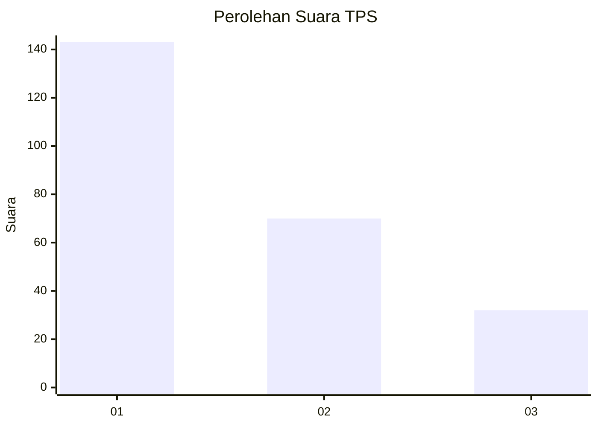
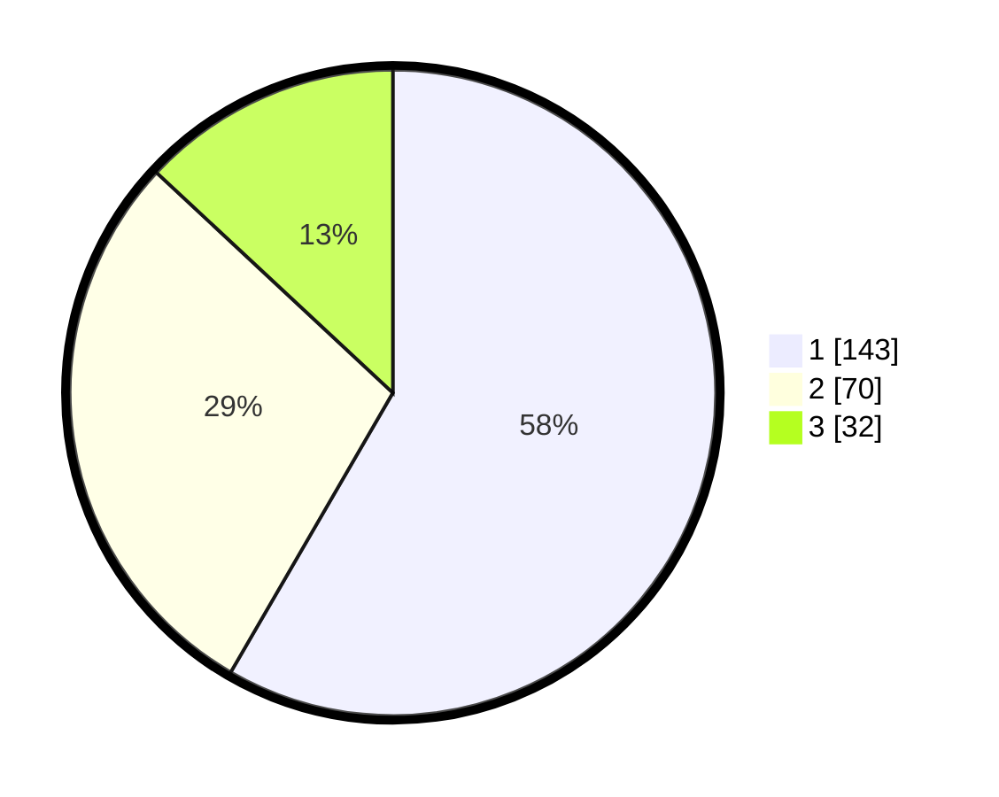

# Hasil

## Grafik

## Tabel

| No. | Nama Paslon    | Suara | Suara (raw) | Persentase |
|:--- |:-------------- | -----:| -----------:| ----------:|
| 1   | ANIES MUHAIMIN | 143   | [143][p-1]  | 58,37      |
| 2   | PRABOWO GIBRAN | 70    | [70][p-2]   | 28,57      |
| 3   | GANJAR MAHFUD  | 32    | [32][p-3]   | 13,06      |

[p-1]: https://github.com/gigit-pemilu/pemilu-2024/blob/main/pilpres/hitung-suara/sub/32-jawa-barat/sub/16-bekasi/sub/06-tambun-selatan/sub/2010-sumberjaya/sub/030-tps/sub/paslon-1.txt
[p-2]: https://github.com/gigit-pemilu/pemilu-2024/blob/main/pilpres/hitung-suara/sub/32-jawa-barat/sub/16-bekasi/sub/06-tambun-selatan/sub/2010-sumberjaya/sub/030-tps/sub/paslon-2.txt
[p-3]: https://github.com/gigit-pemilu/pemilu-2024/blob/main/pilpres/hitung-suara/sub/32-jawa-barat/sub/16-bekasi/sub/06-tambun-selatan/sub/2010-sumberjaya/sub/030-tps/sub/paslon-3.txt

## Foto C Plano

https://sirekap-obj-formc.kpu.go.id/4ced/pemilu/ppwp/32/16/06/20/10/3216062010030-20240215-192518--3ba622ab-a233-40ce-ac1e-6b3aec3941d0.jpg

https://sirekap-obj-formc.kpu.go.id/4ced/pemilu/ppwp/32/16/06/20/10/3216062010030-20240215-192548--f7f78988-2e2e-4408-b67b-4a539a12a5a4.jpg

https://sirekap-obj-formc.kpu.go.id/4ced/pemilu/ppwp/32/16/06/20/10/3216062010030-20240215-192534--f244850f-ce65-4b1e-949e-272ab6e149b9.jpg

## Metadata

| Key        | Value               |
| ---------- | ------------------- |
| Time Stamp | 2024-02-25 21:00:00 |

