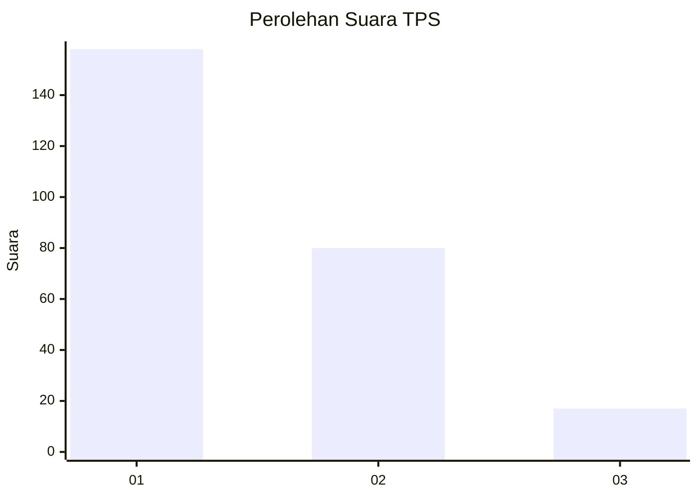
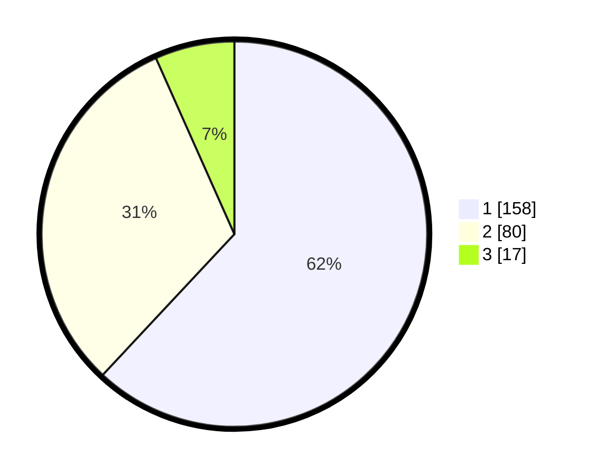

# Hasil

## Grafik

## Tabel

| No. | Nama Paslon    | Suara | Suara (raw) | Persentase |
|:--- |:-------------- | -----:| -----------:| ----------:|
| 1   | ANIES MUHAIMIN | 158   | [158][p-1]  | 61,96      |
| 2   | PRABOWO GIBRAN | 80    | [80][p-2]   | 31,37      |
| 3   | GANJAR MAHFUD  | 17    | [17][p-3]   | 6,67       |

[p-1]: https://github.com/gigit-pemilu/pemilu-2024/blob/main/pilpres/hitung-suara/sub/32-jawa-barat/sub/16-bekasi/sub/06-tambun-selatan/sub/2010-sumberjaya/sub/049-tps/sub/paslon-1.txt
[p-2]: https://github.com/gigit-pemilu/pemilu-2024/blob/main/pilpres/hitung-suara/sub/32-jawa-barat/sub/16-bekasi/sub/06-tambun-selatan/sub/2010-sumberjaya/sub/049-tps/sub/paslon-2.txt
[p-3]: https://github.com/gigit-pemilu/pemilu-2024/blob/main/pilpres/hitung-suara/sub/32-jawa-barat/sub/16-bekasi/sub/06-tambun-selatan/sub/2010-sumberjaya/sub/049-tps/sub/paslon-3.txt

## Foto C Plano

https://sirekap-obj-formc.kpu.go.id/a612/pemilu/ppwp/32/16/06/20/10/3216062010049-20240214-223428--7d321595-be4b-4622-a09d-d3cb386b29c0.jpg

https://sirekap-obj-formc.kpu.go.id/a612/pemilu/ppwp/32/16/06/20/10/3216062010049-20240214-223501--c7d45512-d05c-41df-a294-935c082f09d7.jpg

https://sirekap-obj-formc.kpu.go.id/a612/pemilu/ppwp/32/16/06/20/10/3216062010049-20240214-223525--c6fdba0e-24d5-4aa8-87c2-fd4d2be00cb5.jpg

## Metadata

| Key        | Value               |
| ---------- | ------------------- |
| Time Stamp | 2024-02-24 22:31:28 |

