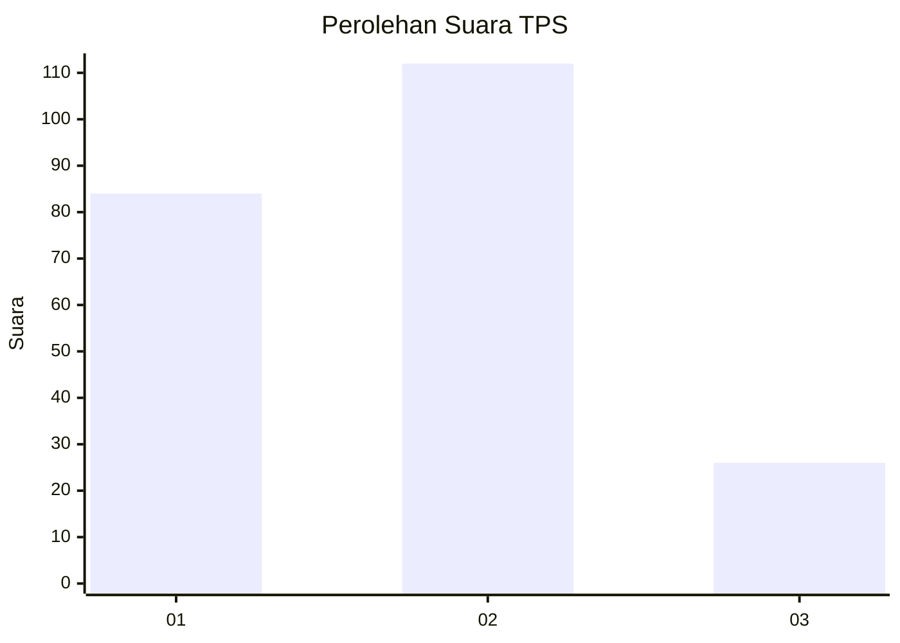
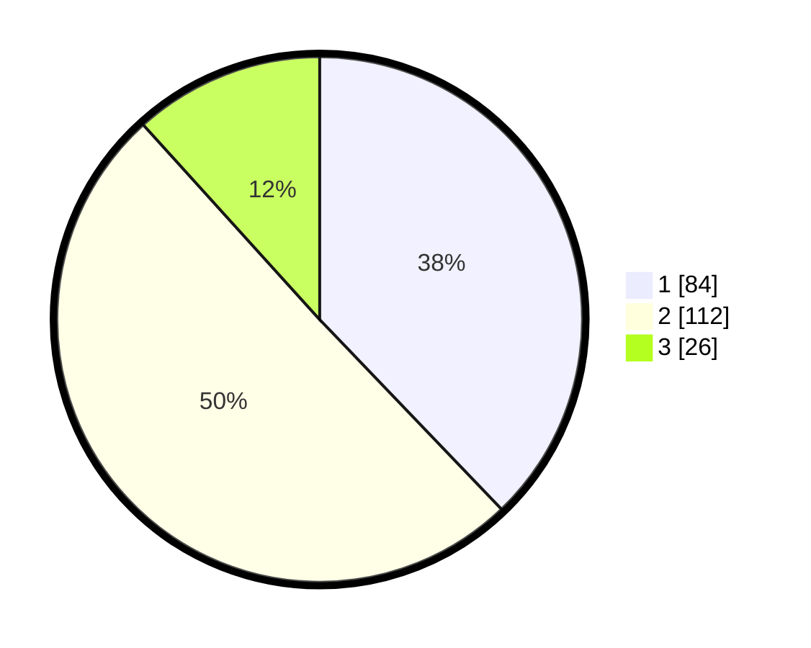

# Hasil

## Grafik

## Tabel

| No. | Nama Paslon    | Suara | Suara (raw) | Persentase |
|:--- |:-------------- | -----:| -----------:| ----------:|
| 1   | ANIES MUHAIMIN | 84    | [84][p-1]   | 37,84      |
| 2   | PRABOWO GIBRAN | 112   | [112][p-2]  | 50,45      |
| 3   | GANJAR MAHFUD  | 26    | [26][p-3]   | 11,71      |

[p-1]: https://github.com/gigit-pemilu/pemilu-2024/blob/main/pilpres/hitung-suara/sub/32-jawa-barat/sub/16-bekasi/sub/06-tambun-selatan/sub/2010-sumberjaya/sub/082-tps/sub/paslon-1.txt
[p-2]: https://github.com/gigit-pemilu/pemilu-2024/blob/main/pilpres/hitung-suara/sub/32-jawa-barat/sub/16-bekasi/sub/06-tambun-selatan/sub/2010-sumberjaya/sub/082-tps/sub/paslon-2.txt
[p-3]: https://github.com/gigit-pemilu/pemilu-2024/blob/main/pilpres/hitung-suara/sub/32-jawa-barat/sub/16-bekasi/sub/06-tambun-selatan/sub/2010-sumberjaya/sub/082-tps/sub/paslon-3.txt

## Foto C Plano

https://sirekap-obj-formc.kpu.go.id/6439/pemilu/ppwp/32/16/06/20/10/3216062010082-20240214-193714--d8fb3a11-eeb5-4bb0-b5ce-7c5cce5f09b0.jpg

https://sirekap-obj-formc.kpu.go.id/6439/pemilu/ppwp/32/16/06/20/10/3216062010082-20240214-203911--32a90e4d-e582-4031-96ca-4f96a59f2faa.jpg

https://sirekap-obj-formc.kpu.go.id/6439/pemilu/ppwp/32/16/06/20/10/3216062010082-20240214-204015--f2b2f190-ff02-49fb-8ce0-cd7548e1fc6f.jpg

## Metadata

| Key        | Value               |
| ---------- | ------------------- |
| Time Stamp | 2024-02-15 23:29:50 |

## DATA PEMILIH TETAP

Jumlah pemilih dalam DPT: **233**.
 * L: **130**.
 * P: **143**.

## DATA PENGGUNA HAK PILIH

Jumlah pengguna hak pilih dalam DPT: **7**.
 * L: **0**.
 * P: **0**.

Jumlah pengguna hak pilih dalam DPTb: **10**.
 * L: **0**.
 * P: **0**.

Jumlah pengguna hak pilih dalam DPK: **70**.
 * L: **5**.
 * P: **7**.

Jumlah pengguna hak pilih: **153**.
 * L: **500**.
 * P: **1**.

## JUMLAH SUARA SAH DAN TIDAK SAH

JUMLAH SELURUH SUARA SAH: **222**.

JUMLAH SUARA TIDAK SAH: **0**.

JUMLAH SELURUH SUARA SAH DAN SUARA TIDAK SAH: **222**.

