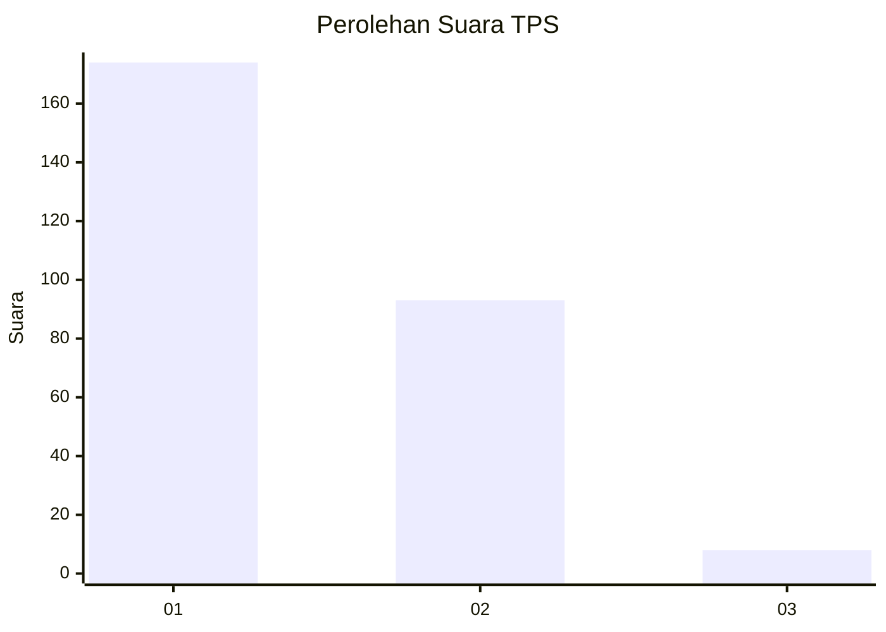
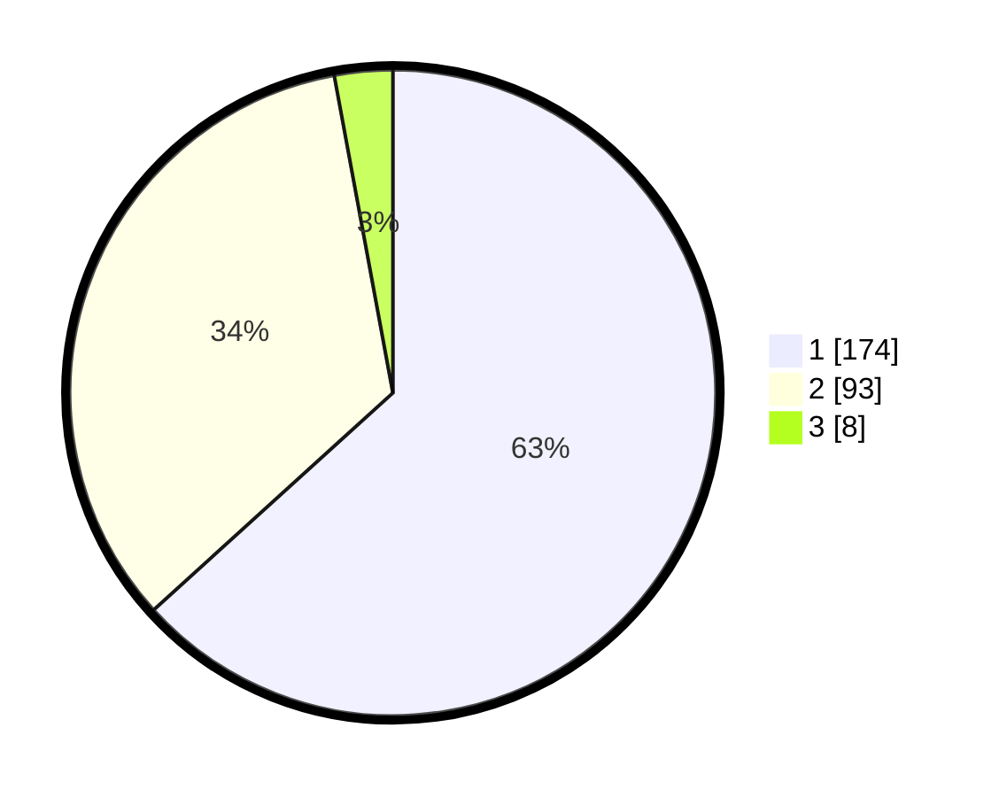

# Hasil

## Grafik

## Tabel

| No. | Nama Paslon    | Suara | Suara (raw) | Persentase |
|:--- |:-------------- | -----:| -----------:| ----------:|
| 1   | ANIES MUHAIMIN | 174   | [174][p-1]  | 63,27      |
| 2   | PRABOWO GIBRAN | 93    | [93][p-2]   | 33,82      |
| 3   | GANJAR MAHFUD  | 8     | [8][p-3]    | 2,91       |

[p-1]: https://github.com/gigit-pemilu/pemilu-2024/blob/main/pilpres/hitung-suara/sub/32-jawa-barat/sub/16-bekasi/sub/06-tambun-selatan/sub/2010-sumberjaya/sub/199-tps/sub/paslon-1.txt
[p-2]: https://github.com/gigit-pemilu/pemilu-2024/blob/main/pilpres/hitung-suara/sub/32-jawa-barat/sub/16-bekasi/sub/06-tambun-selatan/sub/2010-sumberjaya/sub/199-tps/sub/paslon-2.txt
[p-3]: https://github.com/gigit-pemilu/pemilu-2024/blob/main/pilpres/hitung-suara/sub/32-jawa-barat/sub/16-bekasi/sub/06-tambun-selatan/sub/2010-sumberjaya/sub/199-tps/sub/paslon-3.txt

## Foto C Plano

https://sirekap-obj-formc.kpu.go.id/0d47/pemilu/ppwp/32/16/06/20/10/3216062010199-20240215-034550--8d6f7bfd-a87a-4d05-a193-15658f48b848.jpg

https://sirekap-obj-formc.kpu.go.id/0d47/pemilu/ppwp/32/16/06/20/10/3216062010199-20240215-035654--55252610-5a0d-4506-b6dc-69ab6dca9112.jpg

https://sirekap-obj-formc.kpu.go.id/0d47/pemilu/ppwp/32/16/06/20/10/3216062010199-20240215-035425--d48d70de-70c7-4b4f-bbcd-e926014be384.jpg

## Metadata

| Key        | Value               |
| ---------- | ------------------- |
| Time Stamp | 2024-02-25 11:00:00 |

