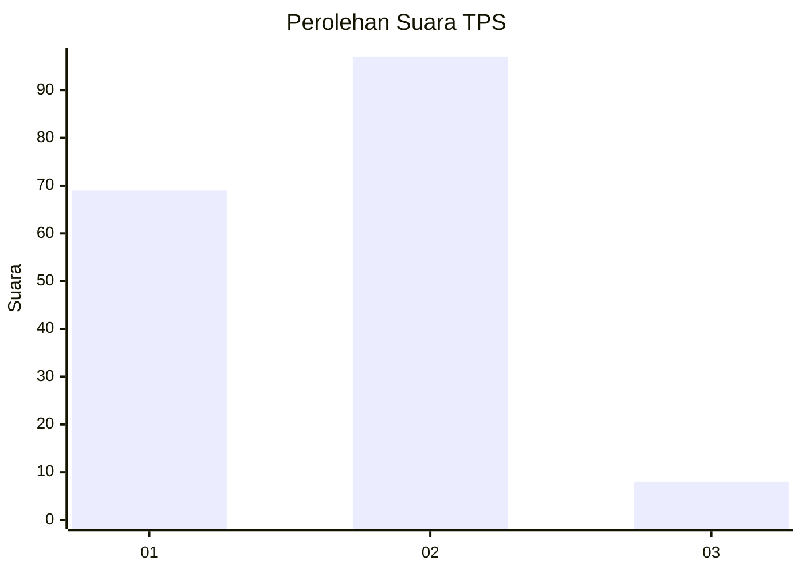
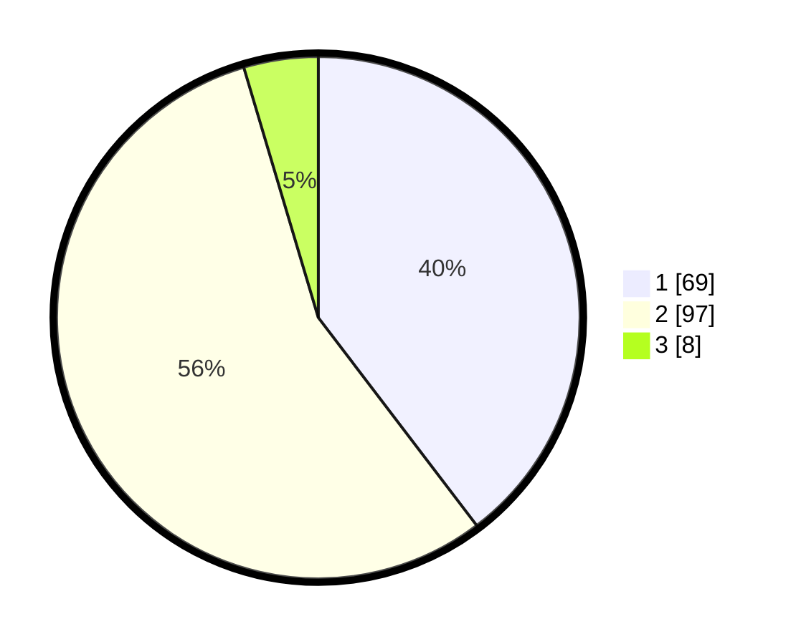

# Hasil

## Grafik

## Tabel

| No. | Nama Paslon    | Suara | Suara (raw) | Persentase |
|:--- |:-------------- | -----:| -----------:| ----------:|
| 1   | ANIES MUHAIMIN | 69    | [69][p-1]   | 39,66      |
| 2   | PRABOWO GIBRAN | 97    | [97][p-2]   | 55,75      |
| 3   | GANJAR MAHFUD  | 8     | [8][p-3]    | 4,60       |

[p-1]: https://github.com/gigit-pemilu/pemilu-2024-32-jawa-barat/blob/main/pilpres/hitung-suara/sub/32-jawa-barat/sub/16-bekasi/sub/07-cibitung/sub/1001-wanasari/sub/001-tps/sub/paslon-1.txt
[p-2]: https://github.com/gigit-pemilu/pemilu-2024-32-jawa-barat/blob/main/pilpres/hitung-suara/sub/32-jawa-barat/sub/16-bekasi/sub/07-cibitung/sub/1001-wanasari/sub/001-tps/sub/paslon-2.txt
[p-3]: https://github.com/gigit-pemilu/pemilu-2024-32-jawa-barat/blob/main/pilpres/hitung-suara/sub/32-jawa-barat/sub/16-bekasi/sub/07-cibitung/sub/1001-wanasari/sub/001-tps/sub/paslon-3.txt

## Foto C Plano

https://sirekap-obj-formc.kpu.go.id/3bef/pemilu/ppwp/32/16/07/10/01/3216071001001-20240214-191342--2467cba2-f3f0-4e2a-a16e-f0d70d7efa49.jpg

https://sirekap-obj-formc.kpu.go.id/3bef/pemilu/ppwp/32/16/07/10/01/3216071001001-20240214-191516--6cac9aef-1bd4-4b6e-a5ac-384bf87c3002.jpg

https://sirekap-obj-formc.kpu.go.id/3bef/pemilu/ppwp/32/16/07/10/01/3216071001001-20240214-191616--a1278bec-6d3d-4a5f-bd2b-8ec63a44c93a.jpg

## Metadata

| Key        | Value               |
| ---------- | ------------------- |
| Time Stamp | 2024-02-16 02:30:27 |

