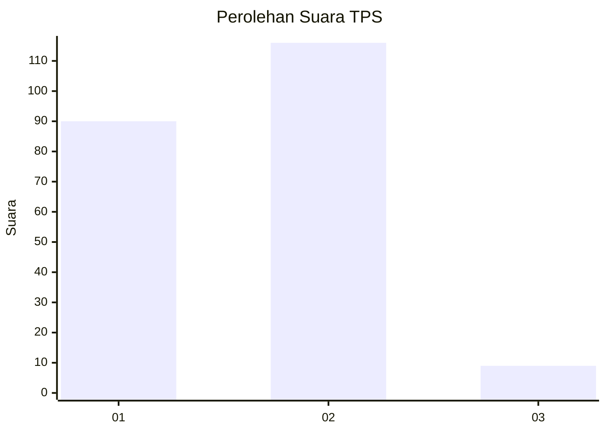
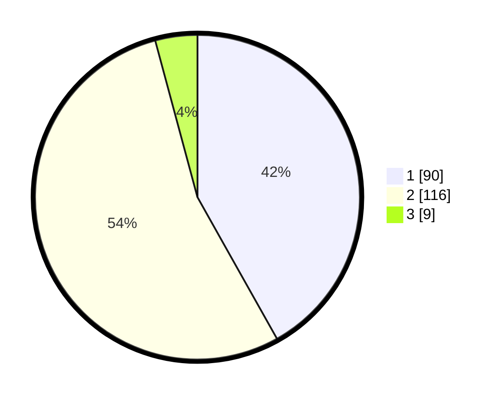

# Hasil

## Grafik

## Tabel

| No. | Nama Paslon    | Suara | Suara (raw) | Persentase |
|:--- |:-------------- | -----:| -----------:| ----------:|
| 1   | ANIES MUHAIMIN | 90    | [90][p-1]   | 41,86      |
| 2   | PRABOWO GIBRAN | 116   | [116][p-2]  | 53,95      |
| 3   | GANJAR MAHFUD  | 9     | [9][p-3]    | 4,19       |

[p-1]: https://github.com/gigit-pemilu/pemilu-2024/blob/main/pilpres/hitung-suara/sub/32-jawa-barat/sub/16-bekasi/sub/07-cibitung/sub/1001-wanasari/sub/003-tps/sub/paslon-1.txt
[p-2]: https://github.com/gigit-pemilu/pemilu-2024/blob/main/pilpres/hitung-suara/sub/32-jawa-barat/sub/16-bekasi/sub/07-cibitung/sub/1001-wanasari/sub/003-tps/sub/paslon-2.txt
[p-3]: https://github.com/gigit-pemilu/pemilu-2024/blob/main/pilpres/hitung-suara/sub/32-jawa-barat/sub/16-bekasi/sub/07-cibitung/sub/1001-wanasari/sub/003-tps/sub/paslon-3.txt

## Foto C Plano

https://sirekap-obj-formc.kpu.go.id/6b86/pemilu/ppwp/32/16/07/10/01/3216071001003-20240214-155502--d4467ff2-378c-453c-a6ea-7c726b5556ea.jpg

https://sirekap-obj-formc.kpu.go.id/6b86/pemilu/ppwp/32/16/07/10/01/3216071001003-20240215-025804--86ff18f1-36aa-45b1-9144-3714285859d7.jpg

https://sirekap-obj-formc.kpu.go.id/6b86/pemilu/ppwp/32/16/07/10/01/3216071001003-20240214-155914--020ab959-2e78-41a9-b502-7da2fc9ecb61.jpg

## Metadata

| Key        | Value               |
| ---------- | ------------------- |
| Time Stamp | 2024-02-16 02:30:27 |

