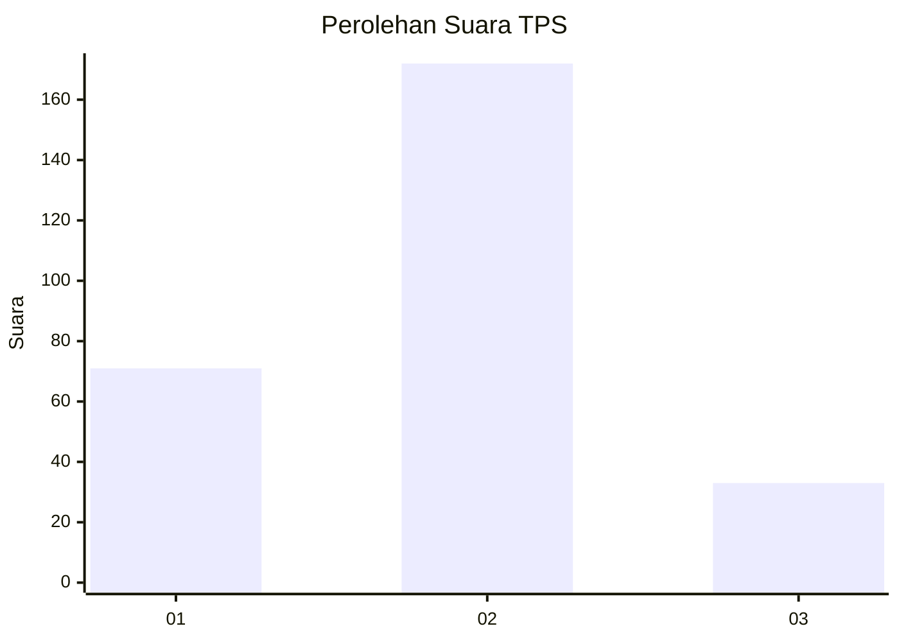
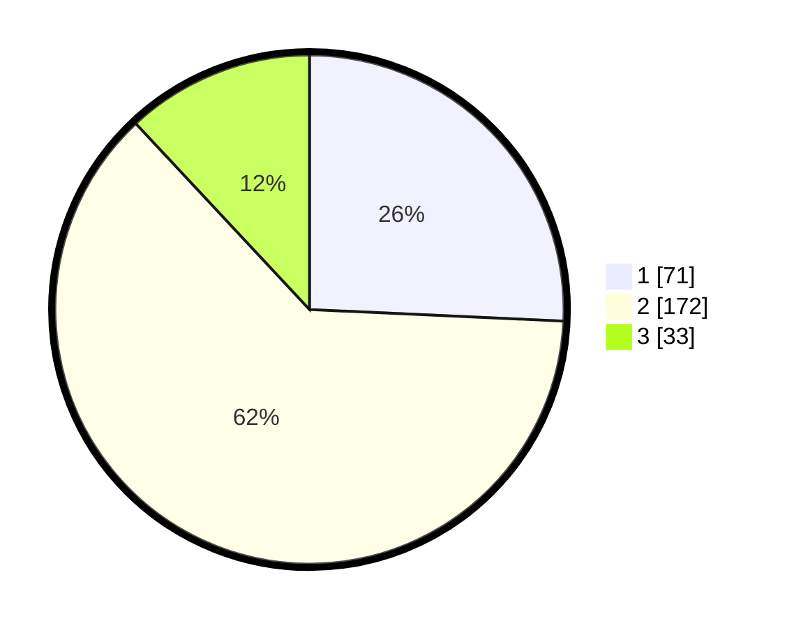

# Hasil

## Grafik

## Tabel

| No. | Nama Paslon    | Suara | Suara (raw) | Persentase |
|:--- |:-------------- | -----:| -----------:| ----------:|
| 1   | ANIES MUHAIMIN | 71    | [71][p-1]   | 25,72      |
| 2   | PRABOWO GIBRAN | 172   | [172][p-2]  | 62,32      |
| 3   | GANJAR MAHFUD  | 33    | [33][p-3]   | 11,96      |

[p-1]: https://github.com/gigit-pemilu/pemilu-2024-32-jawa-barat/blob/main/pilpres/hitung-suara/sub/32-jawa-barat/sub/16-bekasi/sub/07-cibitung/sub/1001-wanasari/sub/020-tps/sub/paslon-1.txt
[p-2]: https://github.com/gigit-pemilu/pemilu-2024-32-jawa-barat/blob/main/pilpres/hitung-suara/sub/32-jawa-barat/sub/16-bekasi/sub/07-cibitung/sub/1001-wanasari/sub/020-tps/sub/paslon-2.txt
[p-3]: https://github.com/gigit-pemilu/pemilu-2024-32-jawa-barat/blob/main/pilpres/hitung-suara/sub/32-jawa-barat/sub/16-bekasi/sub/07-cibitung/sub/1001-wanasari/sub/020-tps/sub/paslon-3.txt

## Foto C Plano

https://sirekap-obj-formc.kpu.go.id/ae5f/pemilu/ppwp/32/16/07/10/01/3216071001020-20240214-155753--d4ed0344-191f-4660-8c56-8c9c5ecd939f.jpg

https://sirekap-obj-formc.kpu.go.id/ae5f/pemilu/ppwp/32/16/07/10/01/3216071001020-20240214-155854--560e2ce3-3ecf-477d-94f6-016e039a6c7b.jpg

https://sirekap-obj-formc.kpu.go.id/ae5f/pemilu/ppwp/32/16/07/10/01/3216071001020-20240214-160127--dbb93f32-e027-4fa7-aae7-dd7bb148ae97.jpg

## Metadata

| Key        | Value               |
| ---------- | ------------------- |
| Time Stamp | 2024-02-24 22:31:28 |

