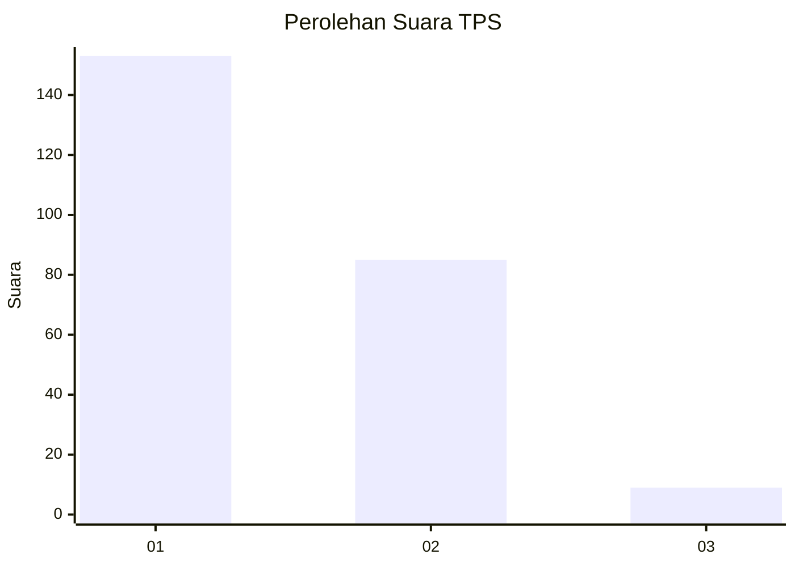
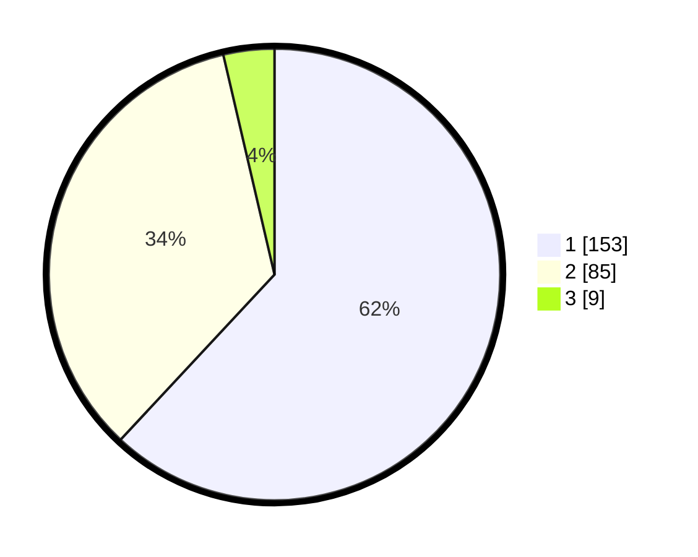

# Hasil

## Grafik

## Tabel

| No. | Nama Paslon    | Suara | Suara (raw) | Persentase |
|:--- |:-------------- | -----:| -----------:| ----------:|
| 1   | ANIES MUHAIMIN | 153   | [153][p-1]  | 61,94      |
| 2   | PRABOWO GIBRAN | 85    | [85][p-2]   | 34,41      |
| 3   | GANJAR MAHFUD  | 9     | [9][p-3]    | 3,64       |

[p-1]: https://github.com/gigit-pemilu/pemilu-2024/blob/main/pilpres/hitung-suara/sub/32-jawa-barat/sub/16-bekasi/sub/07-cibitung/sub/1001-wanasari/sub/197-tps/sub/paslon-1.txt
[p-2]: https://github.com/gigit-pemilu/pemilu-2024/blob/main/pilpres/hitung-suara/sub/32-jawa-barat/sub/16-bekasi/sub/07-cibitung/sub/1001-wanasari/sub/197-tps/sub/paslon-2.txt
[p-3]: https://github.com/gigit-pemilu/pemilu-2024/blob/main/pilpres/hitung-suara/sub/32-jawa-barat/sub/16-bekasi/sub/07-cibitung/sub/1001-wanasari/sub/197-tps/sub/paslon-3.txt

## Foto C Plano

https://sirekap-obj-formc.kpu.go.id/8e18/pemilu/ppwp/32/16/07/10/01/3216071001197-20240214-184708--8f0e2dbd-c441-4970-b608-817db097c046.jpg

https://sirekap-obj-formc.kpu.go.id/8e18/pemilu/ppwp/32/16/07/10/01/3216071001197-20240214-184840--8ce6bb59-89cc-4bbb-973c-4ae7cbc9970a.jpg

https://sirekap-obj-formc.kpu.go.id/8e18/pemilu/ppwp/32/16/07/10/01/3216071001197-20240214-184945--99279c34-2eeb-4ba3-80c5-8a4648c5fa70.jpg

## Metadata

| Key        | Value               |
| ---------- | ------------------- |
| Time Stamp | 2024-02-25 11:00:00 |

