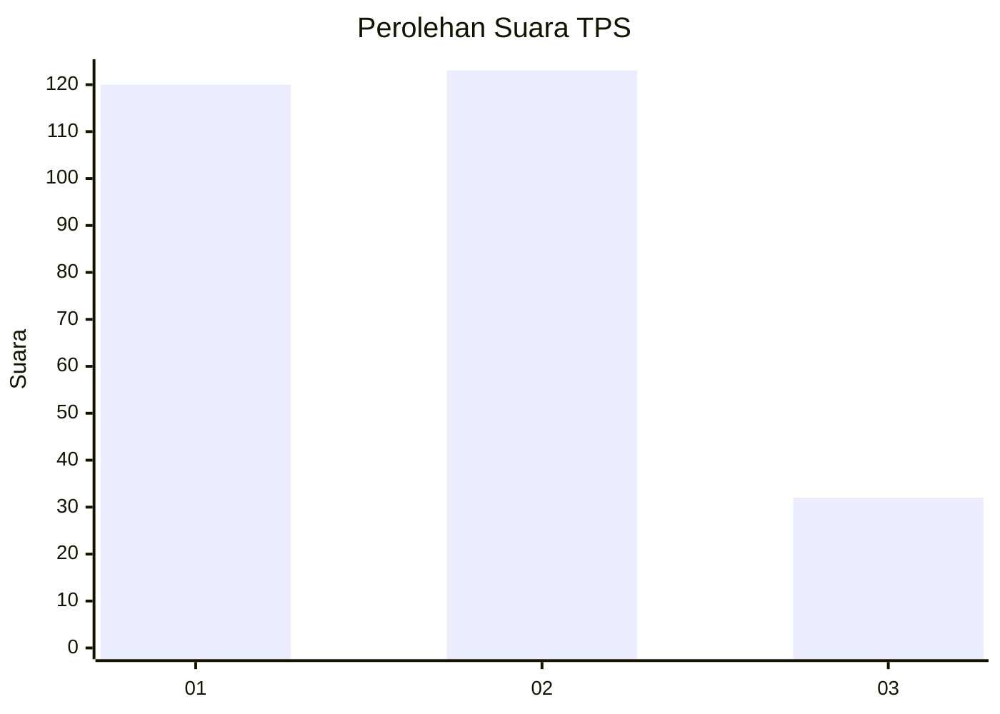
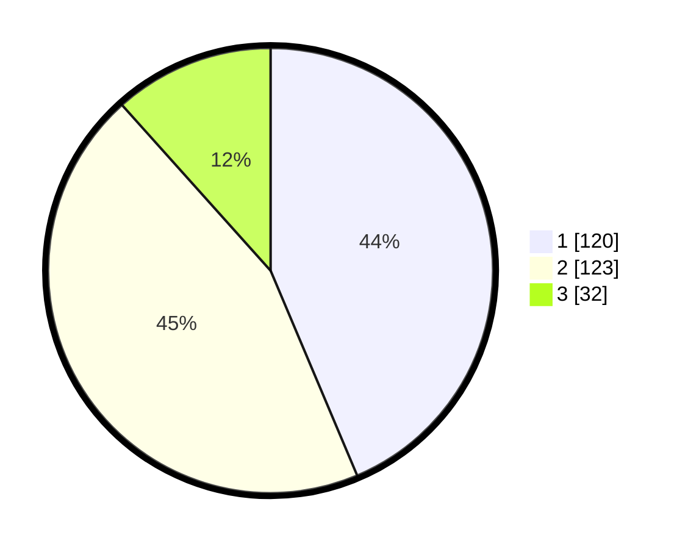

# Hasil

## Grafik

## Tabel

| No. | Nama Paslon    | Suara | Suara (raw) | Persentase |
|:--- |:-------------- | -----:| -----------:| ----------:|
| 1   | ANIES MUHAIMIN | 120   | [120][p-1]  | 43,64      |
| 2   | PRABOWO GIBRAN | 123   | [123][p-2]  | 44,73      |
| 3   | GANJAR MAHFUD  | 32    | [32][p-3]   | 11,64      |

[p-1]: https://github.com/gigit-pemilu/pemilu-2024-32-jawa-barat/blob/main/pilpres/hitung-suara/sub/32-jawa-barat/sub/16-bekasi/sub/07-cibitung/sub/2004-muktiwari/sub/038-tps/sub/paslon-1.txt
[p-2]: https://github.com/gigit-pemilu/pemilu-2024-32-jawa-barat/blob/main/pilpres/hitung-suara/sub/32-jawa-barat/sub/16-bekasi/sub/07-cibitung/sub/2004-muktiwari/sub/038-tps/sub/paslon-2.txt
[p-3]: https://github.com/gigit-pemilu/pemilu-2024-32-jawa-barat/blob/main/pilpres/hitung-suara/sub/32-jawa-barat/sub/16-bekasi/sub/07-cibitung/sub/2004-muktiwari/sub/038-tps/sub/paslon-3.txt

## Foto C Plano

https://sirekap-obj-formc.kpu.go.id/b3f7/pemilu/ppwp/32/16/07/20/04/3216072004038-20240214-232023--6a6af6cf-f908-47d5-be37-79871f6ecf93.jpg

https://sirekap-obj-formc.kpu.go.id/b3f7/pemilu/ppwp/32/16/07/20/04/3216072004038-20240214-232319--58cbff68-a143-4118-a1de-f7b02fc233d8.jpg

https://sirekap-obj-formc.kpu.go.id/b3f7/pemilu/ppwp/32/16/07/20/04/3216072004038-20240214-233052--6b818b0e-2ab2-4cc7-a4ec-764b7797926b.jpg

## Metadata

| Key        | Value               |
| ---------- | ------------------- |
| Time Stamp | 2024-02-24 22:31:28 |

