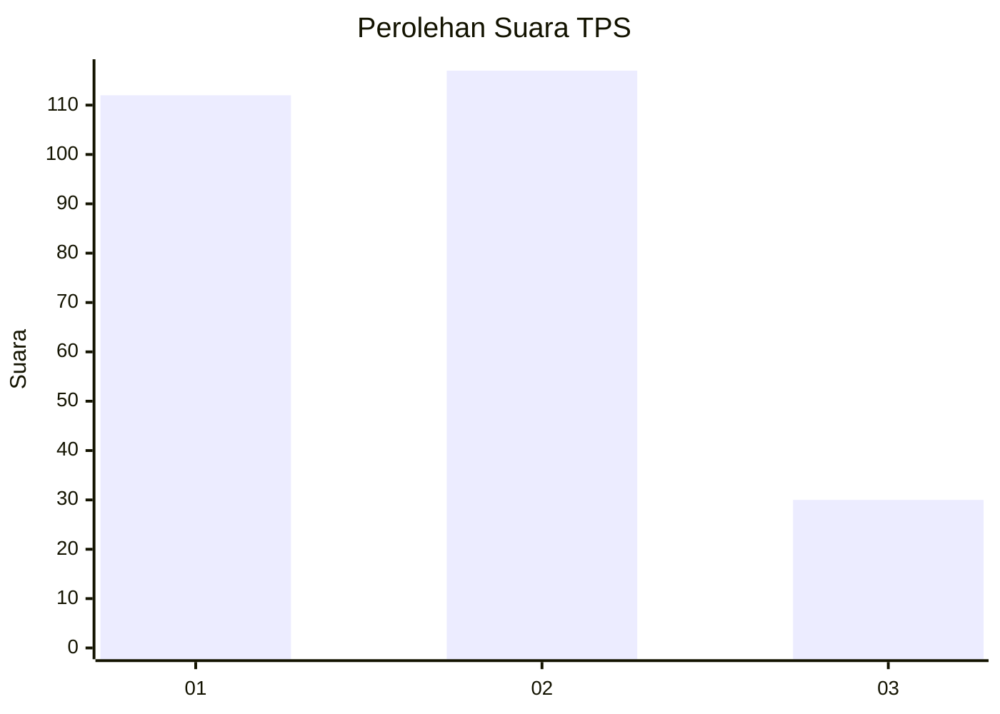
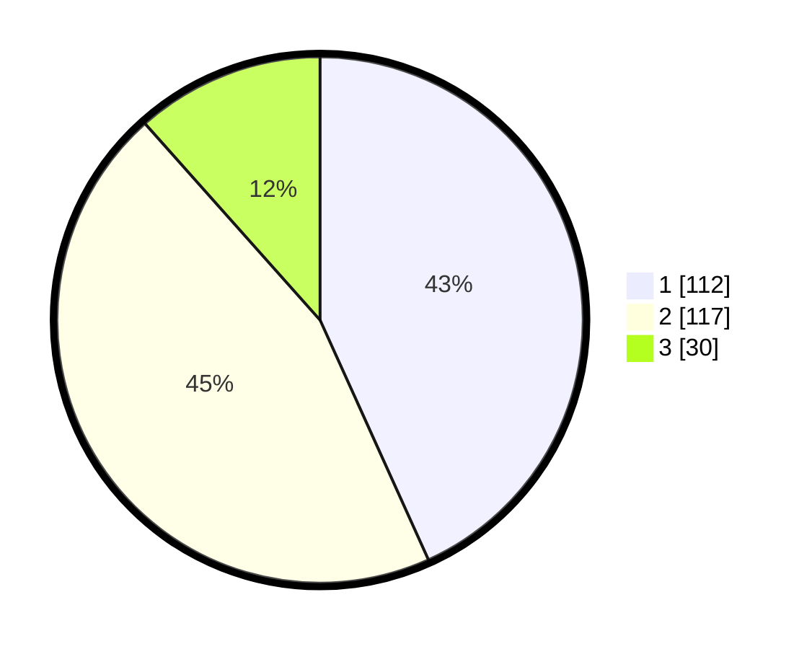

# Hasil

## Grafik

## Tabel

| No. | Nama Paslon    | Suara | Suara (raw) | Persentase |
|:--- |:-------------- | -----:| -----------:| ----------:|
| 1   | ANIES MUHAIMIN | 112   | [112][p-1]  | 43,24      |
| 2   | PRABOWO GIBRAN | 117   | [117][p-2]  | 45,17      |
| 3   | GANJAR MAHFUD  | 30    | [30][p-3]   | 11,58      |

[p-1]: https://github.com/gigit-pemilu/pemilu-2024-32-jawa-barat/blob/main/pilpres/hitung-suara/sub/32-jawa-barat/sub/16-bekasi/sub/07-cibitung/sub/2006-sukajaya/sub/062-tps/sub/paslon-1.txt
[p-2]: https://github.com/gigit-pemilu/pemilu-2024-32-jawa-barat/blob/main/pilpres/hitung-suara/sub/32-jawa-barat/sub/16-bekasi/sub/07-cibitung/sub/2006-sukajaya/sub/062-tps/sub/paslon-2.txt
[p-3]: https://github.com/gigit-pemilu/pemilu-2024-32-jawa-barat/blob/main/pilpres/hitung-suara/sub/32-jawa-barat/sub/16-bekasi/sub/07-cibitung/sub/2006-sukajaya/sub/062-tps/sub/paslon-3.txt

## Foto C Plano

https://sirekap-obj-formc.kpu.go.id/57c7/pemilu/ppwp/32/16/07/20/06/3216072006062-20240214-220112--c4da2f15-6add-4d57-b10e-d4ffa144e451.jpg

https://sirekap-obj-formc.kpu.go.id/57c7/pemilu/ppwp/32/16/07/20/06/3216072006062-20240214-220139--16e9a78b-5aec-458a-8a55-d8c8c240601e.jpg

https://sirekap-obj-formc.kpu.go.id/57c7/pemilu/ppwp/32/16/07/20/06/3216072006062-20240214-220203--14d3b36a-5bbf-4395-a742-b7272696fced.jpg

## Metadata

| Key        | Value               |
| ---------- | ------------------- |
| Time Stamp | 2024-02-25 16:00:00 |

