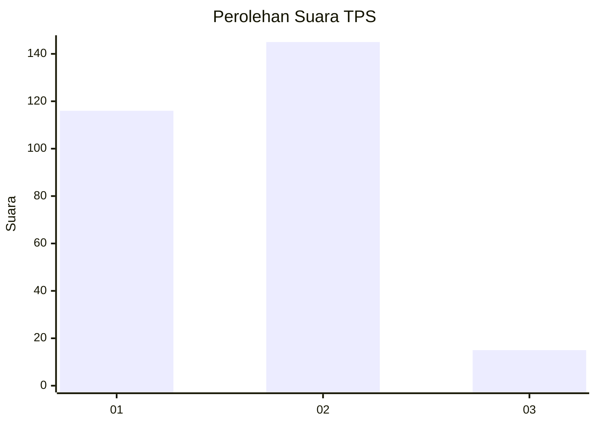
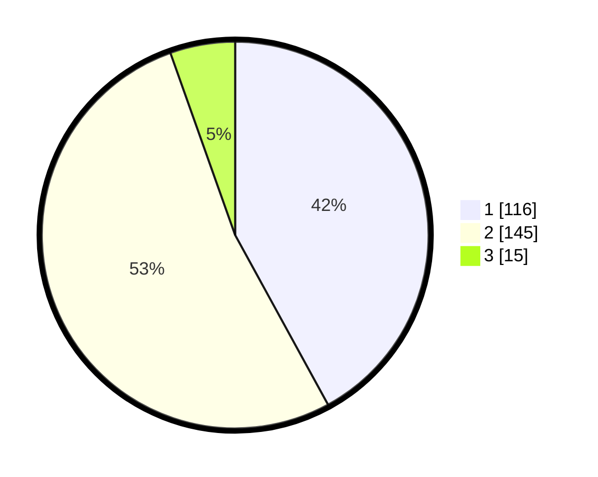

# Hasil

## Grafik

## Tabel

| No. | Nama Paslon    | Suara | Suara (raw) | Persentase |
|:--- |:-------------- | -----:| -----------:| ----------:|
| 1   | ANIES MUHAIMIN | 116   | [116][p-1]  | 42,03      |
| 2   | PRABOWO GIBRAN | 145   | [145][p-2]  | 52,54      |
| 3   | GANJAR MAHFUD  | 15    | [15][p-3]   | 5,43       |

[p-1]: https://github.com/gigit-pemilu/pemilu-2024-32-jawa-barat/blob/main/pilpres/hitung-suara/sub/32-jawa-barat/sub/16-bekasi/sub/07-cibitung/sub/2006-sukajaya/sub/070-tps/sub/paslon-1.txt
[p-2]: https://github.com/gigit-pemilu/pemilu-2024-32-jawa-barat/blob/main/pilpres/hitung-suara/sub/32-jawa-barat/sub/16-bekasi/sub/07-cibitung/sub/2006-sukajaya/sub/070-tps/sub/paslon-2.txt
[p-3]: https://github.com/gigit-pemilu/pemilu-2024-32-jawa-barat/blob/main/pilpres/hitung-suara/sub/32-jawa-barat/sub/16-bekasi/sub/07-cibitung/sub/2006-sukajaya/sub/070-tps/sub/paslon-3.txt

## Foto C Plano

https://sirekap-obj-formc.kpu.go.id/cc68/pemilu/ppwp/32/16/07/20/06/3216072006070-20240214-155713--1beaae11-26ef-40ff-b93e-fc4db92da7a0.jpg

https://sirekap-obj-formc.kpu.go.id/cc68/pemilu/ppwp/32/16/07/20/06/3216072006070-20240214-155831--02060e1c-a0ab-41ae-9a72-f88c73ba9d25.jpg

https://sirekap-obj-formc.kpu.go.id/cc68/pemilu/ppwp/32/16/07/20/06/3216072006070-20240214-155517--af451e25-06e6-4303-a7bf-bb3def168f35.jpg

## Metadata

| Key        | Value               |
| ---------- | ------------------- |
| Time Stamp | 2024-02-26 03:00:00 |

