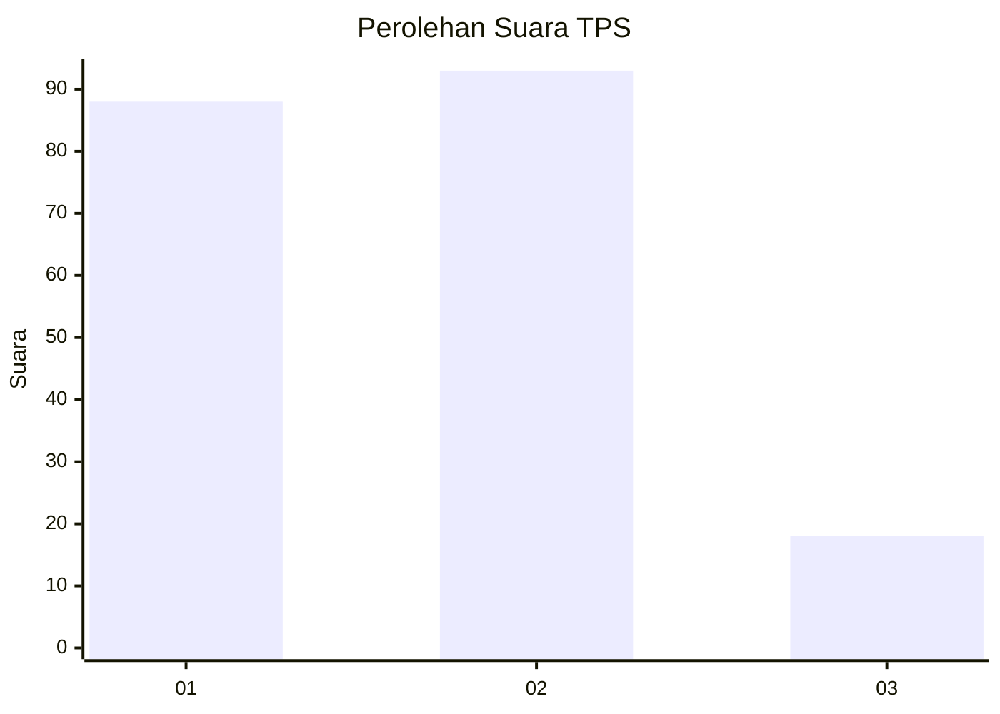
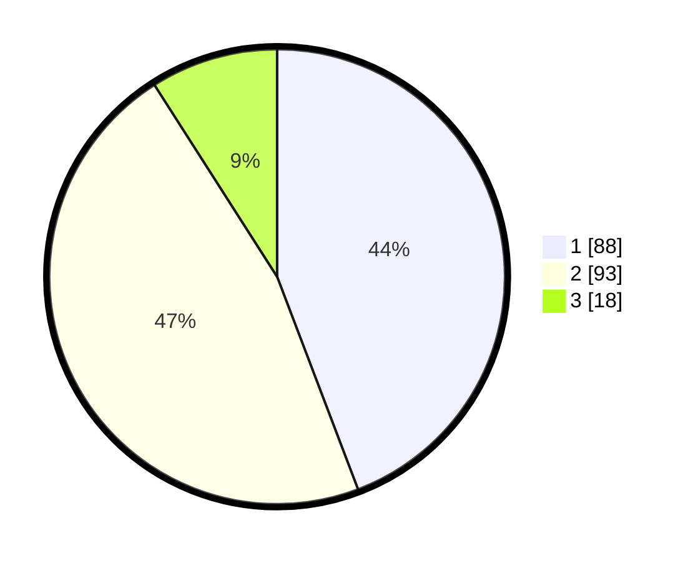

# Hasil

## Grafik

## Tabel

| No. | Nama Paslon    | Suara | Suara (raw) | Persentase |
|:--- |:-------------- | -----:| -----------:| ----------:|
| 1   | ANIES MUHAIMIN | 88    | [88][p-1]   | 44,22      |
| 2   | PRABOWO GIBRAN | 93    | [93][p-2]   | 46,73      |
| 3   | GANJAR MAHFUD  | 18    | [18][p-3]   | 9,05       |

[p-1]: https://github.com/gigit-pemilu/pemilu-2024-32-jawa-barat/blob/main/pilpres/hitung-suara/sub/32-jawa-barat/sub/16-bekasi/sub/08-cikarang-barat/sub/1008-telaga-asih/sub/002-tps/sub/paslon-1.txt
[p-2]: https://github.com/gigit-pemilu/pemilu-2024-32-jawa-barat/blob/main/pilpres/hitung-suara/sub/32-jawa-barat/sub/16-bekasi/sub/08-cikarang-barat/sub/1008-telaga-asih/sub/002-tps/sub/paslon-2.txt
[p-3]: https://github.com/gigit-pemilu/pemilu-2024-32-jawa-barat/blob/main/pilpres/hitung-suara/sub/32-jawa-barat/sub/16-bekasi/sub/08-cikarang-barat/sub/1008-telaga-asih/sub/002-tps/sub/paslon-3.txt

## Foto C Plano

https://sirekap-obj-formc.kpu.go.id/764b/pemilu/ppwp/32/16/08/10/08/3216081008002-20240214-225420--83d4004a-e772-4e17-9945-77932a21c5f3.jpg

https://sirekap-obj-formc.kpu.go.id/764b/pemilu/ppwp/32/16/08/10/08/3216081008002-20240214-225527--05a504f4-9a1a-4d05-8594-e659db05c2c0.jpg

https://sirekap-obj-formc.kpu.go.id/764b/pemilu/ppwp/32/16/08/10/08/3216081008002-20240214-225639--8e9e0abc-68eb-45b9-a6e3-ad3644eb3d1b.jpg

## Metadata

| Key        | Value               |
| ---------- | ------------------- |
| Time Stamp | 2024-02-24 22:31:28 |

