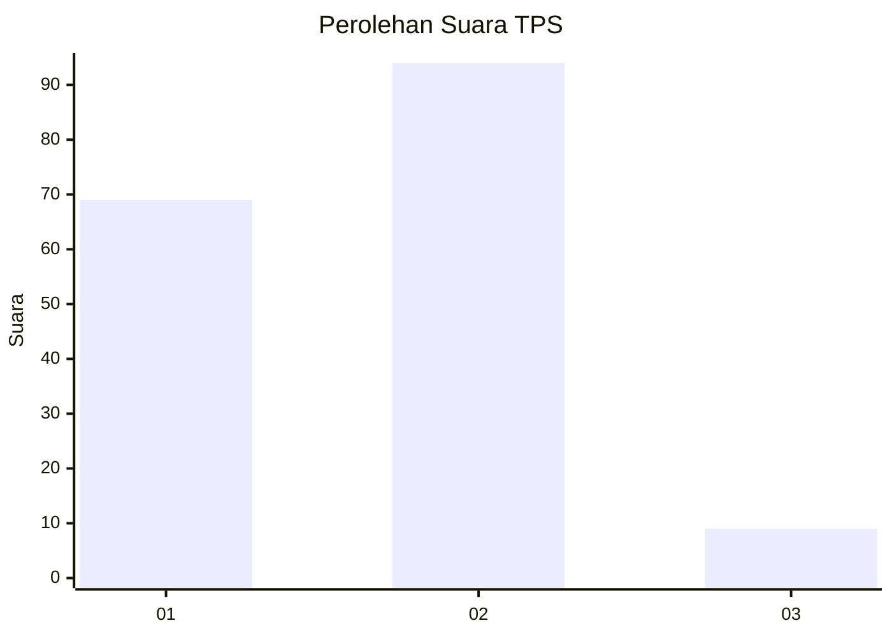
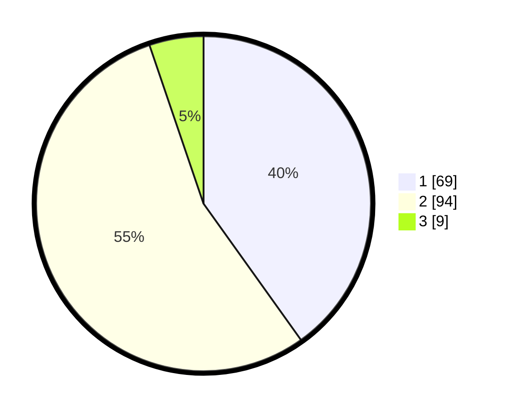

# Hasil

## Grafik

## Tabel

| No. | Nama Paslon    | Suara | Suara (raw) | Persentase |
|:--- |:-------------- | -----:| -----------:| ----------:|
| 1   | ANIES MUHAIMIN | 69    | [69][p-1]   | 40,12      |
| 2   | PRABOWO GIBRAN | 94    | [94][p-2]   | 54,65      |
| 3   | GANJAR MAHFUD  | 9     | [9][p-3]    | 5,23       |

[p-1]: https://github.com/gigit-pemilu/pemilu-2024/blob/main/pilpres/hitung-suara/sub/32-jawa-barat/sub/16-bekasi/sub/08-cikarang-barat/sub/1008-telaga-asih/sub/006-tps/sub/paslon-1.txt
[p-2]: https://github.com/gigit-pemilu/pemilu-2024/blob/main/pilpres/hitung-suara/sub/32-jawa-barat/sub/16-bekasi/sub/08-cikarang-barat/sub/1008-telaga-asih/sub/006-tps/sub/paslon-2.txt
[p-3]: https://github.com/gigit-pemilu/pemilu-2024/blob/main/pilpres/hitung-suara/sub/32-jawa-barat/sub/16-bekasi/sub/08-cikarang-barat/sub/1008-telaga-asih/sub/006-tps/sub/paslon-3.txt

## Foto C Plano

https://sirekap-obj-formc.kpu.go.id/fd81/pemilu/ppwp/32/16/08/10/08/3216081008006-20240214-210000--06283157-5bf2-4856-a355-ffd30b92eed5.jpg

https://sirekap-obj-formc.kpu.go.id/fd81/pemilu/ppwp/32/16/08/10/08/3216081008006-20240214-210155--e7b22632-193a-46b6-9e66-ed0d31e674ae.jpg

https://sirekap-obj-formc.kpu.go.id/fd81/pemilu/ppwp/32/16/08/10/08/3216081008006-20240214-210305--d243485b-0b94-4e3a-81c7-526dc9fdee8c.jpg

## Metadata

| Key        | Value               |
| ---------- | ------------------- |
| Time Stamp | 2024-02-15 00:41:44 |

