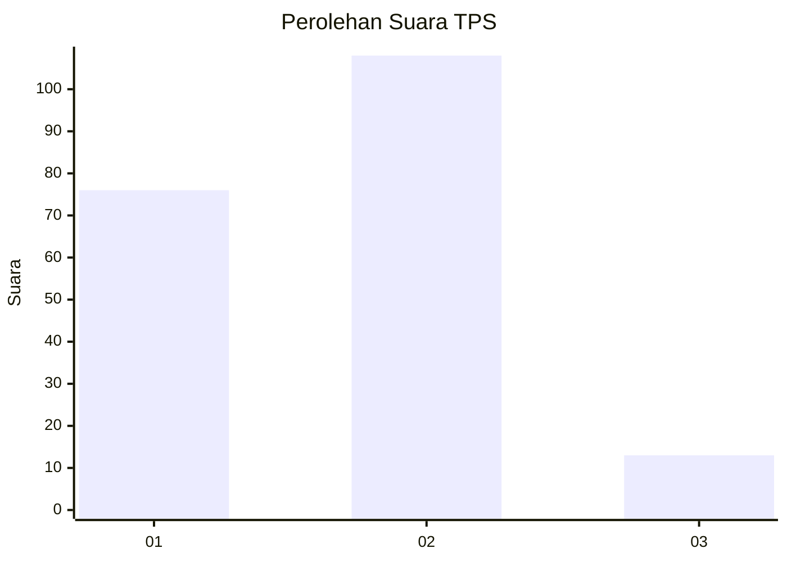

# Hasil

## Grafik

## Tabel

| No. | Nama Paslon    | Suara | Suara (raw) | Persentase |
|:--- |:-------------- | -----:| -----------:| ----------:|
| 1   | ANIES MUHAIMIN | 76    | [76][p-1]   | 38,58      |
| 2   | PRABOWO GIBRAN | 108   | [108][p-2]  | 54,82      |
| 3   | GANJAR MAHFUD  | 13    | [13][p-3]   | 6,60       |

[p-1]: https://github.com/gigit-pemilu/pemilu-2024/blob/main/pilpres/hitung-suara/sub/32-jawa-barat/sub/16-bekasi/sub/08-cikarang-barat/sub/1008-telaga-asih/sub/007-tps/sub/paslon-1.txt
[p-2]: https://github.com/gigit-pemilu/pemilu-2024/blob/main/pilpres/hitung-suara/sub/32-jawa-barat/sub/16-bekasi/sub/08-cikarang-barat/sub/1008-telaga-asih/sub/007-tps/sub/paslon-2.txt
[p-3]: https://github.com/gigit-pemilu/pemilu-2024/blob/main/pilpres/hitung-suara/sub/32-jawa-barat/sub/16-bekasi/sub/08-cikarang-barat/sub/1008-telaga-asih/sub/007-tps/sub/paslon-3.txt

## Foto C Plano

https://sirekap-obj-formc.kpu.go.id/fa62/pemilu/ppwp/32/16/08/10/08/3216081008007-20240214-202746--93e1c9b0-52d9-431d-bf95-705b153930ba.jpg

https://sirekap-obj-formc.kpu.go.id/fa62/pemilu/ppwp/32/16/08/10/08/3216081008007-20240214-202908--09e6973c-8b78-4203-b37b-2c5280353827.jpg

https://sirekap-obj-formc.kpu.go.id/fa62/pemilu/ppwp/32/16/08/10/08/3216081008007-20240214-203011--0f035d21-cc93-41ed-944a-b22b8f27a573.jpg

## Metadata

| Key        | Value               |
| ---------- | ------------------- |
| Time Stamp | 2024-02-24 22:31:28 |

