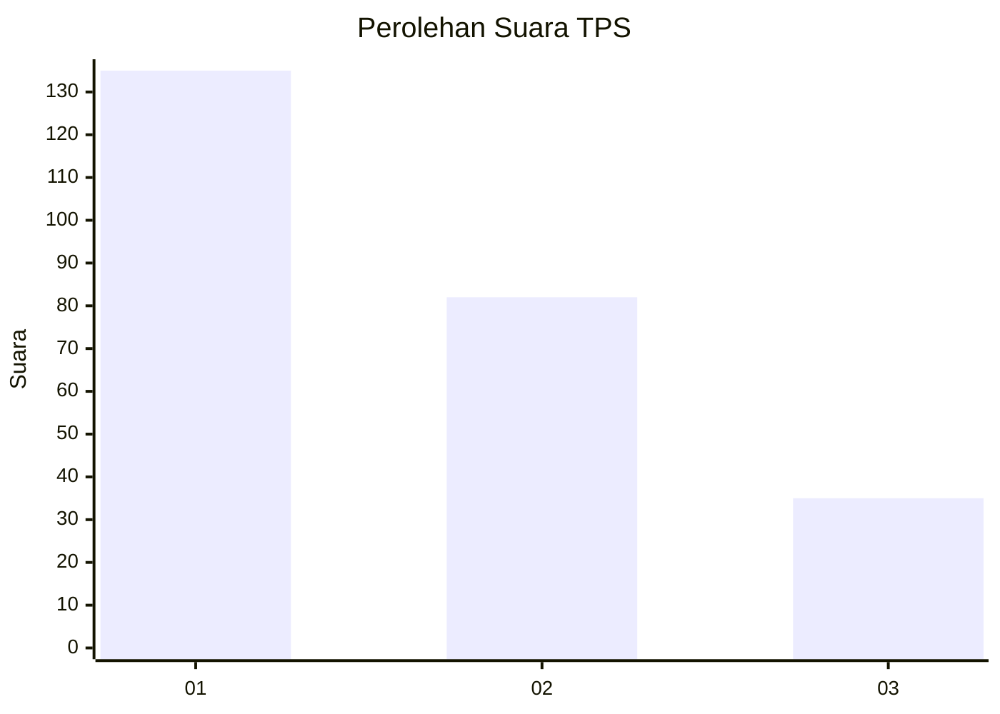
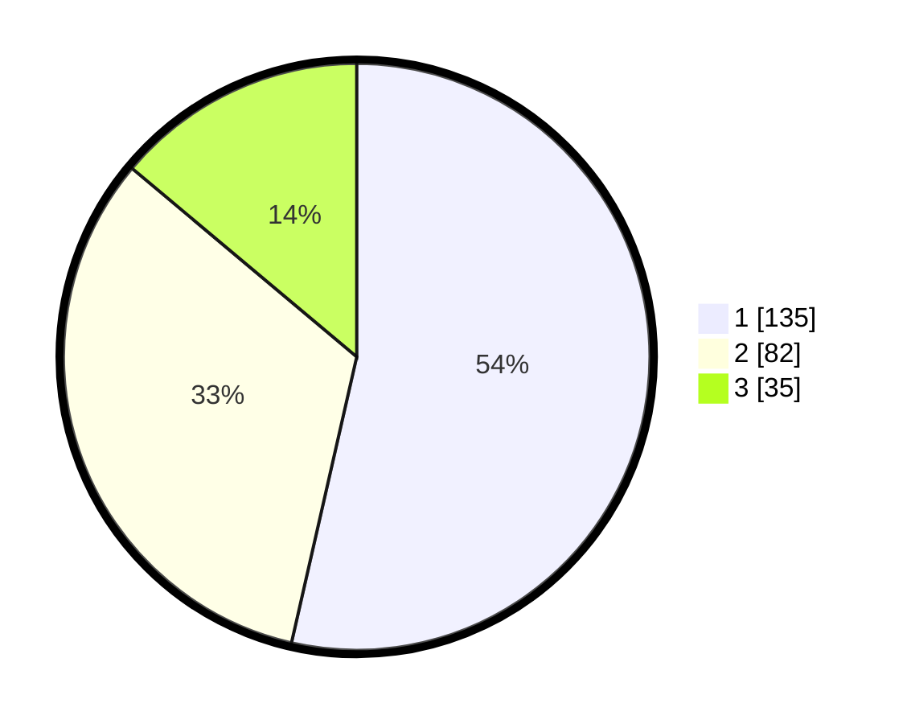

# Hasil

## Grafik

## Tabel

| No. | Nama Paslon    | Suara | Suara (raw) | Persentase |
|:--- |:-------------- | -----:| -----------:| ----------:|
| 1   | ANIES MUHAIMIN | 135   | [135][p-1]  | 53,57      |
| 2   | PRABOWO GIBRAN | 82    | [82][p-2]   | 32,54      |
| 3   | GANJAR MAHFUD  | 35    | [35][p-3]   | 13,89      |

[p-1]: https://github.com/gigit-pemilu/pemilu-2024/blob/main/pilpres/hitung-suara/sub/32-jawa-barat/sub/16-bekasi/sub/08-cikarang-barat/sub/1008-telaga-asih/sub/064-tps/sub/paslon-1.txt
[p-2]: https://github.com/gigit-pemilu/pemilu-2024/blob/main/pilpres/hitung-suara/sub/32-jawa-barat/sub/16-bekasi/sub/08-cikarang-barat/sub/1008-telaga-asih/sub/064-tps/sub/paslon-2.txt
[p-3]: https://github.com/gigit-pemilu/pemilu-2024/blob/main/pilpres/hitung-suara/sub/32-jawa-barat/sub/16-bekasi/sub/08-cikarang-barat/sub/1008-telaga-asih/sub/064-tps/sub/paslon-3.txt

## Foto C Plano

https://sirekap-obj-formc.kpu.go.id/ccfc/pemilu/ppwp/32/16/08/10/08/3216081008064-20240214-222314--c692c24f-96b5-49ab-bcc6-81a7eebea3dd.jpg

https://sirekap-obj-formc.kpu.go.id/ccfc/pemilu/ppwp/32/16/08/10/08/3216081008064-20240215-014828--d23358a6-ef20-45bc-9a7f-6835bfe12afe.jpg

https://sirekap-obj-formc.kpu.go.id/ccfc/pemilu/ppwp/32/16/08/10/08/3216081008064-20240214-222325--44eae1f7-425d-4752-8209-316fe1d13c48.jpg

## Metadata

| Key        | Value               |
| ---------- | ------------------- |
| Time Stamp | 2024-02-24 22:31:28 |

