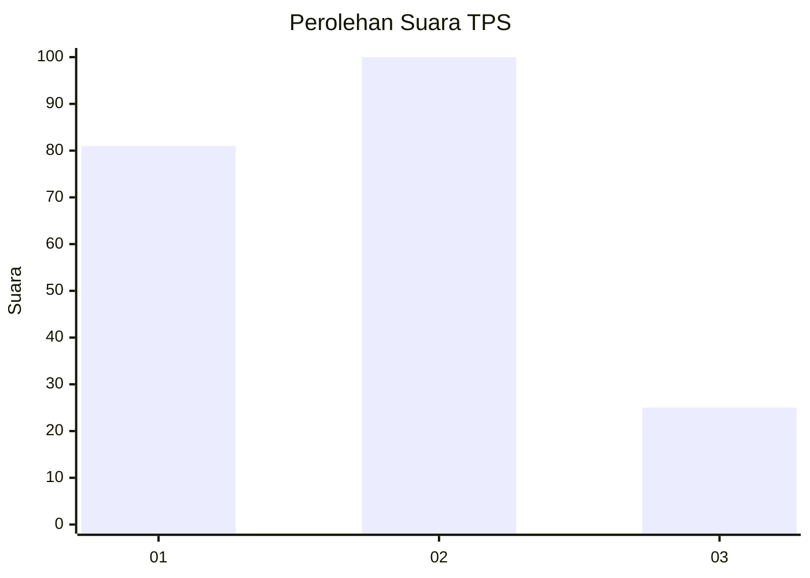
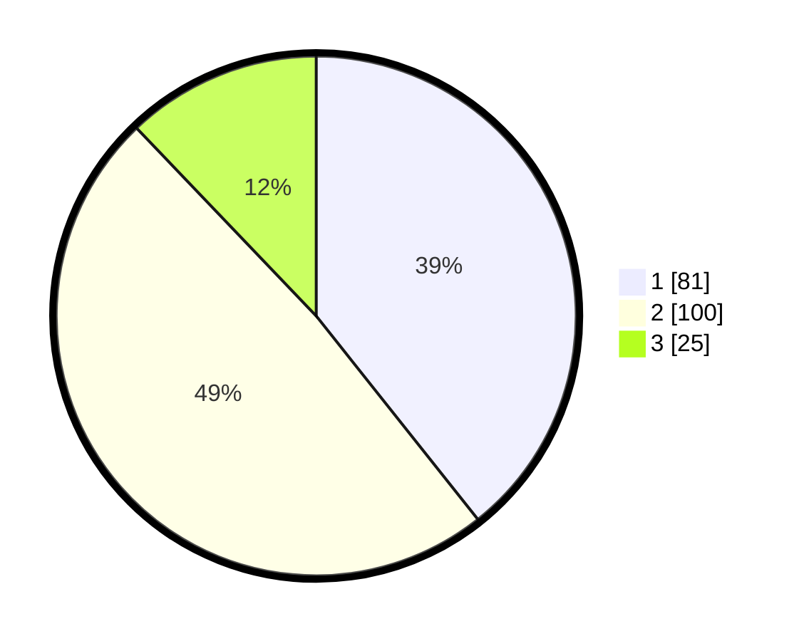

# Hasil

## Grafik

## Tabel

| No. | Nama Paslon    | Suara | Suara (raw) | Persentase |
|:--- |:-------------- | -----:| -----------:| ----------:|
| 1   | ANIES MUHAIMIN | 81    | [81][p-1]   | 39,32      |
| 2   | PRABOWO GIBRAN | 100   | [100][p-2]  | 48,54      |
| 3   | GANJAR MAHFUD  | 25    | [25][p-3]   | 12,14      |

[p-1]: https://github.com/gigit-pemilu/pemilu-2024/blob/main/pilpres/hitung-suara/sub/32-jawa-barat/sub/16-bekasi/sub/08-cikarang-barat/sub/2001-telagamurni/sub/003-tps/sub/paslon-1.txt
[p-2]: https://github.com/gigit-pemilu/pemilu-2024/blob/main/pilpres/hitung-suara/sub/32-jawa-barat/sub/16-bekasi/sub/08-cikarang-barat/sub/2001-telagamurni/sub/003-tps/sub/paslon-2.txt
[p-3]: https://github.com/gigit-pemilu/pemilu-2024/blob/main/pilpres/hitung-suara/sub/32-jawa-barat/sub/16-bekasi/sub/08-cikarang-barat/sub/2001-telagamurni/sub/003-tps/sub/paslon-3.txt

## Foto C Plano

https://sirekap-obj-formc.kpu.go.id/c8e6/pemilu/ppwp/32/16/08/20/01/3216082001003-20240214-202250--e7cbe49b-cf5b-4c16-9acf-6bd4043f3c0e.jpg

https://sirekap-obj-formc.kpu.go.id/c8e6/pemilu/ppwp/32/16/08/20/01/3216082001003-20240214-202822--0f3102f7-5fda-4197-9892-ffe9a64a7fd5.jpg

https://sirekap-obj-formc.kpu.go.id/c8e6/pemilu/ppwp/32/16/08/20/01/3216082001003-20240214-203042--21f9a08b-ca4a-4c34-9c1e-9d07eba8c045.jpg

## Metadata

| Key        | Value               |
| ---------- | ------------------- |
| Time Stamp | 2024-02-15 00:41:44 |

