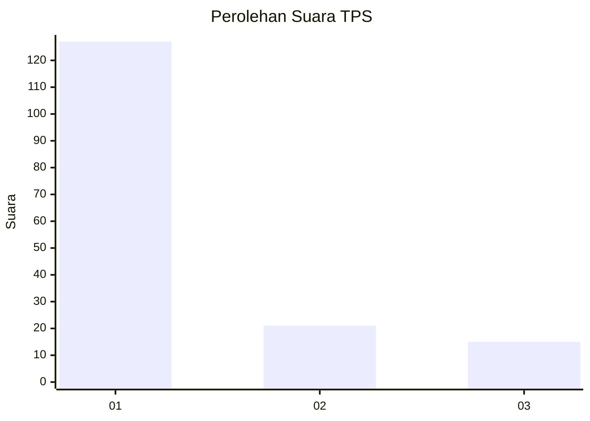
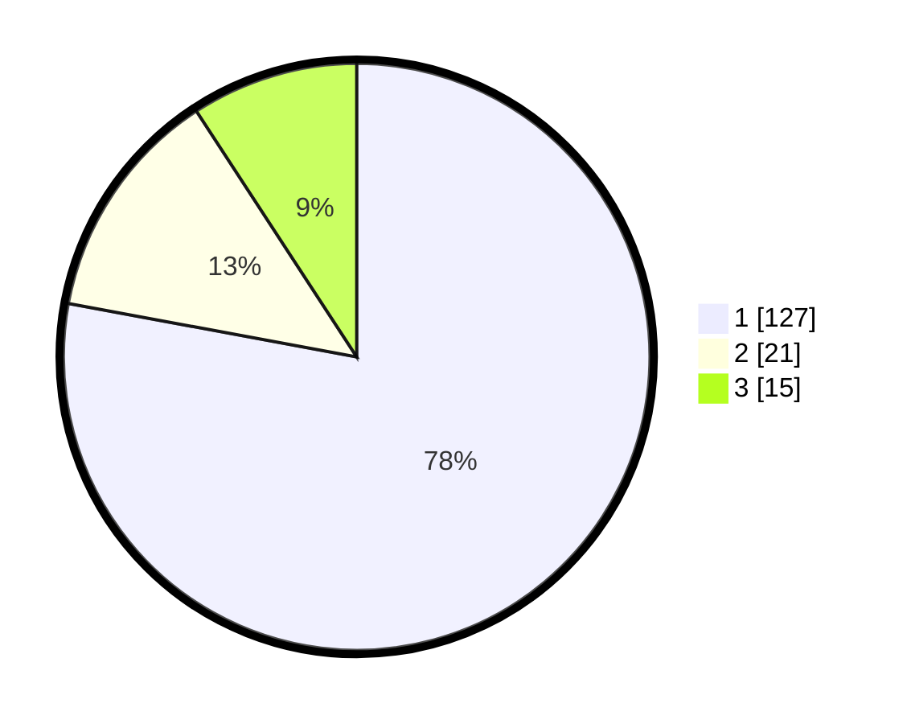

# Hasil

## Grafik

## Tabel

| No. | Nama Paslon    | Suara | Suara (raw) | Persentase |
|:--- |:-------------- | -----:| -----------:| ----------:|
| 1   | ANIES MUHAIMIN | 127   | [127][p-1]  | 77,91      |
| 2   | PRABOWO GIBRAN | 21    | [21][p-2]   | 12,88      |
| 3   | GANJAR MAHFUD  | 15    | [15][p-3]   | 9,20       |

[p-1]: https://github.com/gigit-pemilu/pemilu-2024/blob/main/pilpres/hitung-suara/sub/32-jawa-barat/sub/16-bekasi/sub/08-cikarang-barat/sub/2001-telagamurni/sub/008-tps/sub/paslon-1.txt
[p-2]: https://github.com/gigit-pemilu/pemilu-2024/blob/main/pilpres/hitung-suara/sub/32-jawa-barat/sub/16-bekasi/sub/08-cikarang-barat/sub/2001-telagamurni/sub/008-tps/sub/paslon-2.txt
[p-3]: https://github.com/gigit-pemilu/pemilu-2024/blob/main/pilpres/hitung-suara/sub/32-jawa-barat/sub/16-bekasi/sub/08-cikarang-barat/sub/2001-telagamurni/sub/008-tps/sub/paslon-3.txt

## Foto C Plano

https://sirekap-obj-formc.kpu.go.id/d304/pemilu/ppwp/32/16/08/20/01/3216082001008-20240214-213319--478011a1-5beb-4dc1-abc7-fa2b4d842e4c.jpg

https://sirekap-obj-formc.kpu.go.id/d304/pemilu/ppwp/32/16/08/20/01/3216082001008-20240214-213407--7cda1aba-d140-4f0b-97ca-6b9bf4732f44.jpg

https://sirekap-obj-formc.kpu.go.id/d304/pemilu/ppwp/32/16/08/20/01/3216082001008-20240214-213603--3c3bd765-e0a9-4a37-9b3a-69c950e50c09.jpg

## Metadata

| Key        | Value               |
| ---------- | ------------------- |
| Time Stamp | 2024-02-25 13:00:00 |

