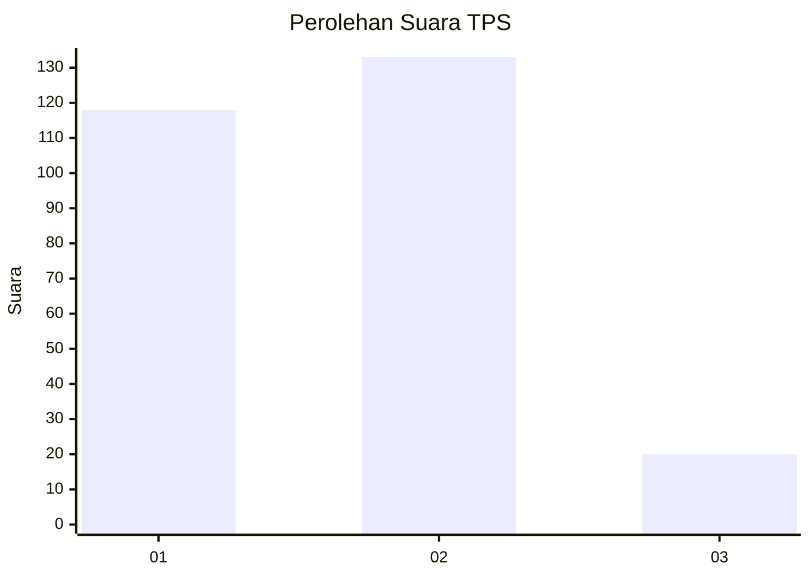
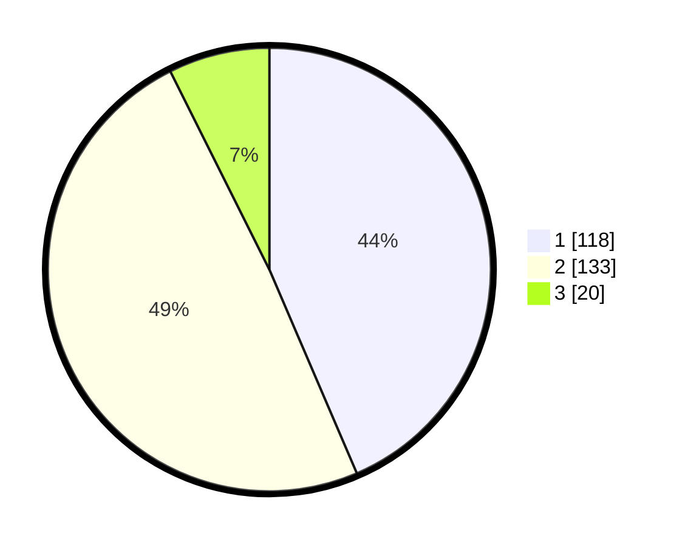

# Hasil

## Grafik

## Tabel

| No. | Nama Paslon    | Suara | Suara (raw) | Persentase |
|:--- |:-------------- | -----:| -----------:| ----------:|
| 1   | ANIES MUHAIMIN | 118   | [118][p-1]  | 43,54      |
| 2   | PRABOWO GIBRAN | 133   | [133][p-2]  | 49,08      |
| 3   | GANJAR MAHFUD  | 20    | [20][p-3]   | 7,38       |

[p-1]: https://github.com/gigit-pemilu/pemilu-2024/blob/main/pilpres/hitung-suara/sub/32-jawa-barat/sub/16-bekasi/sub/08-cikarang-barat/sub/2001-telagamurni/sub/079-tps/sub/paslon-1.txt
[p-2]: https://github.com/gigit-pemilu/pemilu-2024/blob/main/pilpres/hitung-suara/sub/32-jawa-barat/sub/16-bekasi/sub/08-cikarang-barat/sub/2001-telagamurni/sub/079-tps/sub/paslon-2.txt
[p-3]: https://github.com/gigit-pemilu/pemilu-2024/blob/main/pilpres/hitung-suara/sub/32-jawa-barat/sub/16-bekasi/sub/08-cikarang-barat/sub/2001-telagamurni/sub/079-tps/sub/paslon-3.txt

## Foto C Plano

https://sirekap-obj-formc.kpu.go.id/7682/pemilu/ppwp/32/16/08/20/01/3216082001079-20240215-000247--cca6e279-8f10-415c-aa89-fc09d477d1bf.jpg

https://sirekap-obj-formc.kpu.go.id/7682/pemilu/ppwp/32/16/08/20/01/3216082001079-20240215-000505--5d10805a-eb24-4181-baa1-eb1bd5d95d01.jpg

https://sirekap-obj-formc.kpu.go.id/7682/pemilu/ppwp/32/16/08/20/01/3216082001079-20240215-000637--782ba9f3-7f6b-4709-a713-0dd48b8c9803.jpg

## Metadata

| Key        | Value               |
| ---------- | ------------------- |
| Time Stamp | 2024-02-24 22:31:28 |

