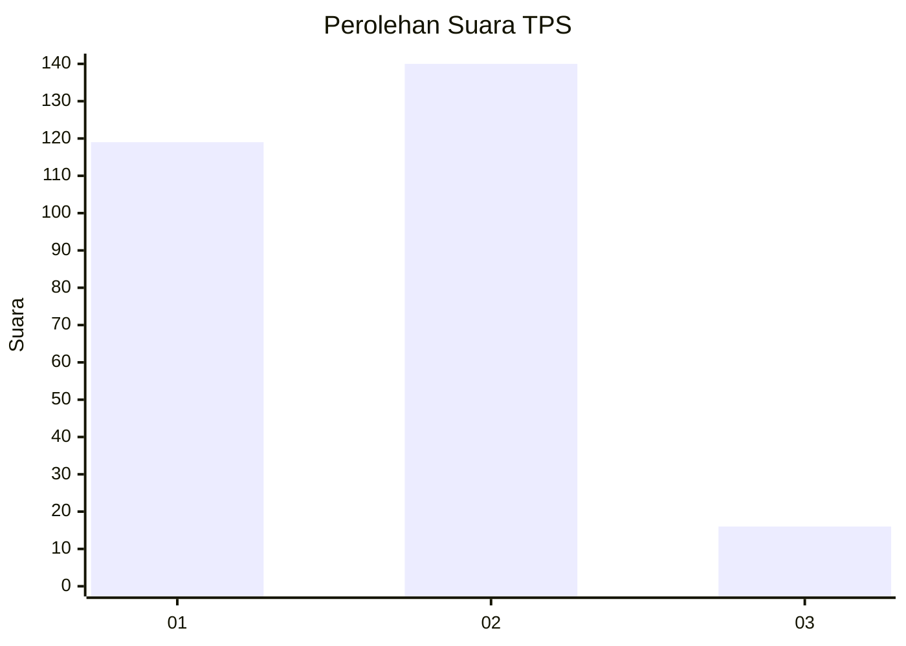
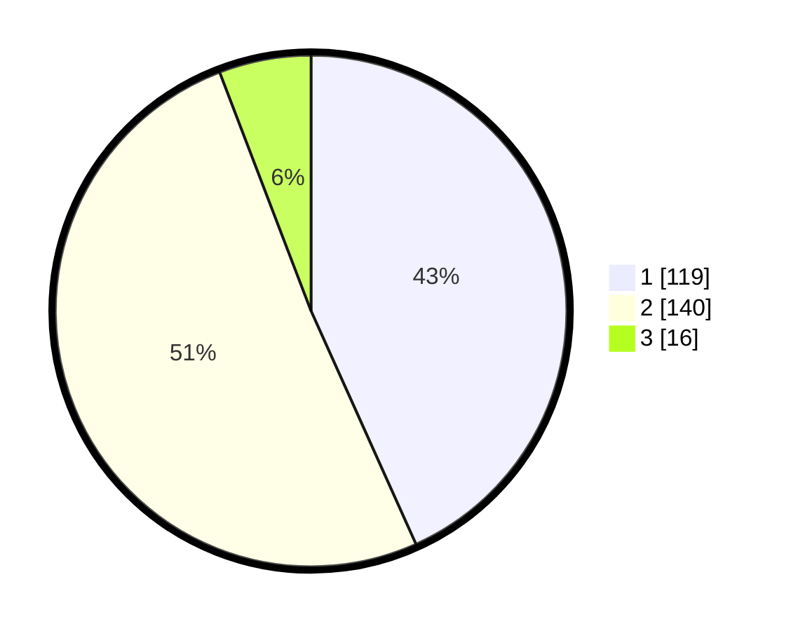

# Hasil

## Grafik

## Tabel

| No. | Nama Paslon    | Suara | Suara (raw) | Persentase |
|:--- |:-------------- | -----:| -----------:| ----------:|
| 1   | ANIES MUHAIMIN | 119   | [119][p-1]  | 43,27      |
| 2   | PRABOWO GIBRAN | 140   | [140][p-2]  | 50,91      |
| 3   | GANJAR MAHFUD  | 16    | [16][p-3]   | 5,82       |

[p-1]: https://github.com/gigit-pemilu/pemilu-2024-32-jawa-barat/blob/main/pilpres/hitung-suara/sub/32-jawa-barat/sub/16-bekasi/sub/08-cikarang-barat/sub/2001-telagamurni/sub/080-tps/sub/paslon-1.txt
[p-2]: https://github.com/gigit-pemilu/pemilu-2024-32-jawa-barat/blob/main/pilpres/hitung-suara/sub/32-jawa-barat/sub/16-bekasi/sub/08-cikarang-barat/sub/2001-telagamurni/sub/080-tps/sub/paslon-2.txt
[p-3]: https://github.com/gigit-pemilu/pemilu-2024-32-jawa-barat/blob/main/pilpres/hitung-suara/sub/32-jawa-barat/sub/16-bekasi/sub/08-cikarang-barat/sub/2001-telagamurni/sub/080-tps/sub/paslon-3.txt

## Foto C Plano

https://sirekap-obj-formc.kpu.go.id/ac4e/pemilu/ppwp/32/16/08/20/01/3216082001080-20240214-155357--30f3b8aa-efa5-4339-9227-85ec35c9ca60.jpg

https://sirekap-obj-formc.kpu.go.id/ac4e/pemilu/ppwp/32/16/08/20/01/3216082001080-20240214-155456--d5acd1d5-0be9-4677-acbf-6e2a33bc34b7.jpg

https://sirekap-obj-formc.kpu.go.id/ac4e/pemilu/ppwp/32/16/08/20/01/3216082001080-20240214-155537--acba7d55-f10a-4ed2-bb88-e67041ed4f8e.jpg

## Metadata

| Key        | Value               |
| ---------- | ------------------- |
| Time Stamp | 2024-02-24 22:31:28 |

