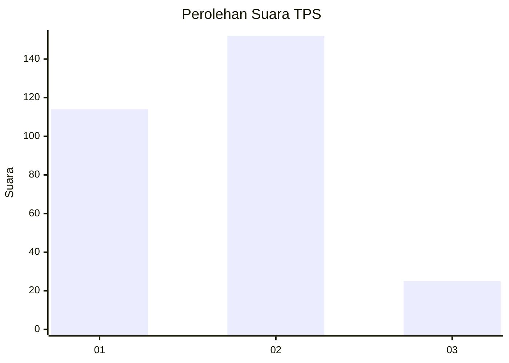
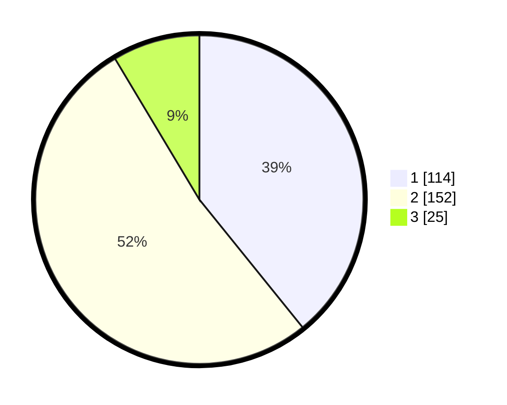

# Hasil

## Grafik

## Tabel

| No. | Nama Paslon    | Suara | Suara (raw) | Persentase |
|:--- |:-------------- | -----:| -----------:| ----------:|
| 1   | ANIES MUHAIMIN | 114   | [114][p-1]  | 39,18      |
| 2   | PRABOWO GIBRAN | 152   | [152][p-2]  | 52,23      |
| 3   | GANJAR MAHFUD  | 25    | [25][p-3]   | 8,59       |

[p-1]: https://github.com/gigit-pemilu/pemilu-2024-32-jawa-barat/blob/main/pilpres/hitung-suara/sub/32-jawa-barat/sub/16-bekasi/sub/08-cikarang-barat/sub/2001-telagamurni/sub/084-tps/sub/paslon-1.txt
[p-2]: https://github.com/gigit-pemilu/pemilu-2024-32-jawa-barat/blob/main/pilpres/hitung-suara/sub/32-jawa-barat/sub/16-bekasi/sub/08-cikarang-barat/sub/2001-telagamurni/sub/084-tps/sub/paslon-2.txt
[p-3]: https://github.com/gigit-pemilu/pemilu-2024-32-jawa-barat/blob/main/pilpres/hitung-suara/sub/32-jawa-barat/sub/16-bekasi/sub/08-cikarang-barat/sub/2001-telagamurni/sub/084-tps/sub/paslon-3.txt

## Foto C Plano

https://sirekap-obj-formc.kpu.go.id/4156/pemilu/ppwp/32/16/08/20/01/3216082001084-20240214-220721--f6742afc-a057-4004-910c-468348a672fd.jpg

https://sirekap-obj-formc.kpu.go.id/4156/pemilu/ppwp/32/16/08/20/01/3216082001084-20240214-221020--b52e53bc-d839-42d4-959a-00bc4422d232.jpg

https://sirekap-obj-formc.kpu.go.id/4156/pemilu/ppwp/32/16/08/20/01/3216082001084-20240214-221209--862a74a8-3a54-458d-b9d2-57b2799af850.jpg

## Metadata

| Key        | Value               |
| ---------- | ------------------- |
| Time Stamp | 2024-02-24 22:31:28 |

