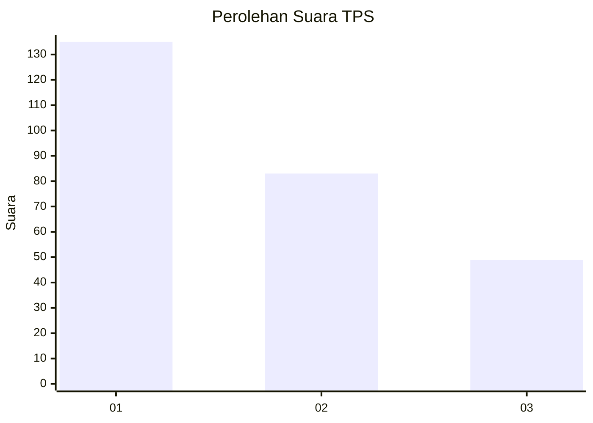
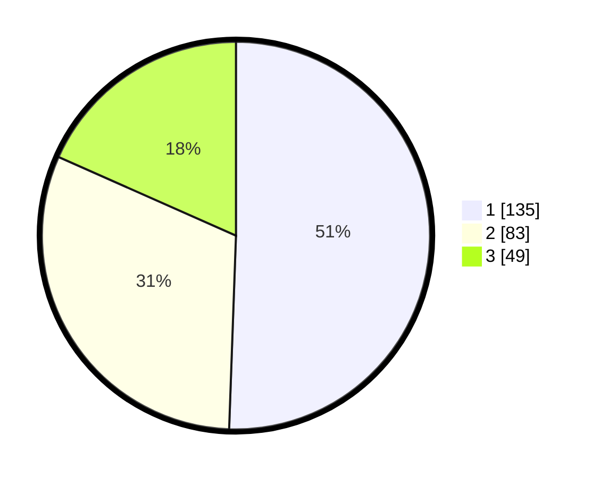

# Hasil

## Grafik

## Tabel

| No. | Nama Paslon    | Suara | Suara (raw) | Persentase |
|:--- |:-------------- | -----:| -----------:| ----------:|
| 1   | ANIES MUHAIMIN | 135   | [135][p-1]  | 50,56      |
| 2   | PRABOWO GIBRAN | 83    | [83][p-2]   | 31,09      |
| 3   | GANJAR MAHFUD  | 49    | [49][p-3]   | 18,35      |

[p-1]: https://github.com/gigit-pemilu/pemilu-2024/blob/main/pilpres/hitung-suara/sub/32-jawa-barat/sub/16-bekasi/sub/08-cikarang-barat/sub/2001-telagamurni/sub/101-tps/sub/paslon-1.txt
[p-2]: https://github.com/gigit-pemilu/pemilu-2024/blob/main/pilpres/hitung-suara/sub/32-jawa-barat/sub/16-bekasi/sub/08-cikarang-barat/sub/2001-telagamurni/sub/101-tps/sub/paslon-2.txt
[p-3]: https://github.com/gigit-pemilu/pemilu-2024/blob/main/pilpres/hitung-suara/sub/32-jawa-barat/sub/16-bekasi/sub/08-cikarang-barat/sub/2001-telagamurni/sub/101-tps/sub/paslon-3.txt

## Foto C Plano

https://sirekap-obj-formc.kpu.go.id/0e6a/pemilu/ppwp/32/16/08/20/01/3216082001101-20240214-162237--d994bbad-254f-42eb-ba84-1c7a15787a3f.jpg

https://sirekap-obj-formc.kpu.go.id/0e6a/pemilu/ppwp/32/16/08/20/01/3216082001101-20240214-155649--3668560b-5a40-499d-b3df-c18c8b94311d.jpg

https://sirekap-obj-formc.kpu.go.id/0e6a/pemilu/ppwp/32/16/08/20/01/3216082001101-20240214-195118--9dbaad4e-ba6a-4487-a482-d6d1e47ea0fd.jpg

## Metadata

| Key        | Value               |
| ---------- | ------------------- |
| Time Stamp | 2024-02-14 21:46:01 |

