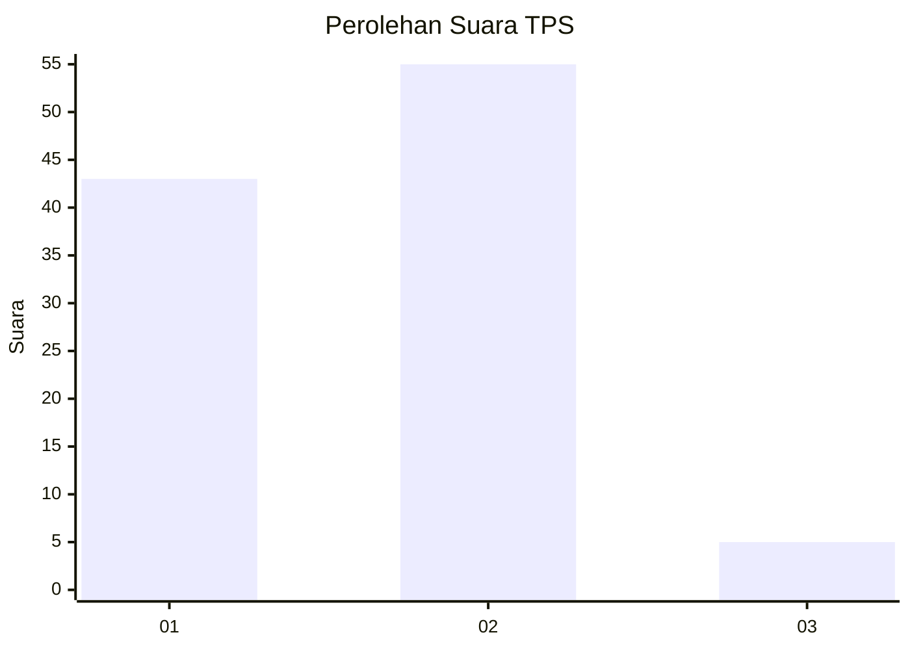
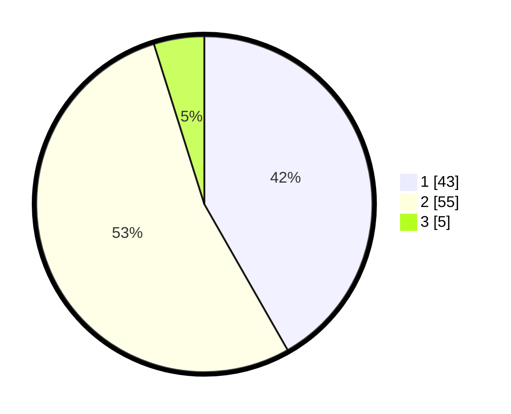

# Hasil

## Grafik

## Tabel

| No. | Nama Paslon    | Suara | Suara (raw) | Persentase |
|:--- |:-------------- | -----:| -----------:| ----------:|
| 1   | ANIES MUHAIMIN | 43    | [43][p-1]   | 41,75      |
| 2   | PRABOWO GIBRAN | 55    | [55][p-2]   | 53,40      |
| 3   | GANJAR MAHFUD  | 5     | [5][p-3]    | 4,85       |

[p-1]: https://github.com/gigit-pemilu/pemilu-2024/blob/main/pilpres/hitung-suara/sub/32-jawa-barat/sub/16-bekasi/sub/08-cikarang-barat/sub/2001-telagamurni/sub/135-tps/sub/paslon-1.txt
[p-2]: https://github.com/gigit-pemilu/pemilu-2024/blob/main/pilpres/hitung-suara/sub/32-jawa-barat/sub/16-bekasi/sub/08-cikarang-barat/sub/2001-telagamurni/sub/135-tps/sub/paslon-2.txt
[p-3]: https://github.com/gigit-pemilu/pemilu-2024/blob/main/pilpres/hitung-suara/sub/32-jawa-barat/sub/16-bekasi/sub/08-cikarang-barat/sub/2001-telagamurni/sub/135-tps/sub/paslon-3.txt

## Foto C Plano

https://sirekap-obj-formc.kpu.go.id/7aaf/pemilu/ppwp/32/16/08/20/01/3216082001135-20240214-220845--87904b05-0046-4334-80ed-c742a4bed687.jpg

https://sirekap-obj-formc.kpu.go.id/7aaf/pemilu/ppwp/32/16/08/20/01/3216082001135-20240214-220903--a6afb1e5-3726-4be8-acff-4fc186f1d4de.jpg

https://sirekap-obj-formc.kpu.go.id/7aaf/pemilu/ppwp/32/16/08/20/01/3216082001135-20240214-220920--7e19c1c4-a303-4ff2-a60f-56b46d40fe2d.jpg

## Metadata

| Key        | Value               |
| ---------- | ------------------- |
| Time Stamp | 2024-02-16 13:30:32 |

