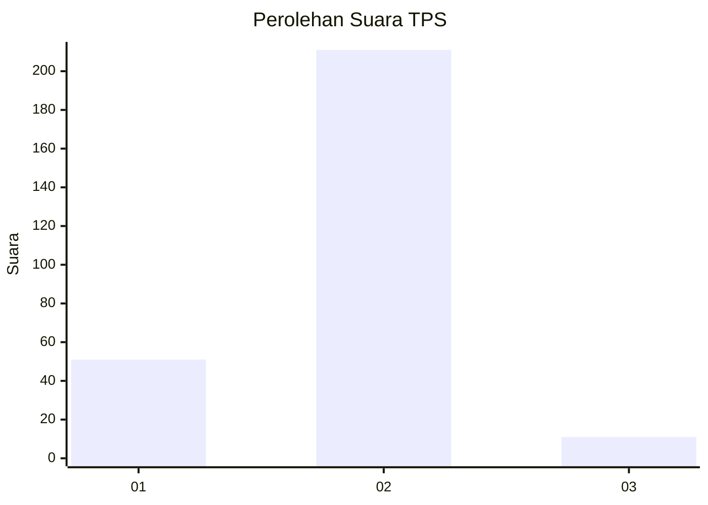
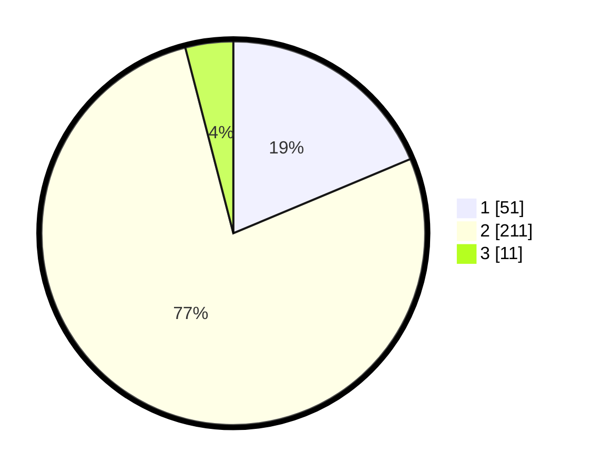

# Hasil

## Grafik

## Tabel

| No. | Nama Paslon    | Suara | Suara (raw) | Persentase |
|:--- |:-------------- | -----:| -----------:| ----------:|
| 1   | ANIES MUHAIMIN | 51    | [51][p-1]   | 18,68      |
| 2   | PRABOWO GIBRAN | 211   | [211][p-2]  | 77,29      |
| 3   | GANJAR MAHFUD  | 11    | [11][p-3]   | 4,03       |

[p-1]: https://github.com/gigit-pemilu/pemilu-2024-32-jawa-barat/blob/main/pilpres/hitung-suara/sub/32-jawa-barat/sub/16-bekasi/sub/08-cikarang-barat/sub/2003-jatiwangi/sub/005-tps/sub/paslon-1.txt
[p-2]: https://github.com/gigit-pemilu/pemilu-2024-32-jawa-barat/blob/main/pilpres/hitung-suara/sub/32-jawa-barat/sub/16-bekasi/sub/08-cikarang-barat/sub/2003-jatiwangi/sub/005-tps/sub/paslon-2.txt
[p-3]: https://github.com/gigit-pemilu/pemilu-2024-32-jawa-barat/blob/main/pilpres/hitung-suara/sub/32-jawa-barat/sub/16-bekasi/sub/08-cikarang-barat/sub/2003-jatiwangi/sub/005-tps/sub/paslon-3.txt

## Foto C Plano

https://sirekap-obj-formc.kpu.go.id/8eb8/pemilu/ppwp/32/16/08/20/03/3216082003005-20240214-234239--d81a2fd6-18be-4707-a3fe-a6bbc736974f.jpg

https://sirekap-obj-formc.kpu.go.id/8eb8/pemilu/ppwp/32/16/08/20/03/3216082003005-20240214-234431--ae561b15-6012-423a-a737-ea2fd0b9acf7.jpg

https://sirekap-obj-formc.kpu.go.id/8eb8/pemilu/ppwp/32/16/08/20/03/3216082003005-20240214-234523--0821991b-41ee-4eef-8edd-d673bc3b62bf.jpg

## Metadata

| Key        | Value               |
| ---------- | ------------------- |
| Time Stamp | 2024-02-24 22:31:28 |

