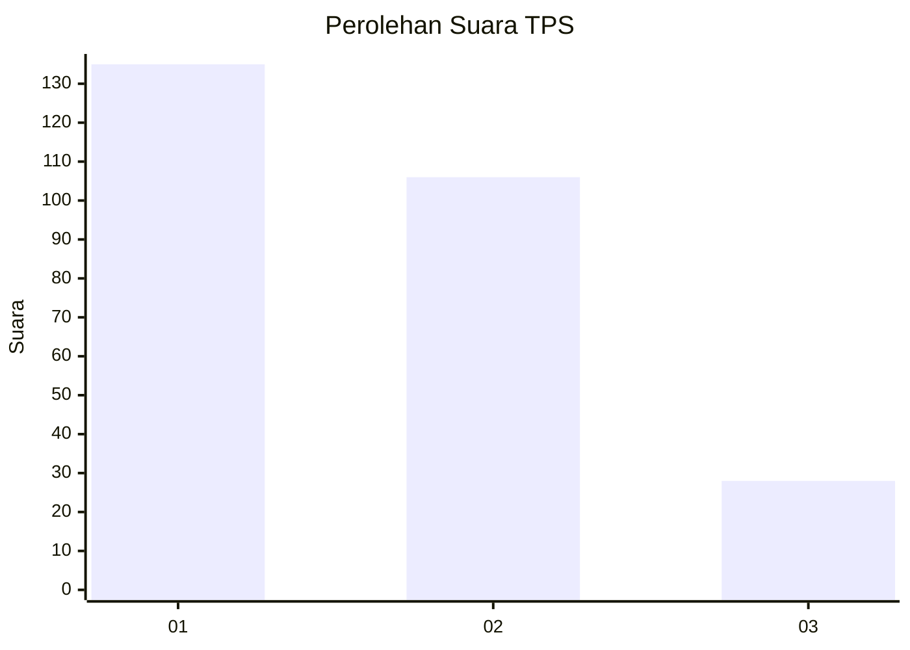
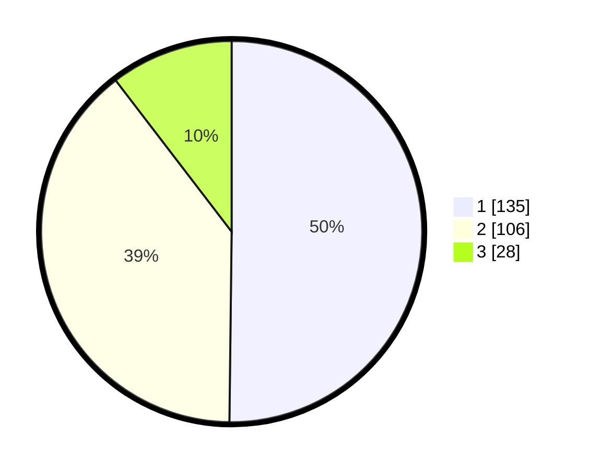

# Hasil

## Grafik

## Tabel

| No. | Nama Paslon    | Suara | Suara (raw) | Persentase |
|:--- |:-------------- | -----:| -----------:| ----------:|
| 1   | ANIES MUHAIMIN | 135   | [135][p-1]  | 50,19      |
| 2   | PRABOWO GIBRAN | 106   | [106][p-2]  | 39,41      |
| 3   | GANJAR MAHFUD  | 28    | [28][p-3]   | 10,41      |

[p-1]: https://github.com/gigit-pemilu/pemilu-2024/blob/main/pilpres/hitung-suara/sub/32-jawa-barat/sub/16-bekasi/sub/08-cikarang-barat/sub/2009-kalijaya/sub/060-tps/sub/paslon-1.txt
[p-2]: https://github.com/gigit-pemilu/pemilu-2024/blob/main/pilpres/hitung-suara/sub/32-jawa-barat/sub/16-bekasi/sub/08-cikarang-barat/sub/2009-kalijaya/sub/060-tps/sub/paslon-2.txt
[p-3]: https://github.com/gigit-pemilu/pemilu-2024/blob/main/pilpres/hitung-suara/sub/32-jawa-barat/sub/16-bekasi/sub/08-cikarang-barat/sub/2009-kalijaya/sub/060-tps/sub/paslon-3.txt

## Foto C Plano

https://sirekap-obj-formc.kpu.go.id/ed58/pemilu/ppwp/32/16/08/20/09/3216082009060-20240214-225553--afb4aac9-a339-443c-bbd4-0dc067f8f187.jpg

https://sirekap-obj-formc.kpu.go.id/ed58/pemilu/ppwp/32/16/08/20/09/3216082009060-20240214-225637--63efe4ca-ff1e-4b7f-b475-14eca37681ca.jpg

https://sirekap-obj-formc.kpu.go.id/ed58/pemilu/ppwp/32/16/08/20/09/3216082009060-20240214-225719--4e0e65d1-19d1-4fa1-ad09-6960a5e54fcb.jpg

## Metadata

| Key        | Value               |
| ---------- | ------------------- |
| Time Stamp | 2024-02-24 22:31:28 |

