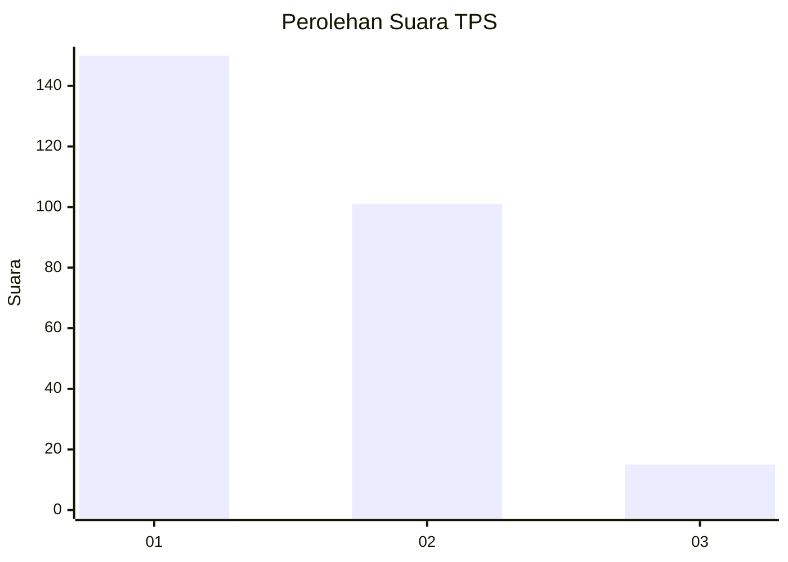
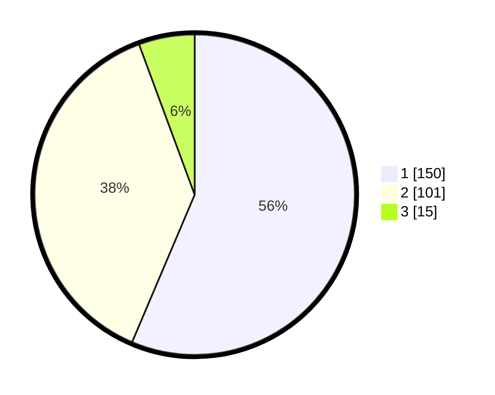

# Hasil

## Grafik

## Tabel

| No. | Nama Paslon    | Suara | Suara (raw) | Persentase |
|:--- |:-------------- | -----:| -----------:| ----------:|
| 1   | ANIES MUHAIMIN | 150   | [150][p-1]  | 56,39      |
| 2   | PRABOWO GIBRAN | 101   | [101][p-2]  | 37,97      |
| 3   | GANJAR MAHFUD  | 15    | [15][p-3]   | 5,64       |

[p-1]: https://github.com/gigit-pemilu/pemilu-2024/blob/main/pilpres/hitung-suara/sub/32-jawa-barat/sub/16-bekasi/sub/08-cikarang-barat/sub/2010-telajung/sub/029-tps/sub/paslon-1.txt
[p-2]: https://github.com/gigit-pemilu/pemilu-2024/blob/main/pilpres/hitung-suara/sub/32-jawa-barat/sub/16-bekasi/sub/08-cikarang-barat/sub/2010-telajung/sub/029-tps/sub/paslon-2.txt
[p-3]: https://github.com/gigit-pemilu/pemilu-2024/blob/main/pilpres/hitung-suara/sub/32-jawa-barat/sub/16-bekasi/sub/08-cikarang-barat/sub/2010-telajung/sub/029-tps/sub/paslon-3.txt

## Foto C Plano

https://sirekap-obj-formc.kpu.go.id/7aee/pemilu/ppwp/32/16/08/20/10/3216082010029-20240214-233912--54730366-78ef-4273-b31a-969f01752eed.jpg

https://sirekap-obj-formc.kpu.go.id/7aee/pemilu/ppwp/32/16/08/20/10/3216082010029-20240214-234516--1b067f9c-df5b-438b-b82b-c257f2d35701.jpg

https://sirekap-obj-formc.kpu.go.id/7aee/pemilu/ppwp/32/16/08/20/10/3216082010029-20240214-234304--924578f2-c3fd-459e-a239-94628e63c498.jpg

## Metadata

| Key        | Value               |
| ---------- | ------------------- |
| Time Stamp | 2024-02-25 13:00:00 |

