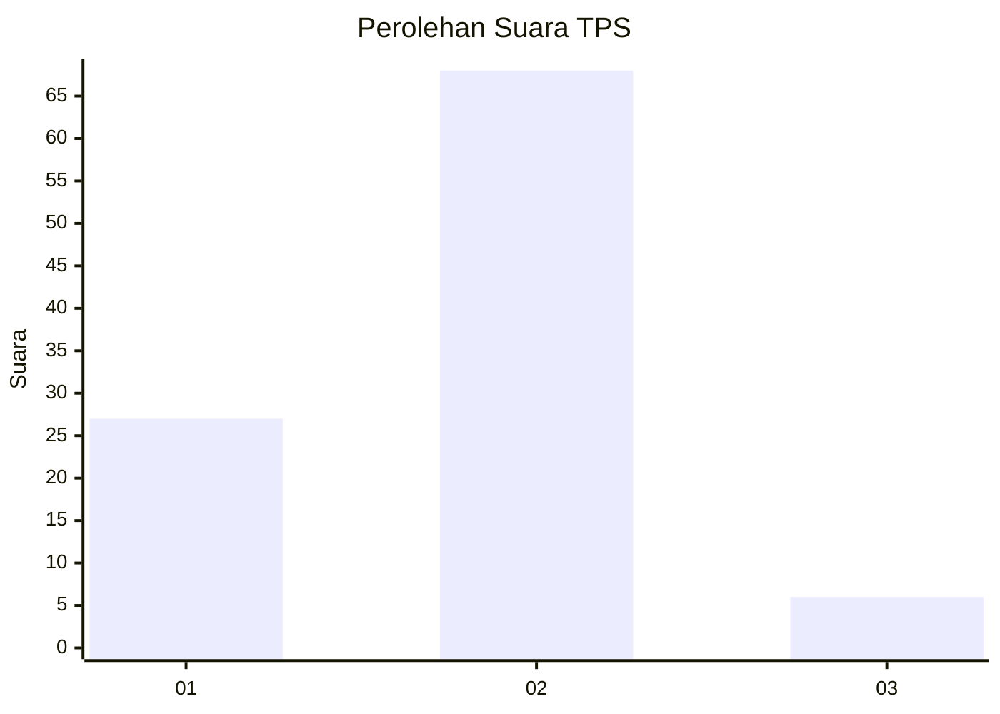
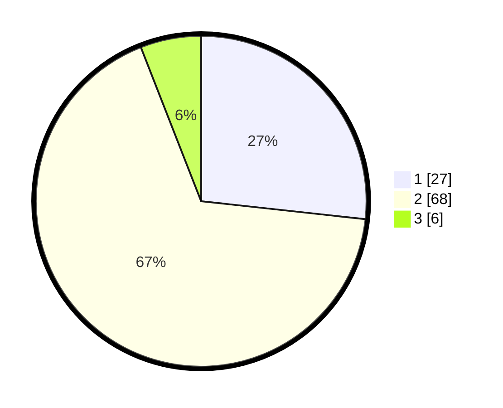

# Hasil

## Grafik

## Tabel

| No. | Nama Paslon    | Suara | Suara (raw) | Persentase |
|:--- |:-------------- | -----:| -----------:| ----------:|
| 1   | ANIES MUHAIMIN | 27    | [27][p-1]   | 26,73      |
| 2   | PRABOWO GIBRAN | 68    | [68][p-2]   | 67,33      |
| 3   | GANJAR MAHFUD  | 6     | [6][p-3]    | 5,94       |

[p-1]: https://github.com/gigit-pemilu/pemilu-2024/blob/main/pilpres/hitung-suara/sub/32-jawa-barat/sub/16-bekasi/sub/09-cikarang-utara/sub/2003-karangasih/sub/019-tps/sub/paslon-1.txt
[p-2]: https://github.com/gigit-pemilu/pemilu-2024/blob/main/pilpres/hitung-suara/sub/32-jawa-barat/sub/16-bekasi/sub/09-cikarang-utara/sub/2003-karangasih/sub/019-tps/sub/paslon-2.txt
[p-3]: https://github.com/gigit-pemilu/pemilu-2024/blob/main/pilpres/hitung-suara/sub/32-jawa-barat/sub/16-bekasi/sub/09-cikarang-utara/sub/2003-karangasih/sub/019-tps/sub/paslon-3.txt

## Foto C Plano

https://sirekap-obj-formc.kpu.go.id/1b97/pemilu/ppwp/32/16/09/20/03/3216092003019-20240214-234244--2c993610-554f-4aeb-8861-cd60b49e33c4.jpg

https://sirekap-obj-formc.kpu.go.id/1b97/pemilu/ppwp/32/16/09/20/03/3216092003019-20240214-233632--eec32b9e-11d0-4c17-8edc-e3800478c81e.jpg

https://sirekap-obj-formc.kpu.go.id/1b97/pemilu/ppwp/32/16/09/20/03/3216092003019-20240214-233911--d726f991-af31-408f-b4f1-5e9d758d2f2c.jpg

## Metadata

| Key        | Value               |
| ---------- | ------------------- |
| Time Stamp | 2024-02-24 22:31:28 |

