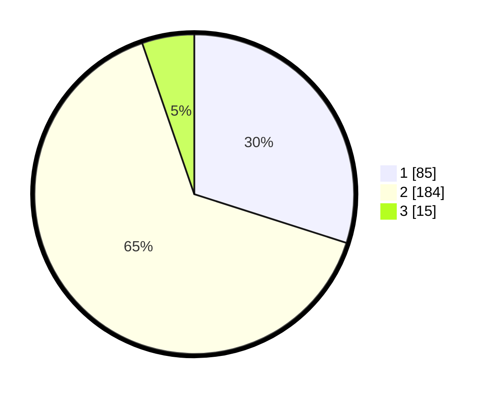

# Hasil

## Grafik

## Tabel

| No. | Nama Paslon    | Suara | Suara (raw) | Persentase |
|:--- |:-------------- | -----:| -----------:| ----------:|
| 1   | ANIES MUHAIMIN | 85    | [85][p-1]   | 29,93      |
| 2   | PRABOWO GIBRAN | 184   | [184][p-2]  | 64,79      |
| 3   | GANJAR MAHFUD  | 15    | [15][p-3]   | 5,28       |

[p-1]: https://github.com/gigit-pemilu/pemilu-2024/blob/main/pilpres/hitung-suara/sub/32-jawa-barat/sub/16-bekasi/sub/09-cikarang-utara/sub/2003-karangasih/sub/030-tps/sub/paslon-1.txt
[p-2]: https://github.com/gigit-pemilu/pemilu-2024/blob/main/pilpres/hitung-suara/sub/32-jawa-barat/sub/16-bekasi/sub/09-cikarang-utara/sub/2003-karangasih/sub/030-tps/sub/paslon-2.txt
[p-3]: https://github.com/gigit-pemilu/pemilu-2024/blob/main/pilpres/hitung-suara/sub/32-jawa-barat/sub/16-bekasi/sub/09-cikarang-utara/sub/2003-karangasih/sub/030-tps/sub/paslon-3.txt

## Foto C Plano

https://sirekap-obj-formc.kpu.go.id/f435/pemilu/ppwp/32/16/09/20/03/3216092003030-20240215-020615--6edf7ee3-84ad-4297-bfd1-b3c2937a89f1.jpg

https://sirekap-obj-formc.kpu.go.id/f435/pemilu/ppwp/32/16/09/20/03/3216092003030-20240215-020722--f532de36-933b-4195-8963-1dbf2fd044a8.jpg

https://sirekap-obj-formc.kpu.go.id/f435/pemilu/ppwp/32/16/09/20/03/3216092003030-20240215-020801--71f0fb65-8b1d-48e2-bef5-23cc712f37ed.jpg

## Metadata

| Key        | Value               |
| ---------- | ------------------- |
| Time Stamp | 2024-02-25 23:00:00 |

