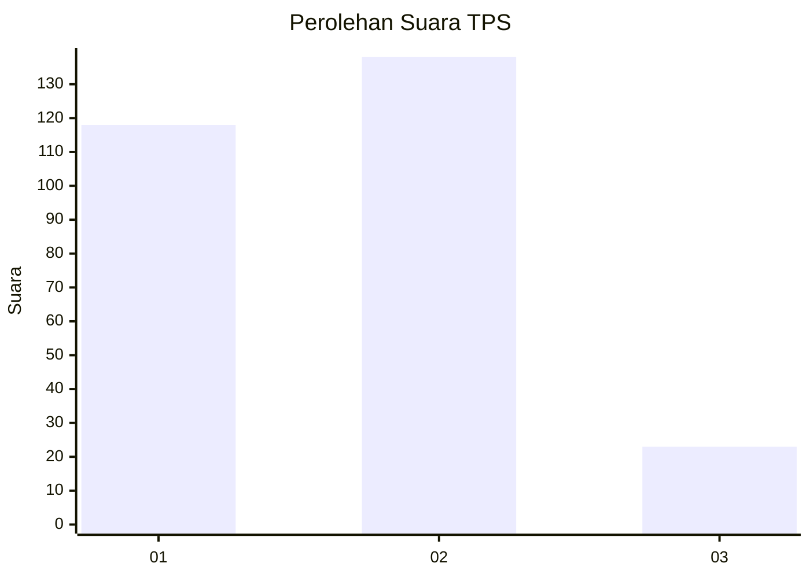
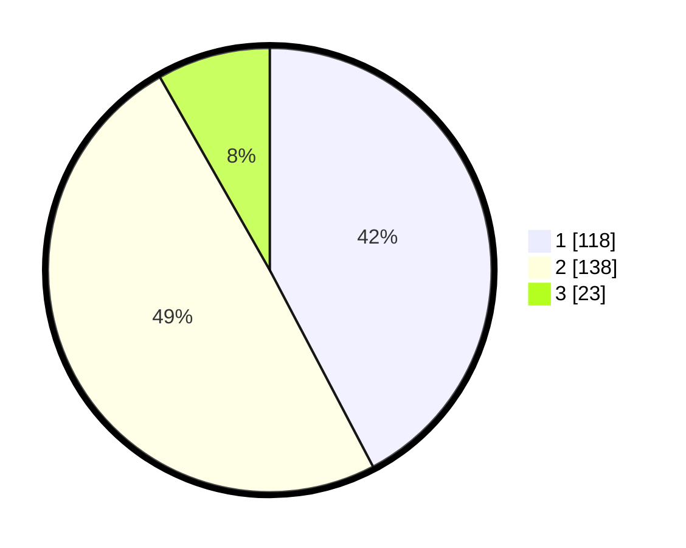

# Hasil

## Grafik

## Tabel

| No. | Nama Paslon    | Suara | Suara (raw) | Persentase |
|:--- |:-------------- | -----:| -----------:| ----------:|
| 1   | ANIES MUHAIMIN | 118   | [118][p-1]  | 42,29      |
| 2   | PRABOWO GIBRAN | 138   | [138][p-2]  | 49,46      |
| 3   | GANJAR MAHFUD  | 23    | [23][p-3]   | 8,24       |

[p-1]: https://github.com/gigit-pemilu/pemilu-2024/blob/main/pilpres/hitung-suara/sub/32-jawa-barat/sub/16-bekasi/sub/09-cikarang-utara/sub/2004-waluya/sub/020-tps/sub/paslon-1.txt
[p-2]: https://github.com/gigit-pemilu/pemilu-2024/blob/main/pilpres/hitung-suara/sub/32-jawa-barat/sub/16-bekasi/sub/09-cikarang-utara/sub/2004-waluya/sub/020-tps/sub/paslon-2.txt
[p-3]: https://github.com/gigit-pemilu/pemilu-2024/blob/main/pilpres/hitung-suara/sub/32-jawa-barat/sub/16-bekasi/sub/09-cikarang-utara/sub/2004-waluya/sub/020-tps/sub/paslon-3.txt

## Foto C Plano

https://sirekap-obj-formc.kpu.go.id/e734/pemilu/ppwp/32/16/09/20/04/3216092004020-20240214-204339--ff288c17-0a41-46de-9878-c6a9136ddc0f.jpg

https://sirekap-obj-formc.kpu.go.id/e734/pemilu/ppwp/32/16/09/20/04/3216092004020-20240214-155551--842e422b-f039-4baf-add5-f00edf55d18c.jpg

https://sirekap-obj-formc.kpu.go.id/e734/pemilu/ppwp/32/16/09/20/04/3216092004020-20240214-155625--9c926c2a-e49c-48d2-bc6f-9af5582234e1.jpg

## Metadata

| Key        | Value               |
| ---------- | ------------------- |
| Time Stamp | 2024-02-15 15:00:29 |

