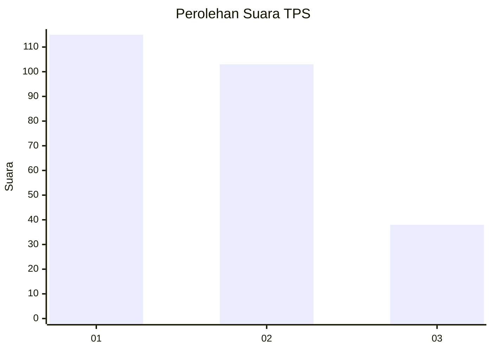
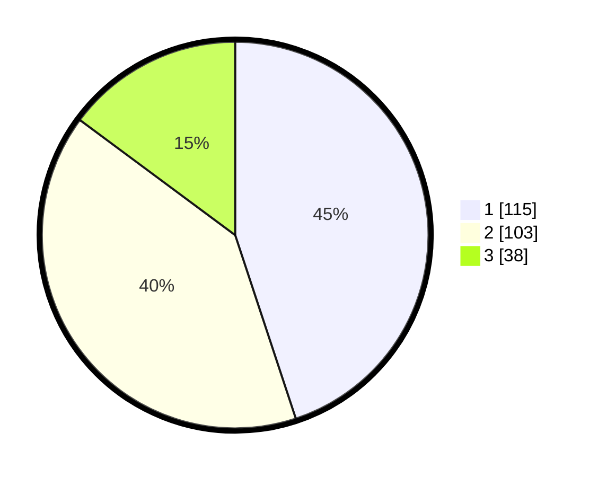

# Hasil

## Grafik

## Tabel

| No. | Nama Paslon    | Suara | Suara (raw) | Persentase |
|:--- |:-------------- | -----:| -----------:| ----------:|
| 1   | ANIES MUHAIMIN | 115   | [115][p-1]  | 44,92      |
| 2   | PRABOWO GIBRAN | 103   | [103][p-2]  | 40,23      |
| 3   | GANJAR MAHFUD  | 38    | [38][p-3]   | 14,84      |

[p-1]: https://github.com/gigit-pemilu/pemilu-2024/blob/main/pilpres/hitung-suara/sub/32-jawa-barat/sub/16-bekasi/sub/09-cikarang-utara/sub/2004-waluya/sub/050-tps/sub/paslon-1.txt
[p-2]: https://github.com/gigit-pemilu/pemilu-2024/blob/main/pilpres/hitung-suara/sub/32-jawa-barat/sub/16-bekasi/sub/09-cikarang-utara/sub/2004-waluya/sub/050-tps/sub/paslon-2.txt
[p-3]: https://github.com/gigit-pemilu/pemilu-2024/blob/main/pilpres/hitung-suara/sub/32-jawa-barat/sub/16-bekasi/sub/09-cikarang-utara/sub/2004-waluya/sub/050-tps/sub/paslon-3.txt

## Foto C Plano

https://sirekap-obj-formc.kpu.go.id/dd70/pemilu/ppwp/32/16/09/20/04/3216092004050-20240215-004351--98d212fc-dd24-4e14-9069-718a65fefb28.jpg

https://sirekap-obj-formc.kpu.go.id/dd70/pemilu/ppwp/32/16/09/20/04/3216092004050-20240215-004437--5352d256-6dd6-4bc6-a5bc-36e36e446373.jpg

https://sirekap-obj-formc.kpu.go.id/dd70/pemilu/ppwp/32/16/09/20/04/3216092004050-20240215-004727--6ddb970f-309d-4120-9c46-76b75e574f4d.jpg

## Metadata

| Key        | Value               |
| ---------- | ------------------- |
| Time Stamp | 2024-02-24 22:31:28 |

