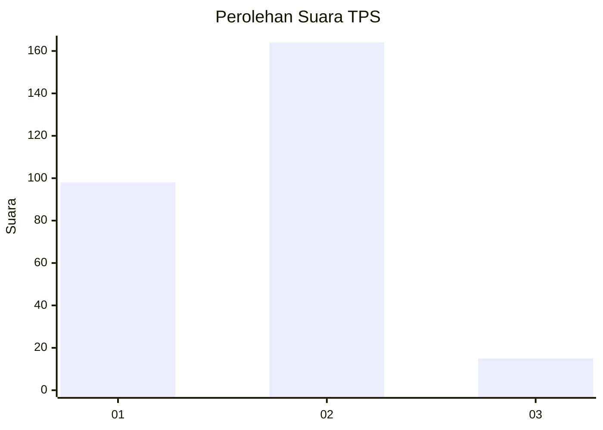
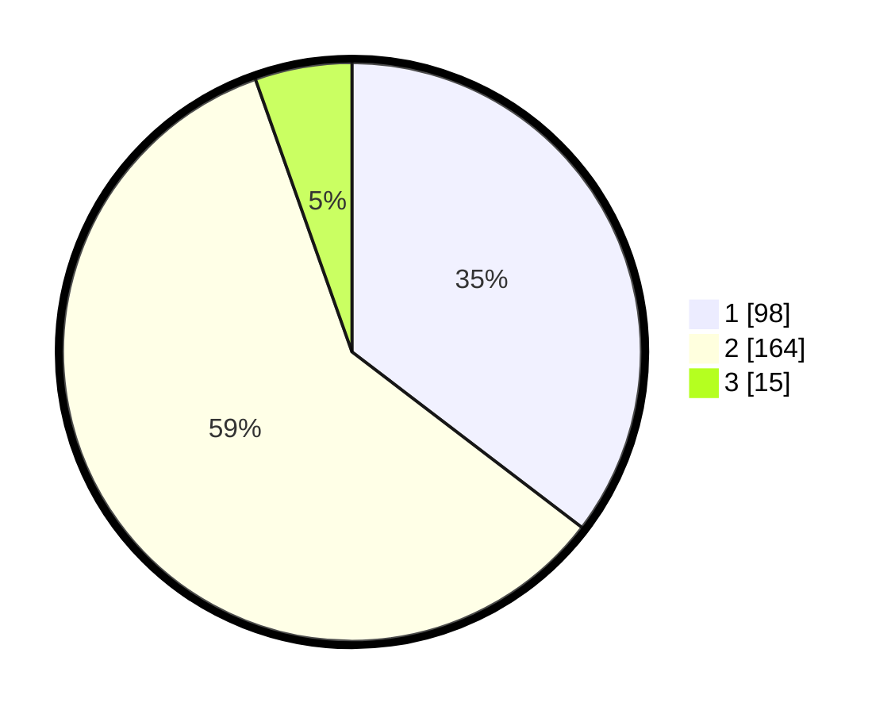

# Hasil

## Grafik

## Tabel

| No. | Nama Paslon    | Suara | Suara (raw) | Persentase |
|:--- |:-------------- | -----:| -----------:| ----------:|
| 1   | ANIES MUHAIMIN | 98    | [98][p-1]   | 35,38      |
| 2   | PRABOWO GIBRAN | 164   | [164][p-2]  | 59,21      |
| 3   | GANJAR MAHFUD  | 15    | [15][p-3]   | 5,42       |

[p-1]: https://github.com/gigit-pemilu/pemilu-2024-32-jawa-barat/blob/main/pilpres/hitung-suara/sub/32-jawa-barat/sub/16-bekasi/sub/09-cikarang-utara/sub/2005-karangraharja/sub/029-tps/sub/paslon-1.txt
[p-2]: https://github.com/gigit-pemilu/pemilu-2024-32-jawa-barat/blob/main/pilpres/hitung-suara/sub/32-jawa-barat/sub/16-bekasi/sub/09-cikarang-utara/sub/2005-karangraharja/sub/029-tps/sub/paslon-2.txt
[p-3]: https://github.com/gigit-pemilu/pemilu-2024-32-jawa-barat/blob/main/pilpres/hitung-suara/sub/32-jawa-barat/sub/16-bekasi/sub/09-cikarang-utara/sub/2005-karangraharja/sub/029-tps/sub/paslon-3.txt

## Foto C Plano

https://sirekap-obj-formc.kpu.go.id/8aae/pemilu/ppwp/32/16/09/20/05/3216092005029-20240214-155716--80b73f80-6324-4462-83f6-a2e1a4e6909d.jpg

https://sirekap-obj-formc.kpu.go.id/8aae/pemilu/ppwp/32/16/09/20/05/3216092005029-20240214-155836--2972e3b7-2084-4289-92be-e3be35bee588.jpg

https://sirekap-obj-formc.kpu.go.id/8aae/pemilu/ppwp/32/16/09/20/05/3216092005029-20240214-160056--51e43a6f-3fac-4277-a0e0-19fdd9191ea0.jpg

## Metadata

| Key        | Value               |
| ---------- | ------------------- |
| Time Stamp | 2024-02-25 12:00:00 |

