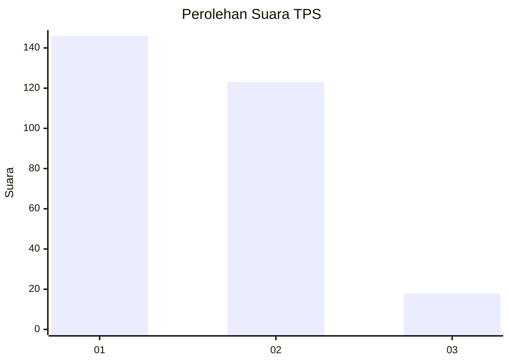
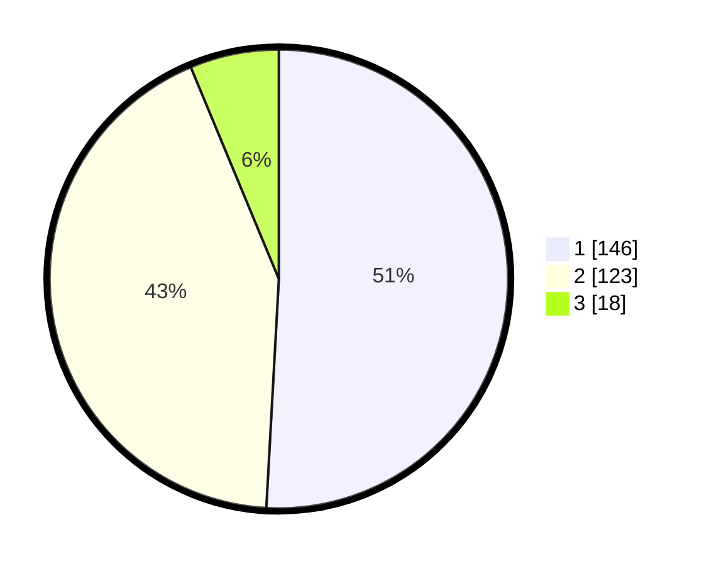

# Hasil

## Grafik

## Tabel

| No. | Nama Paslon    | Suara | Suara (raw) | Persentase |
|:--- |:-------------- | -----:| -----------:| ----------:|
| 1   | ANIES MUHAIMIN | 146   | [146][p-1]  | 50,87      |
| 2   | PRABOWO GIBRAN | 123   | [123][p-2]  | 42,86      |
| 3   | GANJAR MAHFUD  | 18    | [18][p-3]   | 6,27       |

[p-1]: https://github.com/gigit-pemilu/pemilu-2024/blob/main/pilpres/hitung-suara/sub/32-jawa-barat/sub/16-bekasi/sub/09-cikarang-utara/sub/2005-karangraharja/sub/047-tps/sub/paslon-1.txt
[p-2]: https://github.com/gigit-pemilu/pemilu-2024/blob/main/pilpres/hitung-suara/sub/32-jawa-barat/sub/16-bekasi/sub/09-cikarang-utara/sub/2005-karangraharja/sub/047-tps/sub/paslon-2.txt
[p-3]: https://github.com/gigit-pemilu/pemilu-2024/blob/main/pilpres/hitung-suara/sub/32-jawa-barat/sub/16-bekasi/sub/09-cikarang-utara/sub/2005-karangraharja/sub/047-tps/sub/paslon-3.txt

## Foto C Plano

https://sirekap-obj-formc.kpu.go.id/26cb/pemilu/ppwp/32/16/09/20/05/3216092005047-20240214-195251--847568ef-5851-4dc5-9163-f7c18ed19083.jpg

https://sirekap-obj-formc.kpu.go.id/26cb/pemilu/ppwp/32/16/09/20/05/3216092005047-20240214-195836--17a6a18e-7e8b-4069-aed4-bd25d5161865.jpg

https://sirekap-obj-formc.kpu.go.id/26cb/pemilu/ppwp/32/16/09/20/05/3216092005047-20240214-200119--af3b265a-16f1-4c6f-b487-35c983d0475e.jpg

## Metadata

| Key        | Value               |
| ---------- | ------------------- |
| Time Stamp | 2024-02-25 16:00:00 |

