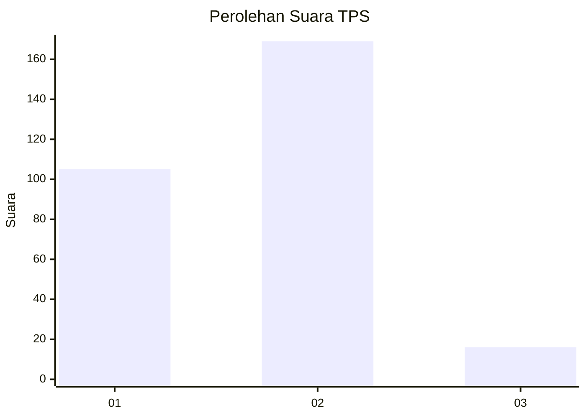
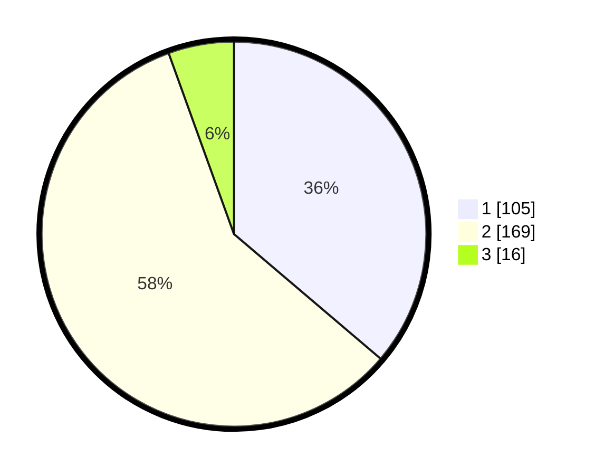

# Hasil

## Grafik

## Tabel

| No. | Nama Paslon    | Suara | Suara (raw) | Persentase |
|:--- |:-------------- | -----:| -----------:| ----------:|
| 1   | ANIES MUHAIMIN | 105   | [105][p-1]  | 36,21      |
| 2   | PRABOWO GIBRAN | 169   | [169][p-2]  | 58,28      |
| 3   | GANJAR MAHFUD  | 16    | [16][p-3]   | 5,52       |

[p-1]: https://github.com/gigit-pemilu/pemilu-2024-32-jawa-barat/blob/main/pilpres/hitung-suara/sub/32-jawa-barat/sub/16-bekasi/sub/09-cikarang-utara/sub/2005-karangraharja/sub/054-tps/sub/paslon-1.txt
[p-2]: https://github.com/gigit-pemilu/pemilu-2024-32-jawa-barat/blob/main/pilpres/hitung-suara/sub/32-jawa-barat/sub/16-bekasi/sub/09-cikarang-utara/sub/2005-karangraharja/sub/054-tps/sub/paslon-2.txt
[p-3]: https://github.com/gigit-pemilu/pemilu-2024-32-jawa-barat/blob/main/pilpres/hitung-suara/sub/32-jawa-barat/sub/16-bekasi/sub/09-cikarang-utara/sub/2005-karangraharja/sub/054-tps/sub/paslon-3.txt

## Foto C Plano

https://sirekap-obj-formc.kpu.go.id/b266/pemilu/ppwp/32/16/09/20/05/3216092005054-20240216-200720--d06e87d6-7f6c-4dd5-b427-a8e635fd20b0.jpg

https://sirekap-obj-formc.kpu.go.id/b266/pemilu/ppwp/32/16/09/20/05/3216092005054-20240216-200817--f85ed961-7114-4a45-9e84-eb5c6c97c40b.jpg

https://sirekap-obj-formc.kpu.go.id/b266/pemilu/ppwp/32/16/09/20/05/3216092005054-20240216-200909--c84057c6-84eb-46c4-af3c-56f3be4663fd.jpg

## Metadata

| Key        | Value               |
| ---------- | ------------------- |
| Time Stamp | 2024-02-19 06:16:00 |

## DATA PEMILIH TETAP

Jumlah pemilih dalam DPT: **552**.
 * L: **57**.
 * P: **283**.

## DATA PENGGUNA HAK PILIH

Jumlah pengguna hak pilih dalam DPT: **269**.
 * L: **137**.
 * P: **523**.

Jumlah pengguna hak pilih dalam DPTb: **301**.
 * L: **1**.
 * P: **808**.

Jumlah pengguna hak pilih dalam DPK: **823**.
 * L: **22**.
 * P: **809**.

Jumlah pengguna hak pilih: **291**.
 * L: **150**.
 * P: **146**.

## JUMLAH SUARA SAH DAN TIDAK SAH

JUMLAH SELURUH SUARA SAH: **290**.

JUMLAH SUARA TIDAK SAH: **1**.

JUMLAH SELURUH SUARA SAH DAN SUARA TIDAK SAH: **291**.

