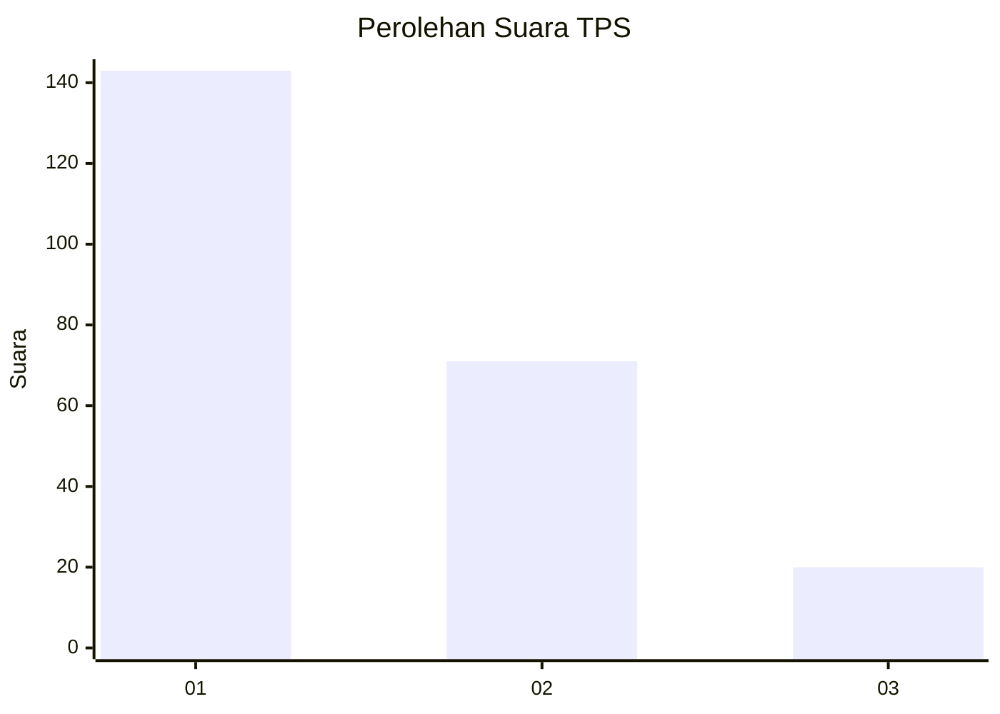
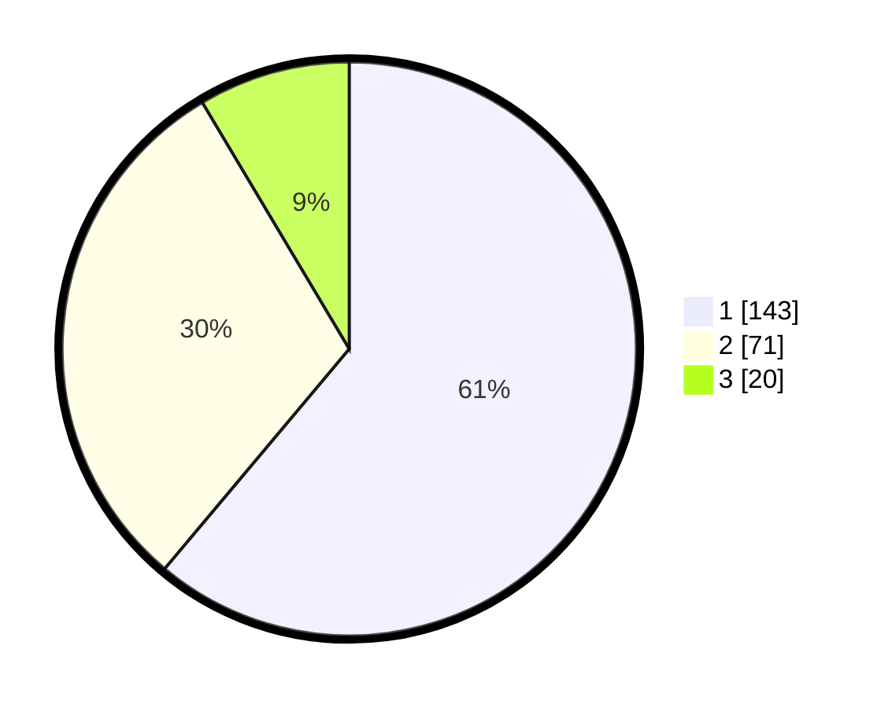

# Hasil

## Grafik

## Tabel

| No. | Nama Paslon    | Suara | Suara (raw) | Persentase |
|:--- |:-------------- | -----:| -----------:| ----------:|
| 1   | ANIES MUHAIMIN | 143   | [143][p-1]  | 61,11      |
| 2   | PRABOWO GIBRAN | 71    | [71][p-2]   | 30,34      |
| 3   | GANJAR MAHFUD  | 20    | [20][p-3]   | 8,55       |

[p-1]: https://github.com/gigit-pemilu/pemilu-2024-32-jawa-barat/blob/main/pilpres/hitung-suara/sub/32-jawa-barat/sub/16-bekasi/sub/09-cikarang-utara/sub/2007-simpangan/sub/005-tps/sub/paslon-1.txt
[p-2]: https://github.com/gigit-pemilu/pemilu-2024-32-jawa-barat/blob/main/pilpres/hitung-suara/sub/32-jawa-barat/sub/16-bekasi/sub/09-cikarang-utara/sub/2007-simpangan/sub/005-tps/sub/paslon-2.txt
[p-3]: https://github.com/gigit-pemilu/pemilu-2024-32-jawa-barat/blob/main/pilpres/hitung-suara/sub/32-jawa-barat/sub/16-bekasi/sub/09-cikarang-utara/sub/2007-simpangan/sub/005-tps/sub/paslon-3.txt

## Foto C Plano

https://sirekap-obj-formc.kpu.go.id/2b60/pemilu/ppwp/32/16/09/20/07/3216092007005-20240214-213028--c1148d3a-35d8-4f03-b3c6-ccdd1b7725c9.jpg

https://sirekap-obj-formc.kpu.go.id/2b60/pemilu/ppwp/32/16/09/20/07/3216092007005-20240214-213040--977e83e1-bf31-4edb-95e3-a1bffead6196.jpg

https://sirekap-obj-formc.kpu.go.id/2b60/pemilu/ppwp/32/16/09/20/07/3216092007005-20240214-213050--5dda7329-ffce-4c86-b85d-eed9b4d3edff.jpg

## Metadata

| Key        | Value               |
| ---------- | ------------------- |
| Time Stamp | 2024-02-24 22:31:28 |

