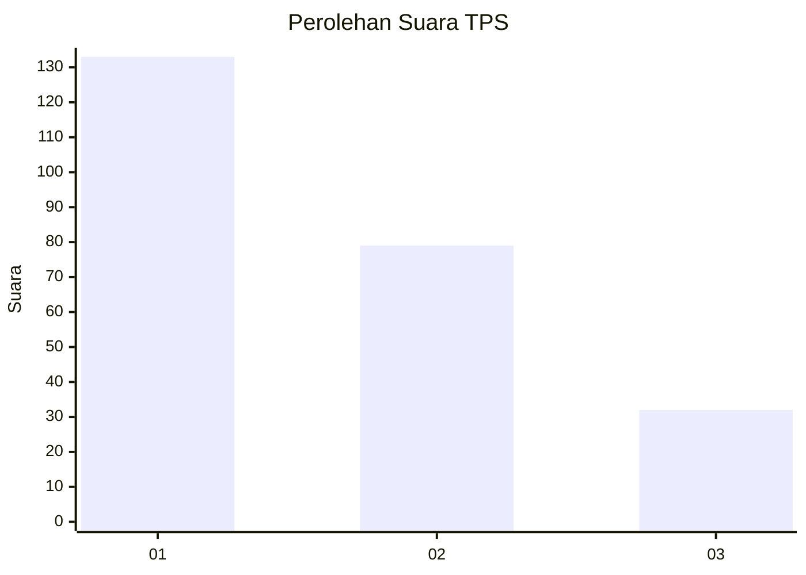
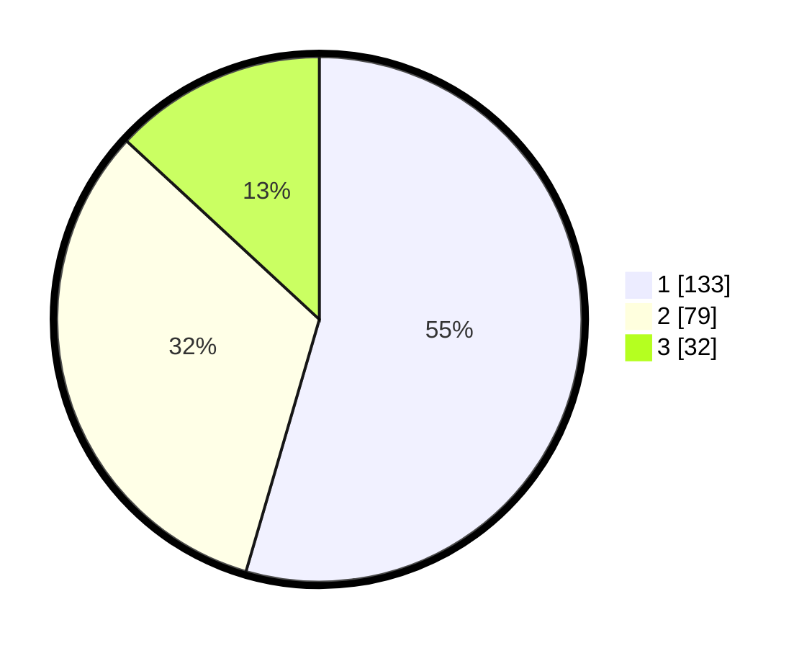

# Hasil

## Grafik

## Tabel

| No. | Nama Paslon    | Suara | Suara (raw) | Persentase |
|:--- |:-------------- | -----:| -----------:| ----------:|
| 1   | ANIES MUHAIMIN | 133   | [133][p-1]  | 54,51      |
| 2   | PRABOWO GIBRAN | 79    | [79][p-2]   | 32,38      |
| 3   | GANJAR MAHFUD  | 32    | [32][p-3]   | 13,11      |

[p-1]: https://github.com/gigit-pemilu/pemilu-2024/blob/main/pilpres/hitung-suara/sub/32-jawa-barat/sub/16-bekasi/sub/09-cikarang-utara/sub/2007-simpangan/sub/010-tps/sub/paslon-1.txt
[p-2]: https://github.com/gigit-pemilu/pemilu-2024/blob/main/pilpres/hitung-suara/sub/32-jawa-barat/sub/16-bekasi/sub/09-cikarang-utara/sub/2007-simpangan/sub/010-tps/sub/paslon-2.txt
[p-3]: https://github.com/gigit-pemilu/pemilu-2024/blob/main/pilpres/hitung-suara/sub/32-jawa-barat/sub/16-bekasi/sub/09-cikarang-utara/sub/2007-simpangan/sub/010-tps/sub/paslon-3.txt

## Foto C Plano

https://sirekap-obj-formc.kpu.go.id/7879/pemilu/ppwp/32/16/09/20/07/3216092007010-20240214-205736--f74f6f95-2c78-48b3-ab3a-bf49643d97f7.jpg

https://sirekap-obj-formc.kpu.go.id/7879/pemilu/ppwp/32/16/09/20/07/3216092007010-20240214-210154--7590009c-b4b6-469c-8f43-fd75b58efead.jpg

https://sirekap-obj-formc.kpu.go.id/7879/pemilu/ppwp/32/16/09/20/07/3216092007010-20240214-210521--765029d8-e732-480f-9f29-1568b332081c.jpg

## Metadata

| Key        | Value               |
| ---------- | ------------------- |
| Time Stamp | 2024-02-15 00:41:44 |

