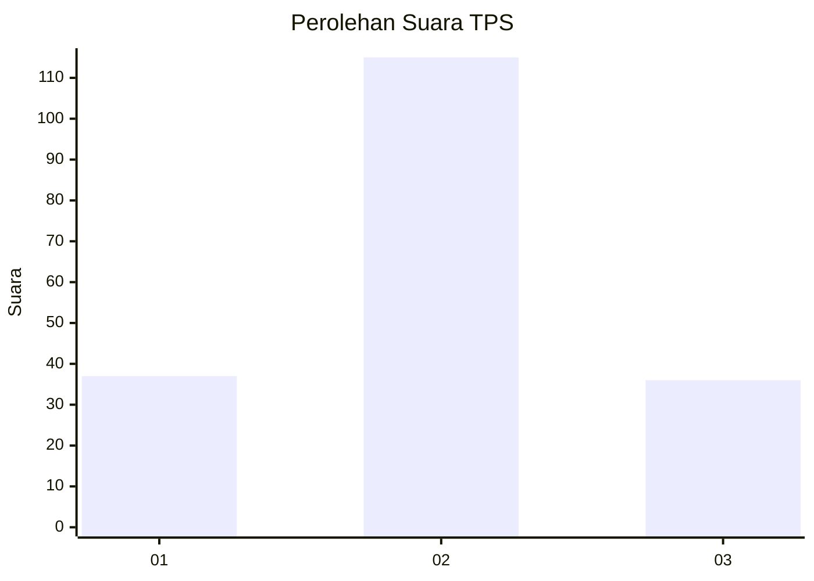
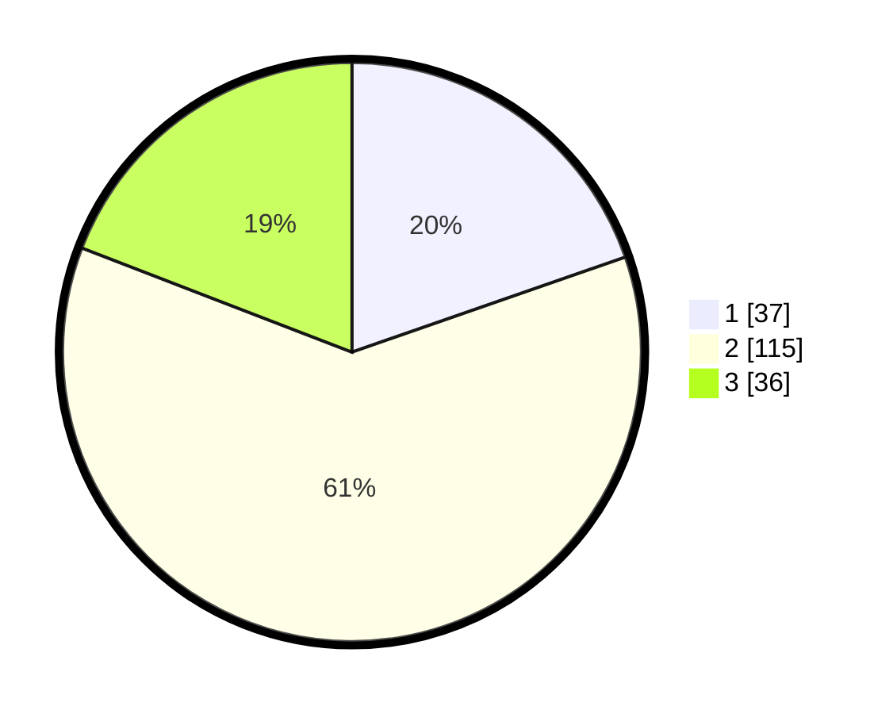

# Hasil

## Grafik

## Tabel

| No. | Nama Paslon    | Suara | Suara (raw) | Persentase |
|:--- |:-------------- | -----:| -----------:| ----------:|
| 1   | ANIES MUHAIMIN | 37    | [37][p-1]   | 19,68      |
| 2   | PRABOWO GIBRAN | 115   | [115][p-2]  | 61,17      |
| 3   | GANJAR MAHFUD  | 36    | [36][p-3]   | 19,15      |

[p-1]: https://github.com/gigit-pemilu/pemilu-2024-32-jawa-barat/blob/main/pilpres/hitung-suara/sub/32-jawa-barat/sub/16-bekasi/sub/10-karang-bahagia/sub/2001-sukaraya/sub/003-tps/sub/paslon-1.txt
[p-2]: https://github.com/gigit-pemilu/pemilu-2024-32-jawa-barat/blob/main/pilpres/hitung-suara/sub/32-jawa-barat/sub/16-bekasi/sub/10-karang-bahagia/sub/2001-sukaraya/sub/003-tps/sub/paslon-2.txt
[p-3]: https://github.com/gigit-pemilu/pemilu-2024-32-jawa-barat/blob/main/pilpres/hitung-suara/sub/32-jawa-barat/sub/16-bekasi/sub/10-karang-bahagia/sub/2001-sukaraya/sub/003-tps/sub/paslon-3.txt

## Foto C Plano

https://sirekap-obj-formc.kpu.go.id/7736/pemilu/ppwp/32/16/10/20/01/3216102001003-20240215-014233--ed1d1190-2ef3-4834-8f89-0ccf4a389e53.jpg

https://sirekap-obj-formc.kpu.go.id/7736/pemilu/ppwp/32/16/10/20/01/3216102001003-20240215-014327--5ef6b335-33b4-4112-93dd-fa73c101a43b.jpg

https://sirekap-obj-formc.kpu.go.id/7736/pemilu/ppwp/32/16/10/20/01/3216102001003-20240215-014430--79760001-ca32-4be0-92a0-32d5887caf06.jpg

## Metadata

| Key        | Value               |
| ---------- | ------------------- |
| Time Stamp | 2024-02-24 22:31:28 |

