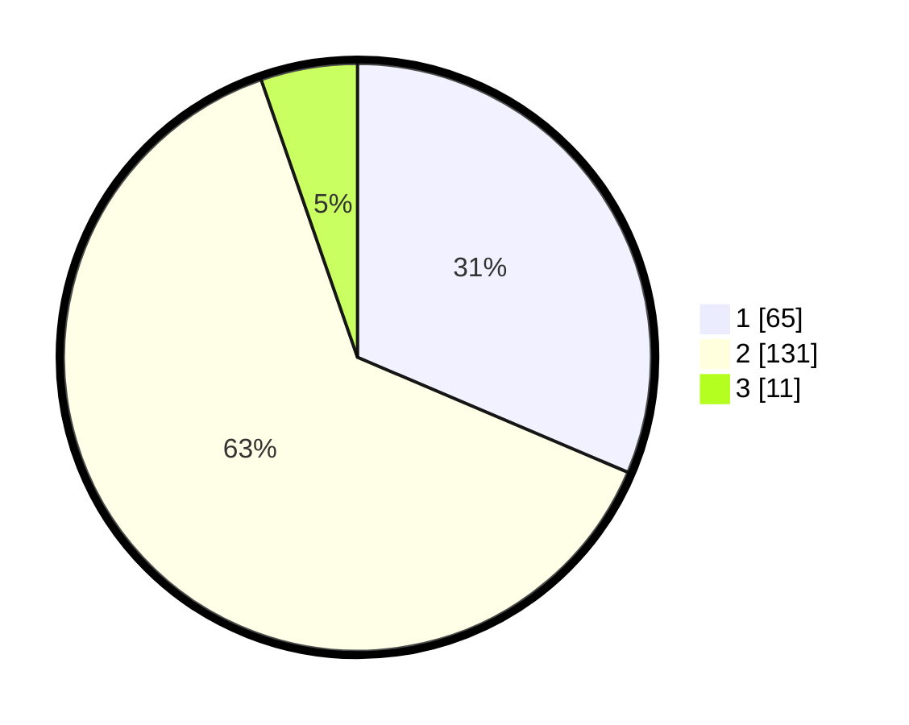

# Hasil

## Grafik

## Tabel

| No. | Nama Paslon    | Suara | Suara (raw) | Persentase |
|:--- |:-------------- | -----:| -----------:| ----------:|
| 1   | ANIES MUHAIMIN | 65    | [65][p-1]   | 31,40      |
| 2   | PRABOWO GIBRAN | 131   | [131][p-2]  | 63,29      |
| 3   | GANJAR MAHFUD  | 11    | [11][p-3]   | 5,31       |

[p-1]: https://github.com/gigit-pemilu/pemilu-2024/blob/main/pilpres/hitung-suara/sub/32-jawa-barat/sub/16-bekasi/sub/10-karang-bahagia/sub/2001-sukaraya/sub/005-tps/sub/paslon-1.txt
[p-2]: https://github.com/gigit-pemilu/pemilu-2024/blob/main/pilpres/hitung-suara/sub/32-jawa-barat/sub/16-bekasi/sub/10-karang-bahagia/sub/2001-sukaraya/sub/005-tps/sub/paslon-2.txt
[p-3]: https://github.com/gigit-pemilu/pemilu-2024/blob/main/pilpres/hitung-suara/sub/32-jawa-barat/sub/16-bekasi/sub/10-karang-bahagia/sub/2001-sukaraya/sub/005-tps/sub/paslon-3.txt

## Foto C Plano

https://sirekap-obj-formc.kpu.go.id/cfa9/pemilu/ppwp/32/16/10/20/01/3216102001005-20240215-004110--14f29132-27cd-4ef8-95ec-06a70e063cc8.jpg

https://sirekap-obj-formc.kpu.go.id/cfa9/pemilu/ppwp/32/16/10/20/01/3216102001005-20240215-004127--0de549ca-5118-48a8-a93d-e6a73b789e07.jpg

https://sirekap-obj-formc.kpu.go.id/cfa9/pemilu/ppwp/32/16/10/20/01/3216102001005-20240215-004143--64d9e71c-01cf-49ad-b679-4d6d68280406.jpg

## Metadata

| Key        | Value               |
| ---------- | ------------------- |
| Time Stamp | 2024-02-16 06:30:27 |

