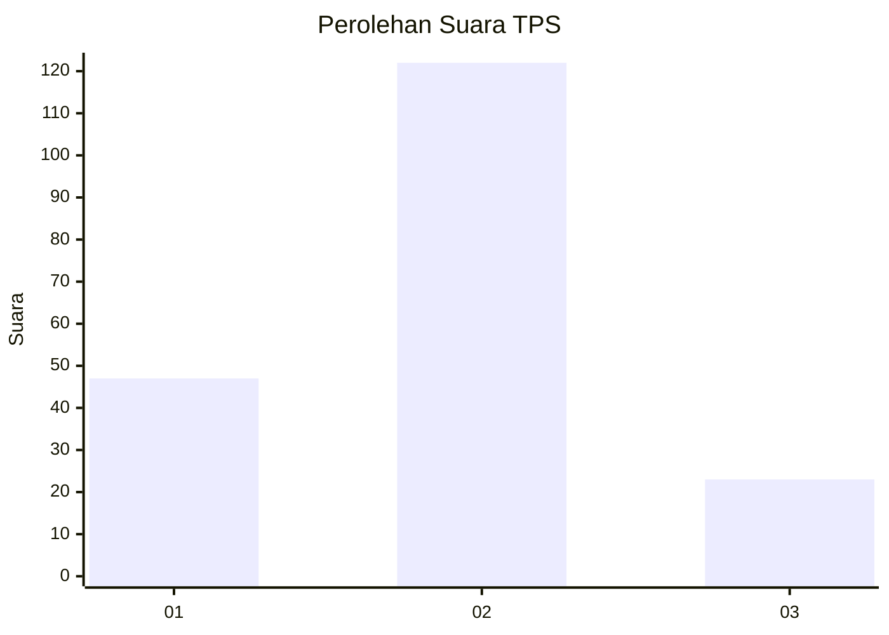
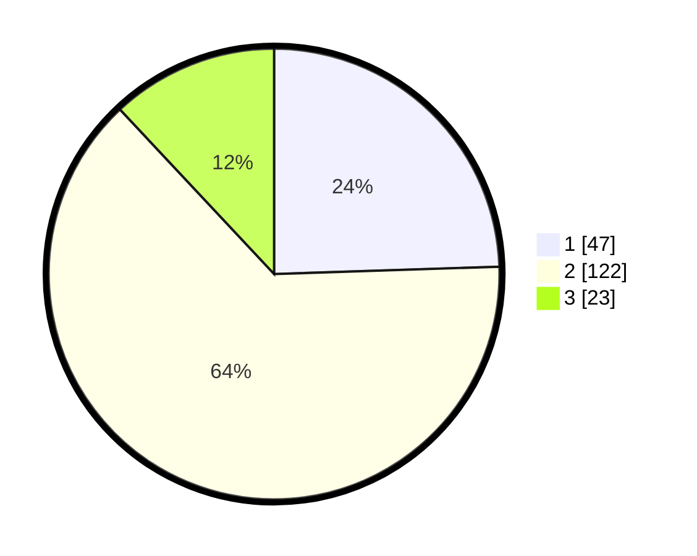

# Hasil

## Grafik

## Tabel

| No. | Nama Paslon    | Suara | Suara (raw) | Persentase |
|:--- |:-------------- | -----:| -----------:| ----------:|
| 1   | ANIES MUHAIMIN | 47    | [47][p-1]   | 24,48      |
| 2   | PRABOWO GIBRAN | 122   | [122][p-2]  | 63,54      |
| 3   | GANJAR MAHFUD  | 23    | [23][p-3]   | 11,98      |

[p-1]: https://github.com/gigit-pemilu/pemilu-2024-32-jawa-barat/blob/main/pilpres/hitung-suara/sub/32-jawa-barat/sub/16-bekasi/sub/10-karang-bahagia/sub/2001-sukaraya/sub/007-tps/sub/paslon-1.txt
[p-2]: https://github.com/gigit-pemilu/pemilu-2024-32-jawa-barat/blob/main/pilpres/hitung-suara/sub/32-jawa-barat/sub/16-bekasi/sub/10-karang-bahagia/sub/2001-sukaraya/sub/007-tps/sub/paslon-2.txt
[p-3]: https://github.com/gigit-pemilu/pemilu-2024-32-jawa-barat/blob/main/pilpres/hitung-suara/sub/32-jawa-barat/sub/16-bekasi/sub/10-karang-bahagia/sub/2001-sukaraya/sub/007-tps/sub/paslon-3.txt

## Foto C Plano

https://sirekap-obj-formc.kpu.go.id/95cc/pemilu/ppwp/32/16/10/20/01/3216102001007-20240215-054501--5a713270-4c46-46ee-ad7a-bae6474e3868.jpg

https://sirekap-obj-formc.kpu.go.id/95cc/pemilu/ppwp/32/16/10/20/01/3216102001007-20240215-030021--29865653-ee46-4c9a-bdc5-00ec6cdc62cb.jpg

https://sirekap-obj-formc.kpu.go.id/95cc/pemilu/ppwp/32/16/10/20/01/3216102001007-20240215-032702--a96286c3-63e9-4b99-9261-71e325720bc1.jpg

## Metadata

| Key        | Value               |
| ---------- | ------------------- |
| Time Stamp | 2024-02-24 22:31:28 |

