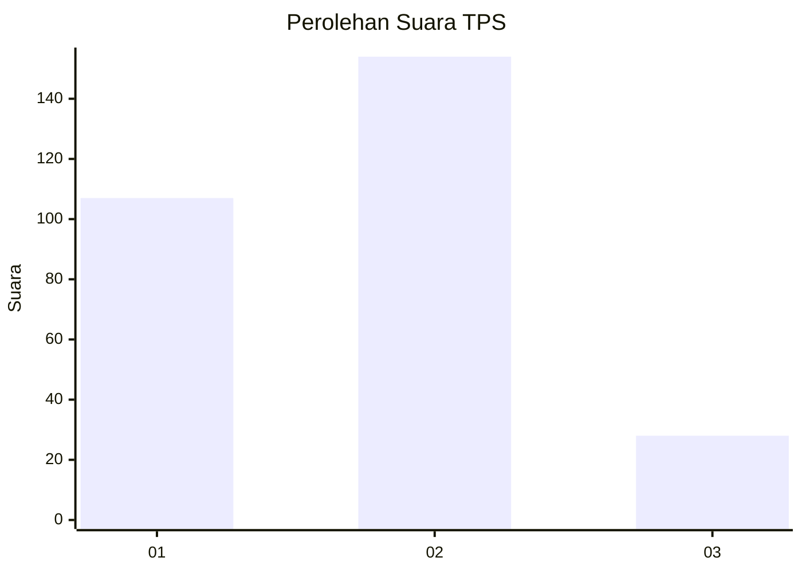

# Hasil

## Grafik

## Tabel

| No. | Nama Paslon    | Suara | Suara (raw) | Persentase |
|:--- |:-------------- | -----:| -----------:| ----------:|
| 1   | ANIES MUHAIMIN | 107   | [107][p-1]  | 37,02      |
| 2   | PRABOWO GIBRAN | 154   | [154][p-2]  | 53,29      |
| 3   | GANJAR MAHFUD  | 28    | [28][p-3]   | 9,69       |

[p-1]: https://github.com/gigit-pemilu/pemilu-2024-32-jawa-barat/blob/main/pilpres/hitung-suara/sub/32-jawa-barat/sub/16-bekasi/sub/10-karang-bahagia/sub/2002-karangrahayu/sub/035-tps/sub/paslon-1.txt
[p-2]: https://github.com/gigit-pemilu/pemilu-2024-32-jawa-barat/blob/main/pilpres/hitung-suara/sub/32-jawa-barat/sub/16-bekasi/sub/10-karang-bahagia/sub/2002-karangrahayu/sub/035-tps/sub/paslon-2.txt
[p-3]: https://github.com/gigit-pemilu/pemilu-2024-32-jawa-barat/blob/main/pilpres/hitung-suara/sub/32-jawa-barat/sub/16-bekasi/sub/10-karang-bahagia/sub/2002-karangrahayu/sub/035-tps/sub/paslon-3.txt

## Foto C Plano

https://sirekap-obj-formc.kpu.go.id/1f9d/pemilu/ppwp/32/16/10/20/02/3216102002035-20240215-022646--42e677b8-dd40-4cb7-9612-54bfeeadba18.jpg

https://sirekap-obj-formc.kpu.go.id/1f9d/pemilu/ppwp/32/16/10/20/02/3216102002035-20240215-022706--4b1b8303-10dd-4291-98c8-f7b74bd014db.jpg

https://sirekap-obj-formc.kpu.go.id/1f9d/pemilu/ppwp/32/16/10/20/02/3216102002035-20240215-022609--bba0fda6-9dcb-4595-a357-160f1e1bf348.jpg

## Metadata

| Key        | Value               |
| ---------- | ------------------- |
| Time Stamp | 2024-02-15 15:00:29 |

