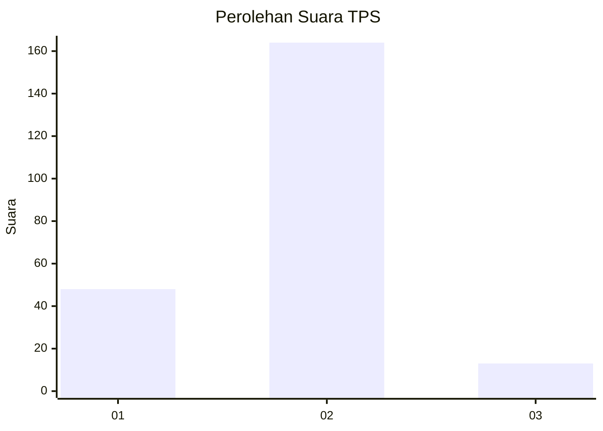

# Hasil

## Grafik

## Tabel

| No. | Nama Paslon    | Suara | Suara (raw) | Persentase |
|:--- |:-------------- | -----:| -----------:| ----------:|
| 1   | ANIES MUHAIMIN | 48    | [48][p-1]   | 21,33      |
| 2   | PRABOWO GIBRAN | 164   | [164][p-2]  | 72,89      |
| 3   | GANJAR MAHFUD  | 13    | [13][p-3]   | 5,78       |

[p-1]: https://github.com/gigit-pemilu/pemilu-2024-32-jawa-barat/blob/main/pilpres/hitung-suara/sub/32-jawa-barat/sub/16-bekasi/sub/11-cikarang-timur/sub/1007-sertajaya/sub/002-tps/sub/paslon-1.txt
[p-2]: https://github.com/gigit-pemilu/pemilu-2024-32-jawa-barat/blob/main/pilpres/hitung-suara/sub/32-jawa-barat/sub/16-bekasi/sub/11-cikarang-timur/sub/1007-sertajaya/sub/002-tps/sub/paslon-2.txt
[p-3]: https://github.com/gigit-pemilu/pemilu-2024-32-jawa-barat/blob/main/pilpres/hitung-suara/sub/32-jawa-barat/sub/16-bekasi/sub/11-cikarang-timur/sub/1007-sertajaya/sub/002-tps/sub/paslon-3.txt

## Foto C Plano

https://sirekap-obj-formc.kpu.go.id/a297/pemilu/ppwp/32/16/11/10/07/3216111007002-20240214-204855--be0fd533-3b01-4a93-8fa2-4d985a203c7c.jpg

https://sirekap-obj-formc.kpu.go.id/a297/pemilu/ppwp/32/16/11/10/07/3216111007002-20240214-205144--7bf7eb1e-f103-4aa2-ad35-3dd94f0fdecc.jpg

https://sirekap-obj-formc.kpu.go.id/a297/pemilu/ppwp/32/16/11/10/07/3216111007002-20240214-205346--46992653-05dc-4454-a753-8f63f21e0a4e.jpg

## Metadata

| Key        | Value               |
| ---------- | ------------------- |
| Time Stamp | 2024-02-24 22:31:28 |

