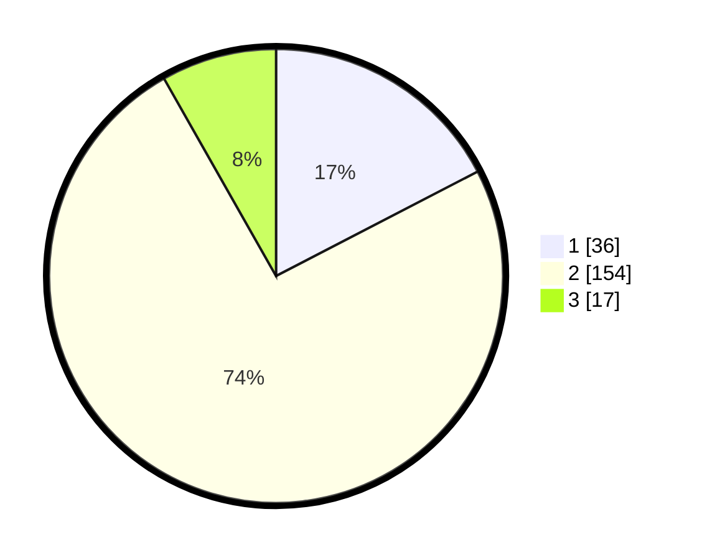

# Hasil

## Grafik

## Tabel

| No. | Nama Paslon    | Suara | Suara (raw) | Persentase |
|:--- |:-------------- | -----:| -----------:| ----------:|
| 1   | ANIES MUHAIMIN | 36    | [36][p-1]   | 17,39      |
| 2   | PRABOWO GIBRAN | 154   | [154][p-2]  | 74,40      |
| 3   | GANJAR MAHFUD  | 17    | [17][p-3]   | 8,21       |

[p-1]: https://github.com/gigit-pemilu/pemilu-2024/blob/main/pilpres/hitung-suara/sub/32-jawa-barat/sub/16-bekasi/sub/11-cikarang-timur/sub/1007-sertajaya/sub/013-tps/sub/paslon-1.txt
[p-2]: https://github.com/gigit-pemilu/pemilu-2024/blob/main/pilpres/hitung-suara/sub/32-jawa-barat/sub/16-bekasi/sub/11-cikarang-timur/sub/1007-sertajaya/sub/013-tps/sub/paslon-2.txt
[p-3]: https://github.com/gigit-pemilu/pemilu-2024/blob/main/pilpres/hitung-suara/sub/32-jawa-barat/sub/16-bekasi/sub/11-cikarang-timur/sub/1007-sertajaya/sub/013-tps/sub/paslon-3.txt

## Foto C Plano

https://sirekap-obj-formc.kpu.go.id/43d8/pemilu/ppwp/32/16/11/10/07/3216111007013-20240215-061642--5e9cb4a8-9bb4-4f5f-b8ce-05ccdb63df75.jpg

https://sirekap-obj-formc.kpu.go.id/43d8/pemilu/ppwp/32/16/11/10/07/3216111007013-20240215-061858--87be2e61-404f-4933-bcaf-73bc8ec02462.jpg

https://sirekap-obj-formc.kpu.go.id/43d8/pemilu/ppwp/32/16/11/10/07/3216111007013-20240215-062026--b0a3f2ea-f3e0-4edd-b05a-598c9f86d7b2.jpg

## Metadata

| Key        | Value               |
| ---------- | ------------------- |
| Time Stamp | 2024-02-24 22:31:28 |

