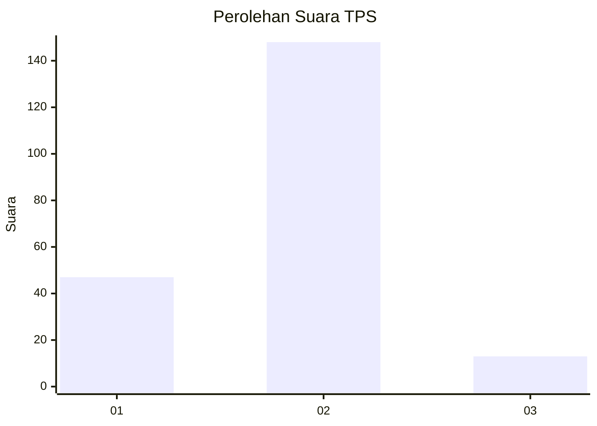

# Hasil

## Grafik

## Tabel

| No. | Nama Paslon    | Suara | Suara (raw) | Persentase |
|:--- |:-------------- | -----:| -----------:| ----------:|
| 1   | ANIES MUHAIMIN | 47    | [47][p-1]   | 22,60      |
| 2   | PRABOWO GIBRAN | 148   | [148][p-2]  | 71,15      |
| 3   | GANJAR MAHFUD  | 13    | [13][p-3]   | 6,25       |

[p-1]: https://github.com/gigit-pemilu/pemilu-2024-32-jawa-barat/blob/main/pilpres/hitung-suara/sub/32-jawa-barat/sub/16-bekasi/sub/11-cikarang-timur/sub/1007-sertajaya/sub/015-tps/sub/paslon-1.txt
[p-2]: https://github.com/gigit-pemilu/pemilu-2024-32-jawa-barat/blob/main/pilpres/hitung-suara/sub/32-jawa-barat/sub/16-bekasi/sub/11-cikarang-timur/sub/1007-sertajaya/sub/015-tps/sub/paslon-2.txt
[p-3]: https://github.com/gigit-pemilu/pemilu-2024-32-jawa-barat/blob/main/pilpres/hitung-suara/sub/32-jawa-barat/sub/16-bekasi/sub/11-cikarang-timur/sub/1007-sertajaya/sub/015-tps/sub/paslon-3.txt

## Foto C Plano

https://sirekap-obj-formc.kpu.go.id/1c9a/pemilu/ppwp/32/16/11/10/07/3216111007015-20240214-155336--c358ee3f-abdb-4b55-8990-40d692eda54a.jpg

https://sirekap-obj-formc.kpu.go.id/1c9a/pemilu/ppwp/32/16/11/10/07/3216111007015-20240214-155450--e6d370e8-1364-42ce-b3b6-c26c1e3fb1bd.jpg

https://sirekap-obj-formc.kpu.go.id/1c9a/pemilu/ppwp/32/16/11/10/07/3216111007015-20240214-155828--4f2ec921-1583-4d15-8238-e0362515b61d.jpg

## Metadata

| Key        | Value               |
| ---------- | ------------------- |
| Time Stamp | 2024-02-14 21:46:01 |

