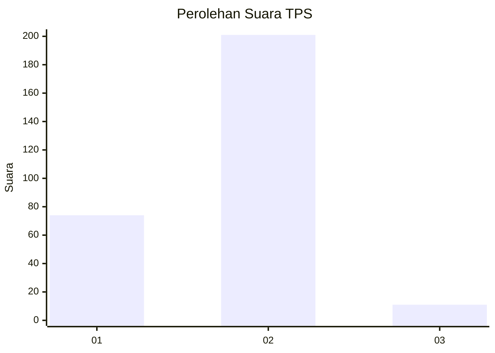
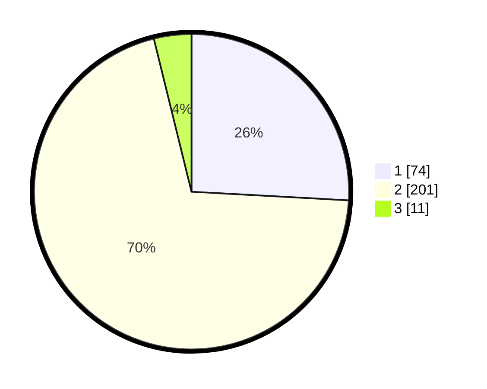

# Hasil

## Grafik

## Tabel

| No. | Nama Paslon    | Suara | Suara (raw) | Persentase |
|:--- |:-------------- | -----:| -----------:| ----------:|
| 1   | ANIES MUHAIMIN | 74    | [74][p-1]   | 25,87      |
| 2   | PRABOWO GIBRAN | 201   | [201][p-2]  | 70,28      |
| 3   | GANJAR MAHFUD  | 11    | [11][p-3]   | 3,85       |

[p-1]: https://github.com/gigit-pemilu/pemilu-2024-32-jawa-barat/blob/main/pilpres/hitung-suara/sub/32-jawa-barat/sub/16-bekasi/sub/11-cikarang-timur/sub/2003-hegarmanah/sub/015-tps/sub/paslon-1.txt
[p-2]: https://github.com/gigit-pemilu/pemilu-2024-32-jawa-barat/blob/main/pilpres/hitung-suara/sub/32-jawa-barat/sub/16-bekasi/sub/11-cikarang-timur/sub/2003-hegarmanah/sub/015-tps/sub/paslon-2.txt
[p-3]: https://github.com/gigit-pemilu/pemilu-2024-32-jawa-barat/blob/main/pilpres/hitung-suara/sub/32-jawa-barat/sub/16-bekasi/sub/11-cikarang-timur/sub/2003-hegarmanah/sub/015-tps/sub/paslon-3.txt

## Foto C Plano

https://sirekap-obj-formc.kpu.go.id/2682/pemilu/ppwp/32/16/11/20/03/3216112003015-20240215-024656--1f40a452-68ab-445d-a15e-33217b00f9db.jpg

https://sirekap-obj-formc.kpu.go.id/2682/pemilu/ppwp/32/16/11/20/03/3216112003015-20240215-024828--154dac73-c464-488c-a4fb-48a12825c89a.jpg

https://sirekap-obj-formc.kpu.go.id/2682/pemilu/ppwp/32/16/11/20/03/3216112003015-20240215-024911--e1a2682c-a980-4aef-a8d4-b380e4fdeaab.jpg

## Metadata

| Key        | Value               |
| ---------- | ------------------- |
| Time Stamp | 2024-02-25 12:00:00 |

