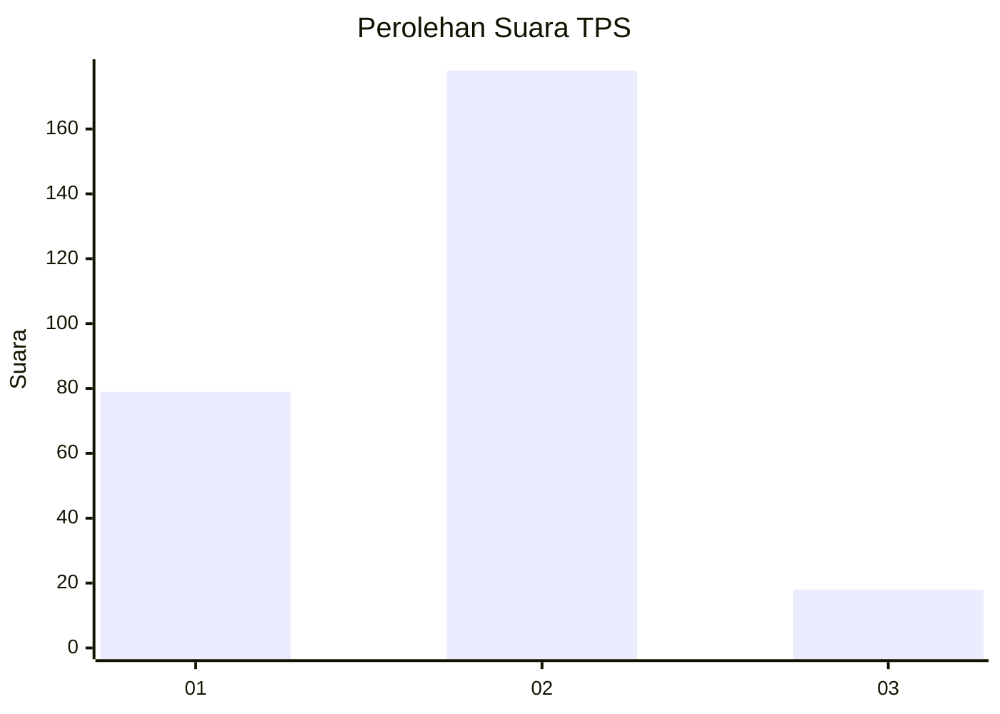
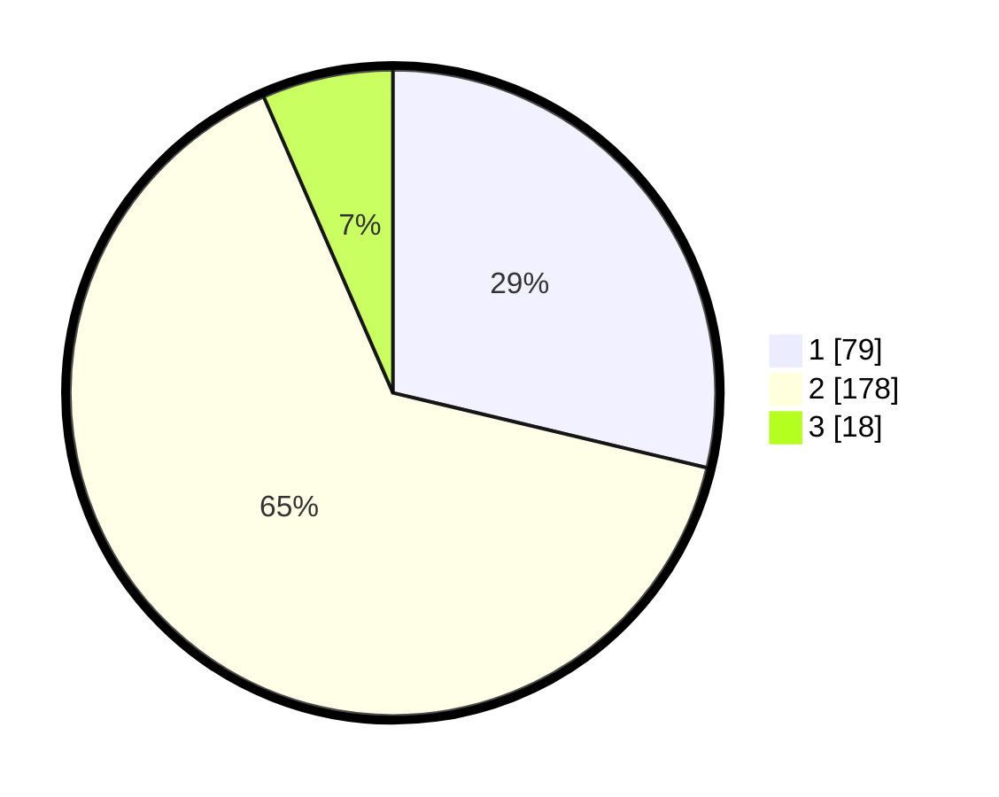

# Hasil

## Grafik

## Tabel

| No. | Nama Paslon    | Suara | Suara (raw) | Persentase |
|:--- |:-------------- | -----:| -----------:| ----------:|
| 1   | ANIES MUHAIMIN | 79    | [79][p-1]   | 28,73      |
| 2   | PRABOWO GIBRAN | 178   | [178][p-2]  | 64,73      |
| 3   | GANJAR MAHFUD  | 18    | [18][p-3]   | 6,55       |

[p-1]: https://github.com/gigit-pemilu/pemilu-2024-32-jawa-barat/blob/main/pilpres/hitung-suara/sub/32-jawa-barat/sub/16-bekasi/sub/11-cikarang-timur/sub/2004-jatireja/sub/007-tps/sub/paslon-1.txt
[p-2]: https://github.com/gigit-pemilu/pemilu-2024-32-jawa-barat/blob/main/pilpres/hitung-suara/sub/32-jawa-barat/sub/16-bekasi/sub/11-cikarang-timur/sub/2004-jatireja/sub/007-tps/sub/paslon-2.txt
[p-3]: https://github.com/gigit-pemilu/pemilu-2024-32-jawa-barat/blob/main/pilpres/hitung-suara/sub/32-jawa-barat/sub/16-bekasi/sub/11-cikarang-timur/sub/2004-jatireja/sub/007-tps/sub/paslon-3.txt

## Foto C Plano

https://sirekap-obj-formc.kpu.go.id/79c1/pemilu/ppwp/32/16/11/20/04/3216112004007-20240215-012447--340ff5e8-fe17-423b-9aa2-979656d099e5.jpg

https://sirekap-obj-formc.kpu.go.id/79c1/pemilu/ppwp/32/16/11/20/04/3216112004007-20240215-012601--6de78657-2608-4cae-91cb-1bb6b1eed7e9.jpg

https://sirekap-obj-formc.kpu.go.id/79c1/pemilu/ppwp/32/16/11/20/04/3216112004007-20240215-013416--236b8427-74ae-4eb4-a9b6-f647b7dcfd8b.jpg

## Metadata

| Key        | Value               |
| ---------- | ------------------- |
| Time Stamp | 2024-02-24 22:31:28 |

