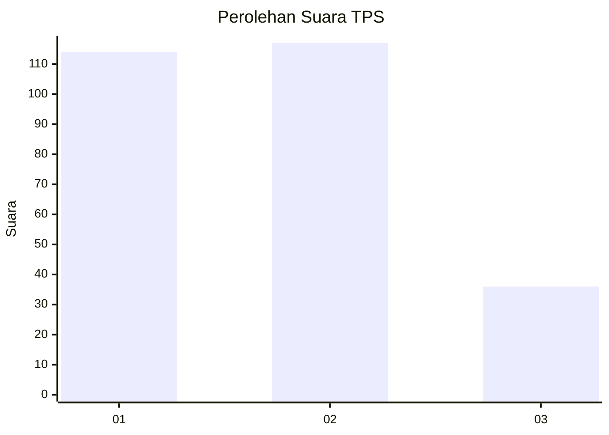
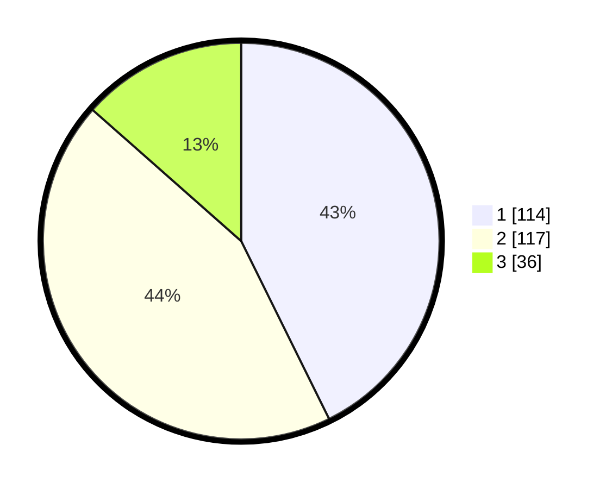

# Hasil

## Grafik

## Tabel

| No. | Nama Paslon    | Suara | Suara (raw) | Persentase |
|:--- |:-------------- | -----:| -----------:| ----------:|
| 1   | ANIES MUHAIMIN | 114   | [114][p-1]  | 42,70      |
| 2   | PRABOWO GIBRAN | 117   | [117][p-2]  | 43,82      |
| 3   | GANJAR MAHFUD  | 36    | [36][p-3]   | 13,48      |

[p-1]: https://github.com/gigit-pemilu/pemilu-2024/blob/main/pilpres/hitung-suara/sub/32-jawa-barat/sub/16-bekasi/sub/11-cikarang-timur/sub/2004-jatireja/sub/035-tps/sub/paslon-1.txt
[p-2]: https://github.com/gigit-pemilu/pemilu-2024/blob/main/pilpres/hitung-suara/sub/32-jawa-barat/sub/16-bekasi/sub/11-cikarang-timur/sub/2004-jatireja/sub/035-tps/sub/paslon-2.txt
[p-3]: https://github.com/gigit-pemilu/pemilu-2024/blob/main/pilpres/hitung-suara/sub/32-jawa-barat/sub/16-bekasi/sub/11-cikarang-timur/sub/2004-jatireja/sub/035-tps/sub/paslon-3.txt

## Foto C Plano

https://sirekap-obj-formc.kpu.go.id/db28/pemilu/ppwp/32/16/11/20/04/3216112004035-20240214-233902--df6e0a4a-d476-4f68-91ea-83efde6f384f.jpg

https://sirekap-obj-formc.kpu.go.id/db28/pemilu/ppwp/32/16/11/20/04/3216112004035-20240214-233956--d4c9b127-72a9-45af-bad0-090331606bd3.jpg

https://sirekap-obj-formc.kpu.go.id/db28/pemilu/ppwp/32/16/11/20/04/3216112004035-20240214-234037--496f0107-d16d-4e73-9b7f-df832cccf267.jpg

## Metadata

| Key        | Value               |
| ---------- | ------------------- |
| Time Stamp | 2024-02-25 12:00:00 |

