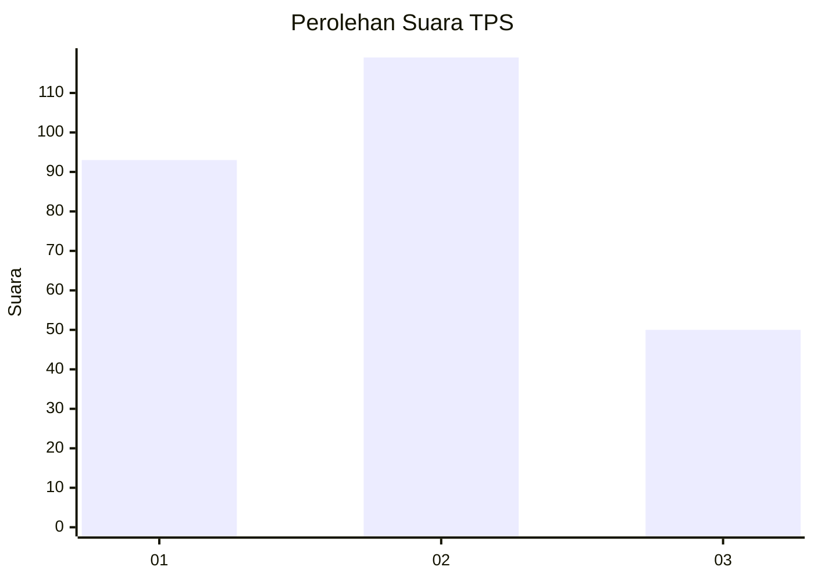
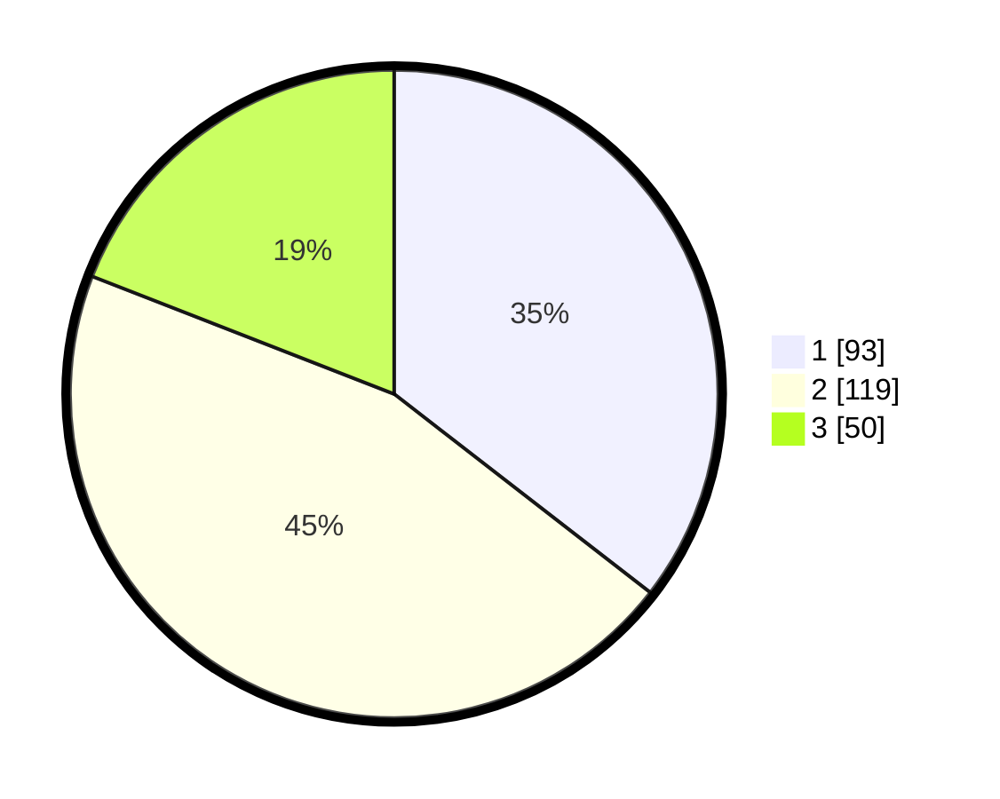

# Hasil

## Grafik

## Tabel

| No. | Nama Paslon    | Suara | Suara (raw) | Persentase |
|:--- |:-------------- | -----:| -----------:| ----------:|
| 1   | ANIES MUHAIMIN | 93    | [93][p-1]   | 35,50      |
| 2   | PRABOWO GIBRAN | 119   | [119][p-2]  | 45,42      |
| 3   | GANJAR MAHFUD  | 50    | [50][p-3]   | 19,08      |

[p-1]: https://github.com/gigit-pemilu/pemilu-2024-32-jawa-barat/blob/main/pilpres/hitung-suara/sub/32-jawa-barat/sub/16-bekasi/sub/11-cikarang-timur/sub/2004-jatireja/sub/055-tps/sub/paslon-1.txt
[p-2]: https://github.com/gigit-pemilu/pemilu-2024-32-jawa-barat/blob/main/pilpres/hitung-suara/sub/32-jawa-barat/sub/16-bekasi/sub/11-cikarang-timur/sub/2004-jatireja/sub/055-tps/sub/paslon-2.txt
[p-3]: https://github.com/gigit-pemilu/pemilu-2024-32-jawa-barat/blob/main/pilpres/hitung-suara/sub/32-jawa-barat/sub/16-bekasi/sub/11-cikarang-timur/sub/2004-jatireja/sub/055-tps/sub/paslon-3.txt

## Foto C Plano

https://sirekap-obj-formc.kpu.go.id/51a5/pemilu/ppwp/32/16/11/20/04/3216112004055-20240214-155504--6437b4ee-d0d8-4ac4-bcfc-f32ed051f93d.jpg

https://sirekap-obj-formc.kpu.go.id/51a5/pemilu/ppwp/32/16/11/20/04/3216112004055-20240214-155645--45e62eb2-1678-4a49-9c74-55b338bafaa4.jpg

https://sirekap-obj-formc.kpu.go.id/51a5/pemilu/ppwp/32/16/11/20/04/3216112004055-20240214-155824--a7cd016a-aea8-4e3c-9524-9c0a548336ef.jpg

## Metadata

| Key        | Value               |
| ---------- | ------------------- |
| Time Stamp | 2024-02-25 01:00:00 |

