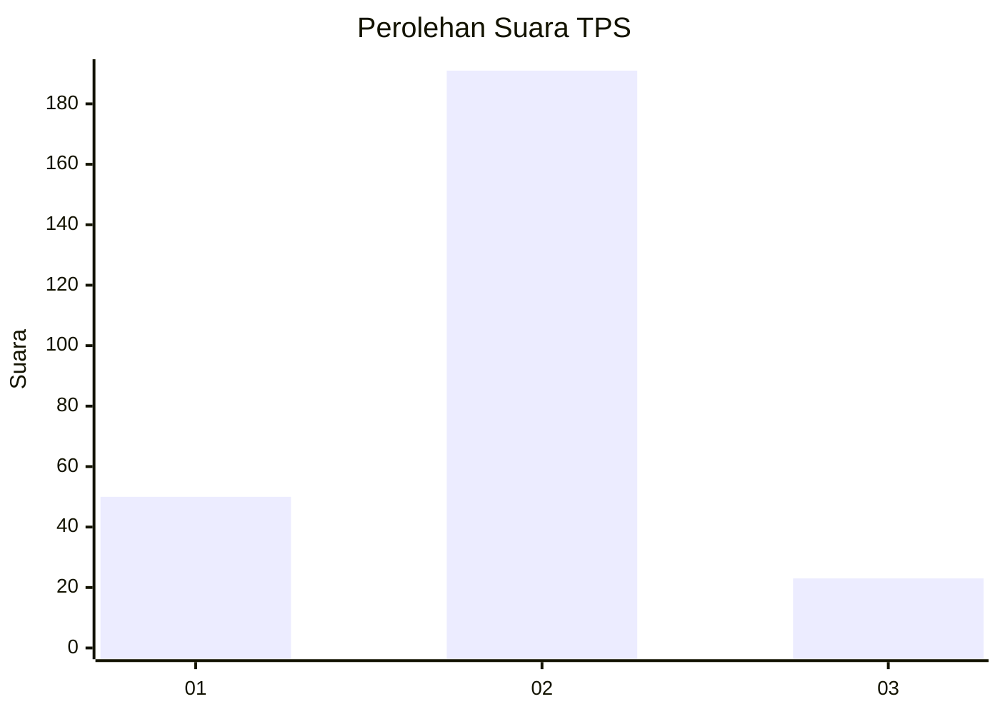
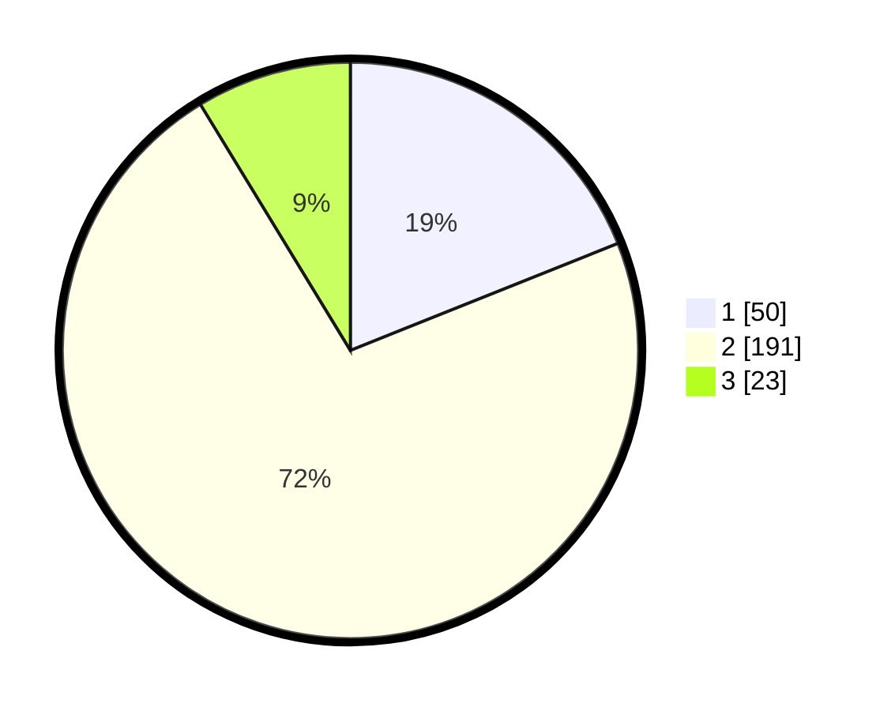

# Hasil

## Grafik

## Tabel

| No. | Nama Paslon    | Suara | Suara (raw) | Persentase |
|:--- |:-------------- | -----:| -----------:| ----------:|
| 1   | ANIES MUHAIMIN | 50    | [50][p-1]   | 18,94      |
| 2   | PRABOWO GIBRAN | 191   | [191][p-2]  | 72,35      |
| 3   | GANJAR MAHFUD  | 23    | [23][p-3]   | 8,71       |

[p-1]: https://github.com/gigit-pemilu/pemilu-2024-32-jawa-barat/blob/main/pilpres/hitung-suara/sub/32-jawa-barat/sub/16-bekasi/sub/11-cikarang-timur/sub/2005-jatibaru/sub/013-tps/sub/paslon-1.txt
[p-2]: https://github.com/gigit-pemilu/pemilu-2024-32-jawa-barat/blob/main/pilpres/hitung-suara/sub/32-jawa-barat/sub/16-bekasi/sub/11-cikarang-timur/sub/2005-jatibaru/sub/013-tps/sub/paslon-2.txt
[p-3]: https://github.com/gigit-pemilu/pemilu-2024-32-jawa-barat/blob/main/pilpres/hitung-suara/sub/32-jawa-barat/sub/16-bekasi/sub/11-cikarang-timur/sub/2005-jatibaru/sub/013-tps/sub/paslon-3.txt

## Foto C Plano

https://sirekap-obj-formc.kpu.go.id/5af1/pemilu/ppwp/32/16/11/20/05/3216112005013-20240214-234538--deb20a58-a3c6-47ea-9f2d-6c67f8247fac.jpg

https://sirekap-obj-formc.kpu.go.id/5af1/pemilu/ppwp/32/16/11/20/05/3216112005013-20240214-234714--86e512f3-b763-4234-9a41-937f230e7e25.jpg

https://sirekap-obj-formc.kpu.go.id/5af1/pemilu/ppwp/32/16/11/20/05/3216112005013-20240214-234925--0f14f15d-087c-41d9-bafc-925ee091b964.jpg

## Metadata

| Key        | Value               |
| ---------- | ------------------- |
| Time Stamp | 2024-02-24 22:31:28 |

