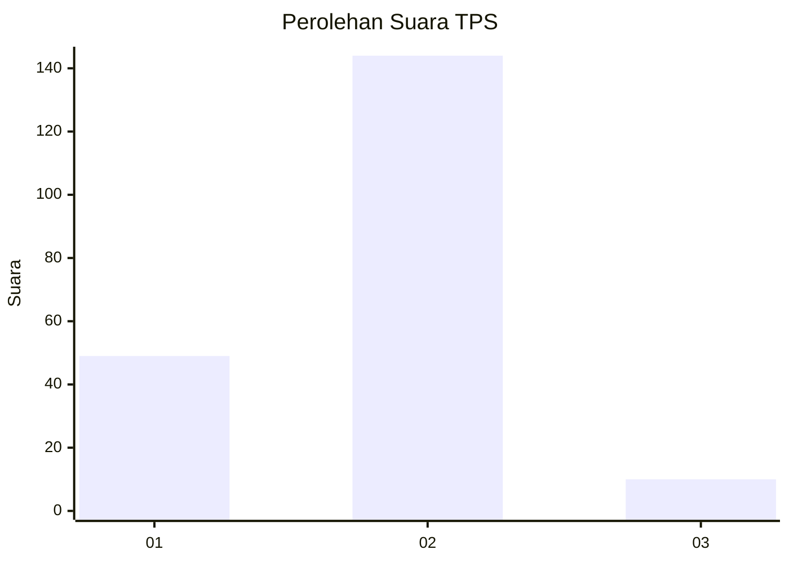
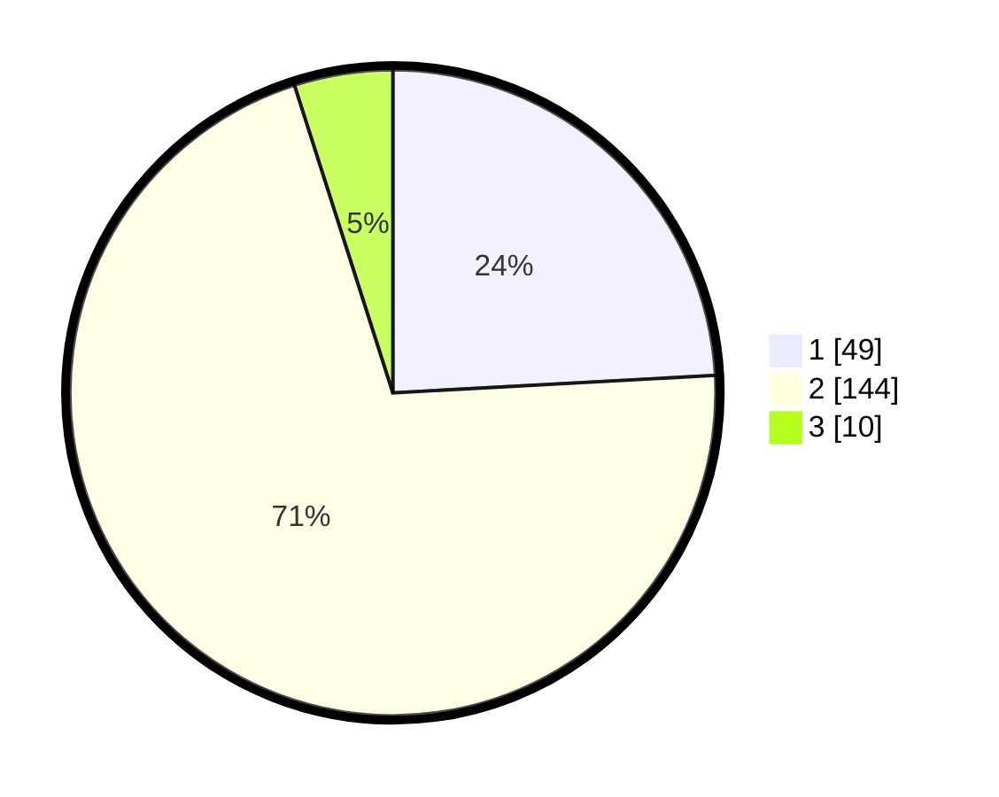

# Hasil

## Grafik

## Tabel

| No. | Nama Paslon    | Suara | Suara (raw) | Persentase |
|:--- |:-------------- | -----:| -----------:| ----------:|
| 1   | ANIES MUHAIMIN | 49    | [49][p-1]   | 24,14      |
| 2   | PRABOWO GIBRAN | 144   | [144][p-2]  | 70,94      |
| 3   | GANJAR MAHFUD  | 10    | [10][p-3]   | 4,93       |

[p-1]: https://github.com/gigit-pemilu/pemilu-2024-32-jawa-barat/blob/main/pilpres/hitung-suara/sub/32-jawa-barat/sub/16-bekasi/sub/12-kedung-waringin/sub/2001-karangsambung/sub/002-tps/sub/paslon-1.txt
[p-2]: https://github.com/gigit-pemilu/pemilu-2024-32-jawa-barat/blob/main/pilpres/hitung-suara/sub/32-jawa-barat/sub/16-bekasi/sub/12-kedung-waringin/sub/2001-karangsambung/sub/002-tps/sub/paslon-2.txt
[p-3]: https://github.com/gigit-pemilu/pemilu-2024-32-jawa-barat/blob/main/pilpres/hitung-suara/sub/32-jawa-barat/sub/16-bekasi/sub/12-kedung-waringin/sub/2001-karangsambung/sub/002-tps/sub/paslon-3.txt

## Foto C Plano

https://sirekap-obj-formc.kpu.go.id/4520/pemilu/ppwp/32/16/12/20/01/3216122001002-20240215-033000--09006f86-6b20-49e7-9621-94752a0b1d13.jpg

https://sirekap-obj-formc.kpu.go.id/4520/pemilu/ppwp/32/16/12/20/01/3216122001002-20240214-203814--75ffad17-88d3-43b4-beef-e7d7cde26c43.jpg

https://sirekap-obj-formc.kpu.go.id/4520/pemilu/ppwp/32/16/12/20/01/3216122001002-20240214-203818--22d7c7ca-bc82-4ea4-b79b-68c152b77ce1.jpg

## Metadata

| Key        | Value               |
| ---------- | ------------------- |
| Time Stamp | 2024-02-24 22:31:28 |

