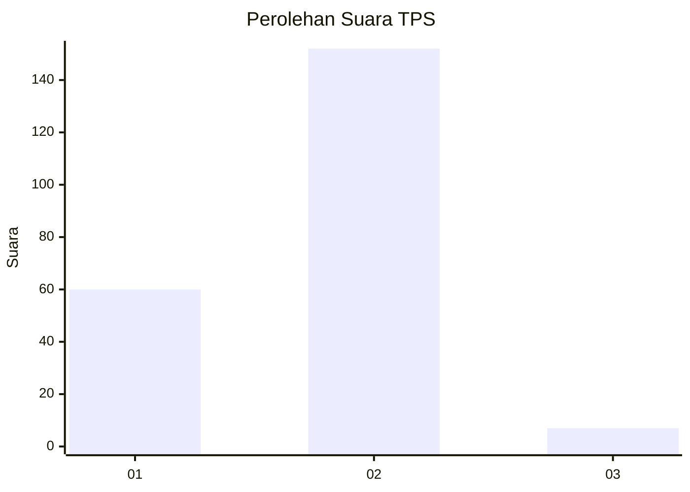
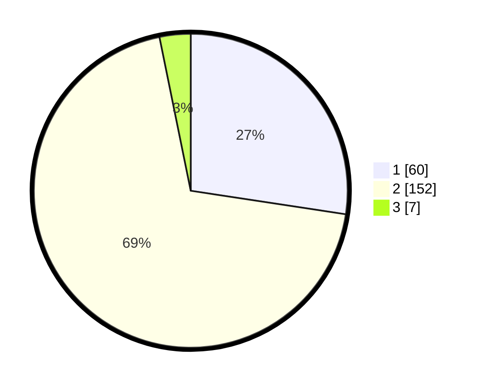

# Hasil

## Grafik

## Tabel

| No. | Nama Paslon    | Suara | Suara (raw) | Persentase |
|:--- |:-------------- | -----:| -----------:| ----------:|
| 1   | ANIES MUHAIMIN | 60    | [60][p-1]   | 27,40      |
| 2   | PRABOWO GIBRAN | 152   | [152][p-2]  | 69,41      |
| 3   | GANJAR MAHFUD  | 7     | [7][p-3]    | 3,20       |

[p-1]: https://github.com/gigit-pemilu/pemilu-2024-32-jawa-barat/blob/main/pilpres/hitung-suara/sub/32-jawa-barat/sub/16-bekasi/sub/12-kedung-waringin/sub/2001-karangsambung/sub/004-tps/sub/paslon-1.txt
[p-2]: https://github.com/gigit-pemilu/pemilu-2024-32-jawa-barat/blob/main/pilpres/hitung-suara/sub/32-jawa-barat/sub/16-bekasi/sub/12-kedung-waringin/sub/2001-karangsambung/sub/004-tps/sub/paslon-2.txt
[p-3]: https://github.com/gigit-pemilu/pemilu-2024-32-jawa-barat/blob/main/pilpres/hitung-suara/sub/32-jawa-barat/sub/16-bekasi/sub/12-kedung-waringin/sub/2001-karangsambung/sub/004-tps/sub/paslon-3.txt

## Foto C Plano

https://sirekap-obj-formc.kpu.go.id/d473/pemilu/ppwp/32/16/12/20/01/3216122001004-20240214-200408--be8d6444-6a58-4302-935f-4245eb586fa9.jpg

https://sirekap-obj-formc.kpu.go.id/d473/pemilu/ppwp/32/16/12/20/01/3216122001004-20240214-190418--46a9c3b7-700a-48c0-b207-cab63e7e21f9.jpg

https://sirekap-obj-formc.kpu.go.id/d473/pemilu/ppwp/32/16/12/20/01/3216122001004-20240214-190427--f37e80c6-5707-4897-a35c-6877d89f3332.jpg

## Metadata

| Key        | Value               |
| ---------- | ------------------- |
| Time Stamp | 2024-02-24 22:31:28 |

